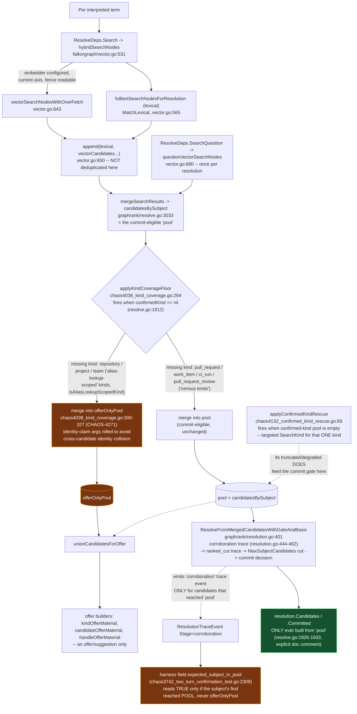
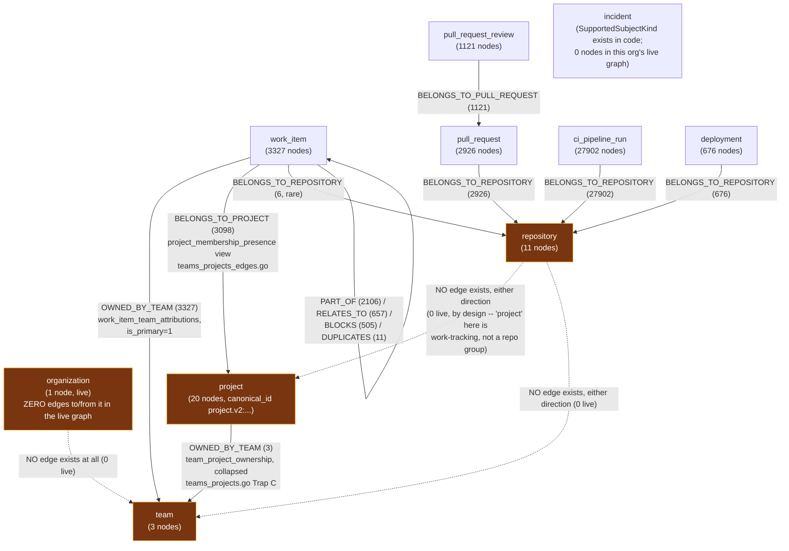
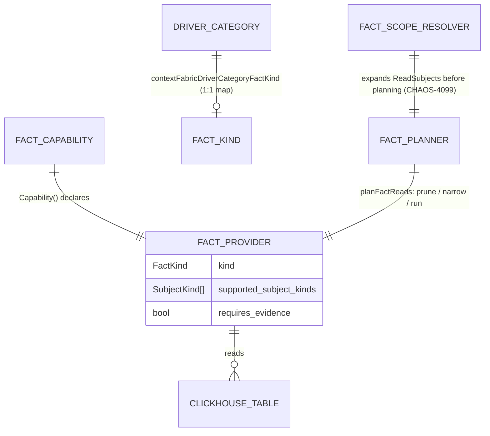
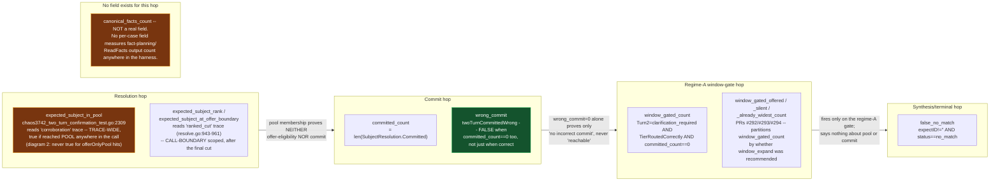

# Context Fabric architecture diagrams (CHAOS-4133)

Six mermaid diagrams covering the question-answering pipeline, the
candidate-pool mechanism that hid CHAOS-4348, the live subject/graph data
model, the fact data model, the two-turn trial harness's measurement
fields, and the N-turn confirmation-carry class (CHAOS-4360). Built
against live code (`codegraph_explore`, file:line cited
throughout) and the live kiac trial graph (`kubectl exec ... redis-cli
GRAPH.QUERY`, counts only, org `70d529e0-3c06-4597-8480-794fd02328b6`,
graph key `acr-cf-fa7030e2106de7411bfbf8ebce74c620-e2`).

Why this page exists (chris, 2026-08-26): a same-day incident (CHAOS-4348)
would have been caught immediately by a diagram that drew the candidate-pool
vs. offer-only-pool split. Before this page, `acr/docs` had four mermaid
blocks total and none of them drew that split.

**Legend (node classes, used across the flowchart/state diagrams; the §6
sequence diagram uses plain notes instead, per mermaid's own sequence
syntax):**
- `defect` / `gap` (amber): a known, currently open gap or in-flight fix.
- `fixed` / `terminal` (green): a shipped, ratified behavior.
- `refuse` (red): a broken or refusing branch.
- dashed edges: skipped/discarded path, shown for context only.

## How to read these / update rule

Each diagram is paired with a one-paragraph legend and file:line anchors to
the code it depicts. Anchors are read-time citations, not links — the repo
has no stable line-anchor URL scheme, so re-run `codegraph explore` on the
named symbol if a line has moved.

**Standing rule (chris, 2026-08-26 17:55): any PR touching `graphrank`,
fact planning (`fact_planner.go`, `fact_registry.go`, `fact_scope.go`),
`devhealthfacts`, or `internal/contracts/v1` MUST update the affected
diagram in the same PR.** A diagram that silently drifts from the code it
claims to depict is worse than no diagram.

---

## 1 — Question flow end-to-end

```mermaid
flowchart TD
  ASKDEV["Ask Dev UI<br/>StructureNeedsPanel.tsx (ask-dev repo)<br/>renders kind/anchor/handle/window/candidate offers"] --> API["POST /api/v1/context-fabric/investigations<br/>internal/api/context_fabric_routes.go"]
  API --> ENGINE["Engine.Investigate<br/>engine.go:435"]
  ENGINE --> INTERP["Interpret (model call)<br/>RuntimeQuestionInterpreter.Interpret<br/>model_runtime.go:510"]
  INTERP --> STRUCT["structure needs: kind / anchor / handle / window<br/>composeEffectiveWindow (window.go)<br/>canonicalizeStructure (chaos3900)"]
  STRUCT --> CARRY{"CHAOS-4360 same-conversation<br/>window carry<br/>resolveCarriedWindow<br/>(chaos4360_carry.go)<br/>-- ONLY when effectiveWindow<br/>would be inferred_default"}
  CARRY -->|"hit: nearest chain confirmation<br/>found (bounded walk,<br/>CHAOS-3898 taint gate applied)<br/>effectiveWindow REPLACED,<br/>Source=carried disclosed on<br/>ConfirmedStructure -- never<br/>re-accepts a receipt, the<br/>IsStructureSuperseded guard<br/>is untouched"| WGATE
  CARRY -->|"miss: no reference / unloadable /<br/>stale_graph_epoch / no_confirmed_window /<br/>depth_exceeded"| WGATE{"class-default window gate<br/>WindowCanonicalizationGatedClassDefault<br/>CHAOS-4040/4234"}
  WGATE -->|"regime A: inferred_default"| GATED["gatedOfferMaterial<br/>chaos4234_offers_only.go"]
  GATED --> OFFRES["graph.ResolveSubjects(WithOffersOnlyResolution)<br/>same pool mechanism as regime B,<br/>commit-bearing output DISCARDED"]
  OFFRES --> WOFFER["windowConfirmationRequiredResult<br/>status=clarification_required, SubjectResolution EMPTY<br/>kind/handle/candidate offers minted BESIDE window offer"]
  WGATE -->|"regime B: explicit / confirmed window"| RESOLVE["graphrank.ResolveSubjects<br/>ResolveDeps: Search / SearchQuestion / SearchKind /<br/>AliasLookup + CHAOS-4038 coverage floor<br/>(see diagram 2)"]
  RESOLVE --> POOL["candidate pool split:<br/>pool (commit-eligible) vs offerOnlyPool (CHAOS-4271)<br/>-- see diagram 2 for why this matters"]
  POOL --> GATE1["ResolveFromMergedCandidatesWithGateAndBasis<br/>resolution.go:401 -- corroboration -> ranked_cut -> commit decision"]
  GATE1 --> DISCOVER["DiscoverContext<br/>cohort + structure offers, falkorgraph/reader.go"]
  DISCOVER --> SCOPE["FactReadScopeResolver<br/>fact_scope.go -- CHAOS-4099, activated<br/>project/team origin -> activity-proxy / attributed-team expansion"]
  SCOPE --> PLAN["planFactReads<br/>fact_planner.go:183 -- per-capability<br/>SupportedSubjectKinds partition: prune / narrow / run"]
  PLAN -->|"no supported subject, no scope gap"| PRUNE["pruned:subject_kind_unsupported<br/>proof of absence (CHAOS-3783)"]
  PLAN -->|"no supported subject, scope gap disclosed"| UNEXP["unexpanded:&lt;outcome&gt;<br/>CHAOS-4099 -- honest 'reachable but not read'<br/>NEVER SourcePruned"]
  PLAN -->|"some/all subjects supported"| READ["FactCapabilityRegistry.ReadFacts<br/>fan-out over devhealthfacts providers (ClickHouse)<br/>-- see diagram 4"]
  PRUNE --> BUNDLE
  UNEXP --> BUNDLE
  READ --> BUNDLE["CanonicalFactBundle + Coverage"]
  BUNDLE --> SYN["Synthesize (model call)<br/>RuntimeAnswerSynthesizer.Synthesize<br/>model_runtime.go:596"]
  SYN --> ROWS["attachCanonicalRows (CHAOS-4355)<br/>model-authored Rows rejected in ValidateAgainst;<br/>engine copies Rows verbatim from the canonical fact<br/>each claim cites -- model_runtime.go"]
  ROWS --> OVERRIDE["applySynthesisStatusOverride<br/>CHAOS-4098 -- decisive clarification_required -> no_match<br/>runs BEFORE the commit gate"]
  OVERRIDE --> GATE2{"CHAOS-4085 DP9 commit-affirmation gate<br/>applyCommitAffirmation<br/>chaos4085_commit_affirmation.go:447"}
  GATE2 -->|"exempt / affirmed"| COMMIT["Commit subject(s)"]
  GATE2 -->|"refused"| RETRACT["Retract-only<br/>(fail-closed, never fabricates a commit)"]
  COMMIT --> STATUS["Answer status:<br/>complete / degraded / no_match / clarification_required"]
  RETRACT --> STATUS
  WOFFER --> STATUS
  STATUS --> SAVE["Save (keyed on clamped request context)"]
  SAVE --> RENDERBACK["answerprojection.Project<br/>-> API / MCP -> Ask Dev renders offers + answer"]
  RENDERBACK --> ASKDEV

  classDef gap fill:#78350f,stroke:#f59e0b,color:#ffffff
  classDef fixed fill:#14532d,stroke:#22c55e,color:#ffffff
  classDef refuse fill:#7f1d1d,stroke:#ef4444,color:#ffffff
  class POOL gap
  class UNEXP,GATE2,ROWS,CARRY fixed
  class RETRACT refuse
```



**Caption.** One investigation runs interpretation, a window gate that
forks into a discard-heavy "offers-only" resolution (regime A, CHAOS-4234)
or a decisive resolution (regime B), subject resolution against a split
candidate pool, fact-scope expansion, fact planning, fact reads, synthesis,
and a post-synthesis commit-affirmation gate, in that order. The amber node
is today's open gap: the **candidate pool split** (diagram 2) is where
CHAOS-4348 (project/team subjects silently excluded from the commit-eligible
pool) and CHAOS-4347 (fact routing/coverage widening for those same kinds,
in progress as of 2026-08-26 17:52 PDT) both live. **Two items in the
original brief for this diagram were verified stale and are corrected
here, not drawn as gaps:**
- **CHAOS-4171 (structure-offer renderer) is BUILT, not "not built."**
  `ask-dev/src/components/StructureNeedsPanel.tsx` (547 lines) renders
  kind/anchor/handle/window offers AND `CandidateOptionsSection` (CHAOS-4012)
  with model-generated `phrasing` per option; `.remember/today-2026-08-26.md:2`
  records "CHAOS-4171/3478/4244 chain closed." Treat any doc or comment
  still citing an unbuilt renderer as stale.
- CHAOS-4098 and CHAOS-4085 (the status-override and commit-affirmation
  gates) are shipped, ratified behavior — drawn `fixed`, not `gap`, matching
  their state in the CHAOS-4061 retro diagrams
  (`.remember/retro-4061-diagrams-draft.md`, diagram 1) reused here for
  visual convention.

**Updated 2026-08-27 (CHAOS-4355, `lane-4355-acr`): hop 5 (Rows render) is
BUILT, not "not built."** CHAOS-4347 (#300) added `Rows` on
`ContextFabricClaimedFact`/`ProjectedFact` additively but left them
unreachable — `SynthesisDraft.ValidateAgainst` rejected any claim that set
Rows (model-authored or otherwise), and nothing else set them, so a
producer's renderable table (e.g. `MetricsProvider`'s project rollup
`team_breakdown`) never survived synthesis. CHAOS-4355 closes that gap
WITHOUT letting the model author Rows: `ValidateAgainst` still rejects a
model-supplied `claim.Rows` unconditionally (even one that happens to match
canonical exactly — see
`TestSynthesisDraftValidateAgainstRejectsModelAuthoredRowsEvenWhenTheyMatchCanonical`),
and `attachCanonicalRows` (`model_runtime.go`), which runs INSIDE
`Synthesize` immediately after `ValidateAgainst` passes, is the only place a
`ClaimedFact.Rows` is ever set — copied verbatim from the SAME canonical
fact (`Kind`+`Subject`) the claim's scalar `Value` was already grounded
against, never derived or reworded. `answerprojection.Project` already
carried `Rows` through unchanged since #300 (`project.go`'s
`projectDrivers`), so this was the one missing hop. `RecordProjectedRowsCount`
(`EngineTelemetry`) reports the total rows attached and whether any claim
lost table content -- an unambiguous table capped at
`ContextFabricClaimedFactMaxRows`, or no table attached at all because its
canonical fact carried more than one Rows-shaped field and which one a
claim means is ambiguous (the fact-plan-adjacent "dropped by cap/pruning"
signal) -- once per `Synthesize` call that reaches claim assembly, zero
included. A
call rejected earlier (unavailable runtime, a model draft `ValidateAgainst`
itself rejects, a receipt-sink failure) reports nothing here; that failure
is the receipt sink's own outcome to record.

**Updated 2026-08-27 (CHAOS-4360, `lane-4360-acr`): same-conversation
window carry defeats the class-default gate for a re-verified turn.** Live
walkthrough (CHAOS-4355, cf-rulings.md 06:30/09:10/13:40 08-27): turn 2
confirms a window via `winr_` receipt and asks for a fresh subject
clarification; the Workbench's accumulate-and-re-ask-ONCE batching means
turn 3 carries only the new candidate pick, never the window receipt
(re-sending it would be correctly `vetoed_stale` by
`IsStructureSuperseded` — receipts are single-use by design, unchanged
here). Before this ticket, turn 3's own window canonicalization therefore
produced `inferred_default`, the WGATE node above fired, and
`composePriorSubjectReceiptDispositions` could only ever classify the
carried `PriorSubjectReceipts` entry as `skipped_failed_reauth` — a
project-status question could never reach a decisive answer past two
turns. `resolveCarriedWindow` (`chaos4360_carry.go`) now runs immediately
before WGATE, exactly once per call, ONLY when this turn's own window
would otherwise be inferred: it walks the chain of prior results this
request references (bounded depth/visited count, the SAME CHAOS-3898 §2.2
ingress taint gate `resolvePriorSubjectHints` already applies), and on a
hit replaces `effectiveWindow` with the nearest genuinely CONFIRMED
(never inferred) window found — so WGATE never fires for that turn, the
REAL `ResolveSubjects` resolution runs, and the existing, unmodified
`PriorSubjectReceipts` re-verification mechanism reaches `applied` against
it. A carry is disclosed, never silent: a new `ContextFabricConfirmedStructureEntry`
with `Source=carried` (a v1-additive fourth `ContextFabricStructureSource`
value, deliberately excluded from `structureSupersessionClaims` — a carry
reads already-stored confirmed structure, it never re-accepts a receipt)
names the origin `PriorResultID`. Scope: this ticket carries the WINDOW
only (the proven defect and the ticket's own literal acceptance bar);
`expected_kind`/`subject_anchor` functional carry is flagged as a
follow-up, not built here, since `PriorSubjectReceipts` re-verification
already resolves the concrete candidate-commit gap on its own once the
window stops being gated.

---

## 2 — Candidate pool internals: why an offer-only hit can never commit



**Caption.** Every resolution builds candidates through two independently
merged mechanisms — ordinary unscoped lexical+vector search
(`hybridSearchNodes`) and a kind-scoped, lexical-only `SearchKind` pass used
by the CHAOS-4038 coverage floor and the CHAOS-4132 confirmed-kind rescue.
The floor's own split (CHAOS-4271, `chaos4038_kind_coverage.go:300-327`) is
the load-bearing fact this diagram exists to draw: a find for one of the
four "census kinds" (pull request, work item, CI run, review) merges into
the same `pool` the commit gate reads, but a find for repository, project,
or team merges into a **separate `offerOnlyPool`** that only ever reaches
offer builders — `ResolveFromMergedCandidatesWithGateAndBasis` builds its
ranked/committed candidates exclusively from `pool`, never
`offerOnlyPool`, by explicit construction (`resolve.go:1926-1933`). This is
also why the harness's `expected_subject_in_pool` field can read **false**
for a repository/project/team subject that was genuinely retrieved and
offered: the "corroboration" trace event that field scans for is only
emitted for candidates in `pool`. `wrong_commit=0` on such a run proves no
*wrong* subject was affirmed — it says nothing about whether the *right*
subject was ever a reachable commit candidate, because an offer-only hit
was never in a position to become one. This split is the mechanism behind
CHAOS-4348 (project/team subjects showing 0/20 "in pool" on 2026-08-26,
`.remember/now.md:73`) and the reason CHAOS-4347's fact-routing work
started from a false premise of unreachability rather than the real
gap — missing facts, not missing pool membership (see diagram 4).

**In-flight fix (not yet merged as of this writing):** `lane-4347-project`
(branch `chaos-4348-project-team-pool`) is building two new search arms
scoped to repository/project/team (`graphrank/chaos4348_reachability.go`,
`falkorgraph/chaos4348_exact_name.go`) that merge into the real `pool`
through the existing identity-collision guard, plus confirms two more
contributing mechanisms not drawn above: ordinary unscoped `Search`/
`SearchQuestion` lose the fulltext ranking race for these kinds against
~34,000+ activity nodes sharing a token (`resolve.go` per-term loop,
~line 1713), and `IsObservationAttributionRelation`
(`graphrank/subject.go:208`) is a closed 2-member set that has nothing to
do with `BELONGS_TO_PROJECT`/`OWNED_BY_TEAM`, so observation-traversal
does not cover the project/team edges either. Update this diagram in the
same PR that merges that fix, per the update rule above.

---

## 3 — Subject hierarchy and graph data model

Node/edge shape verified live against the kiac trial graph (org
`70d529e0-3c06-4597-8480-794fd02328b6`, `GRAPH.QUERY acr-cf-fa7030e2106de7411bfbf8ebce74c620-e2`,
2026-08-26). All nodes carry label `Subject` with a `subject_kind` property;
all edges carry relationship type `Relates` with a `relation_type` property
(never a distinct Cypher relationship type per edge kind).



**Caption.** The hierarchy is **not** organization → team → project →
repository → activity. Live data shows organization has zero edges to
anything, and there is **no direct repository↔project or repository↔team
edge at all, by design**
(`docs/design/context-fabric-team-project-subjects.md` §9: "No new fact
providers... project gets zero fact-provider entries... `project` here is a
work-tracking project, Linear-shaped, not a repository group. There is no
direct project↔repository edge"). The only path from a project or team to
a repository-scoped activity kind (PR, review, CI run, deployment) is
**through `work_item`** — `project <-BELONGS_TO_PROJECT- work_item
-BELONGS_TO_REPOSITORY-> repository -BELONGS_TO_REPOSITORY<-
{pull_request, ci_pipeline_run, deployment}`
(`docs/design/context-fabric-fact-scope.md` §1) — and that chain is
explicitly an **activity proxy**, never an ownership claim: "repositories
with at least one project-linked work item," disclosed as such via
`FactScopeBasisActivityProxy`. Producers: work_item edges from
`internal/contextfabric/devhealthsource/teams_projects_edges.go`
(`querySubjectProjectMemberships`, `queryWorkItemTeams`); repository/PR/CI/
deployment/review edges from `devhealthsource/tables.go`; project→team from
`teams_projects.go`. `incident` is a `SubjectKind` the code supports
end-to-end but this org's live graph currently has zero incident nodes —
absence of evidence, not absence of a code path.

**Clarification (CHAOS-4363):** the "NO edge exists" markers above describe
the **graph** projection only. `HealthProvider`'s new project-subject rollup
(diagram 4) reads `team_repo_ownership` directly off **ClickHouse** -- a
real per-team repository-ownership table this package had not read before
-- to chain `project -> team_project_ownership -> team_repo_ownership ->
repository` for the `compounding_risk_daily` repo layer. That is a
ClickHouse fact-producer join, not a graph edge: it does not add a
`REPO -> TEAM`/`REPO -> PROJ` edge to this diagram, and the live trial data
plane currently holds zero `team_repo_ownership` rows for the org above (an
upstream ingestion gap, not a producer defect -- see this ticket's CH
readback evidence).

**Stale doc comment found (report only, no Go edit per this lane's scope):**
`internal/contextfabric/devhealthsource/teams_projects.go:54` and
`internal/contextfabric/devhealthsource/clickhouse.go:29` both assert,
in a CHAOS-3898-era comment, "live-verified zero project.v2:-shaped nodes
exist anywhere in that org's graph today." The live kiac graph now holds 20
project nodes, every one with a `project.v2:<provider>:<id>` canonical id
(e.g. `project.v2:linear:2fb2c2b3-c52a-441a-b5f6-0453ce894e32`) — a rebuild
has happened since that comment was written (the graph is on lifecycle
epoch 2). The comment is a historical decision record (why the version was
bumped) and is not wrong about *why*, but its present-tense "today" claim is
stale and could mislead a reader checking current graph state.

---

## 4 — Fact data model



**19 registered `FactProvider`s** (`internal/contextfabric/devhealthfacts`,
wired at `NewProviders`, `providers.go:14-35`; composed at
`internal/runtime/hosted/open.go:597`):

**Updated 2026-08-26/27 (CHAOS-4347, `lane-4347-ch`, PR #300):** the
`metrics`/`continuous_integration`/`deployments` rows below are widened by
REAL table joins/reads, never by proxying one kind's data as another's —
see `metrics.go`'s package doc comment
(`internal/contextfabric/devhealthfacts/metrics.go:1-83`) and
`context-fabric-fact-scope.md` §11 for why this is architecturally
distinct from a `FactReadScopeResolver` expansion (the resolver grants a
disclosed READ permission onto a kind a capability does NOT itself
support; this widening gives the capability a genuine second/third
source for the SAME kind).

| FactKind | ClickHouse table | Supported subject kinds |
| --- | --- | --- |
| identity | `repos`, `work_items` | repository, work_item |
| membership | `repos`, `work_items` ⋈ `repos` | repository, work_item |
| status | `work_items` | work_item |
| work | `work_items` | work_item |
| actual_completion | `work_items` | work_item |
| blockers | `work_item_dependencies` | work_item |
| required_children | `work_item_dependencies` | work_item |
| pull_requests | `git_pull_requests` | pull_request |
| reviews | `git_pull_request_reviews` | pull_request_review |
| continuous_integration | `ci_pipeline_runs` (per-run status); **+`cicd_metrics_daily`** (repository aggregate, CHAOS-4347) | ci_pipeline_run, **repository** |
| deployments | `deployments` (per-deployment status/environment); **+`deploy_metrics_daily`** (repository aggregate, CHAOS-4347) | deployment, **repository** |
| incidents | `operational_incidents` | incident |
| metrics | `repo_metrics_daily`; **+`team_metrics_daily`** (team, direct); **+`team_project_ownership` ⋈ `team_metrics_daily`** (project, summed-counts rollup, CHAOS-4347) | repository, **team, project** |
| health | `compounding_risk_daily`; **+`team_project_ownership` ⋈ `compounding_risk_daily` (team layer) and +`team_project_ownership` ⋈ `team_repo_ownership` ⋈ `compounding_risk_daily` (repo layer, one hop further), both landing in one `risk_breakdown` Rows table (project, CHAOS-4363)** | repository, team, **project** |
| workload | `capacity_forecasts`; **+`team_project_ownership` ⋈ `capacity_forecasts`, per-team `team_breakdown` Rows, never summed/averaged (project, CHAOS-4363)** | team, **project** |
| investment | `investment_metrics_daily`; **+`team_project_ownership` ⋈ `investment_metrics_daily`, per-team `team_breakdown` Rows, never summed across (investment_area, project_stream) (project, CHAOS-4363)** | team, **project** |
| readiness | `estimate_coverage_metrics_daily`; **+`team_project_ownership` ⋈ `estimate_coverage_metrics_daily`, per-team `team_breakdown` Rows, never summed across work scopes (project, CHAOS-4363)** | team, **project** |
| operational_deficiencies | `recommendations_daily` | team |
| source_health | `backfill_log` | organization |

**`FactMetrics`'s project rollup never averages a rate across
differently-sized teams.** Additive counts (commits, after-hours/weekend
commit counts) are SUMMED across the project's current owning teams
(`team_project_ownership`, `valid_to IS NULL` / as-of the requested
instant); each team's own rate (e.g. `after_hours_commit_ratio`) rides
unmodified in a new per-team `team_breakdown` field instead, disclosed via
a `rollup_basis` field on the fact. This is what
`ContextFabricClaimedFact.Rows` / `ContextFabricProjectedFact.Rows`
(new, additive, `context_fabric_types.go` / `context_fabric_answer_projection.go`,
CHAOS-4347) exist for: a renderable table on a fact/claim whose evidence
is genuinely a set of rows, not a lossy single scalar. Deliberately does
NOT touch `ContextFabricScalarValue` itself (also the projection-write
contract's property-value type, which documents "nested objects and
arrays remain disallowed" as a deliberate invariant for THAT surface).
**Updated 2026-08-27 (CHAOS-4355): now wired into synthesis, still never
into prompts.** `MetricsProvider`'s project rollup remains the only producer
of a `Rows`-bearing fact today, but a driver's cited claim now DOES carry
it: `attachCanonicalRows` (`internal/contextfabric/model_runtime.go`), the
one place a `ClaimedFact.Rows` is ever set, copies it verbatim from the
canonical fact each claim cites, immediately after
`SynthesisDraft.ValidateAgainst` passes -- ValidateAgainst itself still
rejects any claim where the MODEL set Rows directly, unconditionally, so
the model is never the source. `answerprojection.Project` carries it
through unchanged (`project.go`'s `projectDrivers`, unchanged since #300).
The prompt itself was NOT changed -- the model is never told Rows exist,
so no new prompt version was needed. The sidecar's own answer-rendering
closure test (`internal/sidecar/render_answer_untrusted_test.go`) still
carves out the render-layer half of this: a claim can now carry Rows, but
nothing in `dev-health-web`/Ask Dev renders them yet (see
`context-fabric-fact-scope.md` for the exact projected shape a renderer
would consume).

**Gated off: `evidence` (1 kind, not 8).** `doc.go:37-46` and
`providers_test.go:48-52` name exactly one deliberately unregistered
`FactKind` — no ClickHouse table maps honestly to it (`report_provenance`
exists but is empty in every environment; no subject-ID convention for
`artifact_id`/`plan_id`). `internal/contracts/v1/context_fabric_types.go:313-332`
declares 20 `ContextFabricFactKind` members total: the 19 above + `evidence`.

**Stale claim found:** `internal/contextfabric/AGENTS.md`'s WHERE-TO-LOOK
table (line 45) reads "ClickHouse-backed `FactProvider`s; 8 fact kinds gated
off (no canonical source)." Only 1 is gated off in code today. The "8" most
likely conflates with the 8 unread CH tables below — report to team-lead;
not corrected in this PR (docs-only, different file, out of this page's
scope, flagging per this lane's discrepancy-reporting mandate).

**Update (CHAOS-4347, PR #300): 3 of the original 8 CH tables now have a
reading `FactProvider`** — `team_metrics_daily`, `cicd_metrics_daily`,
`deploy_metrics_daily` (see the widened table above). Their production
column types were verified LIVE off the kiac trial ClickHouse
(`system.columns`, `kubectl exec` into the `trial-clickhouse` pod, ns
`acr-trial-data`) and added to `devhealthschema`'s shared production
declaration, not inferred from the ops migration files alone.

**5 CH tables still have no reading `FactProvider`** (unchanged, repo-wide
`rg`, zero hits in any `internal/contextfabric/**/*.go` read path):
`dora_metrics_daily`, `work_item_metrics_daily`, `issue_type_metrics_daily`,
`user_metrics_daily`, `ai_impact_metrics_daily`. **Correction to this
page's own earlier text:** `dora_metrics_daily` is keyed by
**`repo_id`**, not `team_id` (`repo_id UUID, day Date, metric_name String,
value Float64` — verified against both the ops migration
(`023b_dora_metrics.sql`) and the live kiac schema) — an earlier framing
of this table as team-scoped was wrong; it was out of scope for the
metrics team/project widening for exactly that reason, not merely
unstarted. (One unrelated hit remains: `cicd_metrics_daily` also appears
in a trial-harness table-name classification map,
`internal/runtime/hosted/frontier_trial_live_test.go:1459`, explicitly
commented as not a read or a schema declaration — that reference is
unrelated to the new FactProvider read path above.)

**Category → FactKind is a 1:1 map today, and that is CHAOS-4347's other
half.** `contextFabricDriverCategoryFactKind`
(`internal/contracts/v1/context_fabric_types.go:483-498`) maps exactly 14 of
16 driver categories to exactly one `FactKind` each (`relationship` and
`narrative` map to none — no canonical fact backs either judgment kind).
Because the map is 1:1, `status` routes only to `FactStatus`
(work_item-only, per the table above) — a repository- or project-scoped
"status" question has no fact route by construction, not because the
subject is unreachable (diagram 3 shows it usually is reachable). Ruled
2026-08-26 (`cf-rulings.md:316`, chris): a new v1 `FactKind` (working name
`project_status`) or a widened `StatusProvider.SupportedSubjectKinds` is the
fix, lane's choice; approved in principle, implementation "Phase 2 held
pending trial-case validation" as of 17:42 PDT — **not yet in
`context_fabric_types.go` on `main`**.

**Correction (flagged by lane-4347-ch, not fixed in this PR — out of this
lane's scope): the paragraph above is now stale.** `lane-4335`'s CHAOS-4347
PR #298 (`internal/contextfabric/chaos4347_status_category_composition.go`)
merged as `1e9815c7`, ahead of this page's own cited baseline `569f0f39`.
It does not touch the 1:1 `contextFabricDriverCategoryFactKind` map itself,
but adds a composition step (`composeStatusCategoryRequirements`) between
that map and the providers: a resolved-subject-kind repository/team
`status` requirement now expands into repository→{metrics, health,
identity} / team→{health, workload, readiness} before planning, so
"status routes only to FactStatus" is no longer true post-resolution for
those two kinds (work_item stays 1:1). The `project_status`
new-FactKind-vs-widen-`StatusProvider` decision above is unaffected and
still open — that is a separate, still-unbuilt slice
(`lane-4347-project`, CHAOS-4348 reachability work is currently ahead of
it in that lane's queue).

**Update (CHAOS-4363, 4347-A, routing slice):** `statusCategoryFactKindComposition`'s
`SubjectTeam` entry now also composes `FactInvestment`, so the team leg of
the paragraph above is `team→{health, workload, readiness, investment}`.
Repository's set is unchanged.

**Update (CHAOS-4363, 4347-A, producer slice — completes this ticket):**
investment/workload/readiness/health (see the widened table above) all now
answer for a **project** subject directly, by a real
`team_project_ownership` join (health also chains one hop further through
`team_repo_ownership`) -- the SAME real-join pattern `metrics.go` set for
`FactMetrics` in CHAOS-4347, never the `FactReadScopeResolver` activity-proxy
route. Unlike `FactMetrics`' commit counts, none of these four sum or
average across owning teams: each source table partitions by a dimension
(`investment_area`/`project_stream`, `work_scope_id`, or the forecast's own
Monte Carlo statistics) that would be meaningless mixed across teams, so
every project-level fact instead carries a `team_breakdown` (or, for health,
`risk_breakdown`) `Rows` table with each contributing team's (and, for
health, repository's) own row verbatim, disclosed via `rollup_basis`. A
project-status question now reaches ≥3 `Rows` tables (investment, backlog
risk via workload/readiness, completion risk via health) with a `team_name`
axis, per this ticket's acceptance criterion. `investment_classifications_daily`
is deliberately NOT read for the "classification breakdown" the ticket
proposed: its live production schema (`system.columns`, kiac trial
ClickHouse, 2026-08-27) carries `repo_id`/`artifact_id`/`artifact_type`, no
`team_id` column at all -- the same "no team-keyed source" gap CHAOS-4347's
disposition inventory found for cognitive load (`user_metrics_daily`).

**Live data gap disclosed, not hidden (CH readback, 2026-08-27, org
`70d529e0-3c06-4597-8480-794fd02328b6`):** investment (6 rows), workload (12
rows), and readiness (17 rows) each returned real, non-zero rows for the
project `linear:CHAOS` is currently owned by. Health's project rollup
returned **zero** rows against this data plane -- verified as a genuine
upstream ingestion gap, not a query defect: `compounding_risk_daily` holds
2455 `repo`-scope rows for this org and **zero** `team`-scope rows, and
`team_repo_ownership` holds **zero** rows across every org in this data
plane. The query itself is proven correct by this package's own unit tests
(synthetic fixtures exercising both UNION branches) AND a real-ClickHouse
integration test (`chaos4363_project_rollups_integration_test.go`) that
seeds both a team-scope and a repo-scope row and asserts both survive in one
read. A "completion risk" Rows table for a project therefore will not
populate on THIS pilot data until Ops backfills team-scope
`compounding_risk_daily` and/or `team_repo_ownership` -- flagged to
team-lead as a follow-up, out of this ticket's ACR-side scope.

**Codex round-1 findings, all fixed (CHAOS-4363):** (1) each project
rollup's breakdown Rows table is now capped at 64 entries
(`maxProjectRollupBreakdownRows`, shared.go) before `RowsFactValue` --
`FactValue.Validate` rejects a table over that bound outright, which would
otherwise turn a large project's fact into a hard read error instead of a
truncated answer; (2) `QueryVersion` bumped `v1` -> `v2` (a conjunctive
answer-reuse key dimension shared by every capability in this package, so
this bump invalidates ALL prior reuse candidates, not only the four changed
kinds -- the safe direction); (3) health's team+repo UNION ALL is now
wrapped in an outer `SELECT ... ORDER BY ... LIMIT`, since appending LIMIT
directly after two UNION ALL'd SELECTs binds only to the second (repo)
branch in ClickHouse, and UNION ALL's own output order is otherwise
unspecified; (4) `readProjectInvestment` now counts (not silently drops) a
row omitted for `churn_loc` UInt64 overflow, folding it into
`OmittedCount`/`Truncated` the same way the team-level read already did;
(5) `team_repo_ownership` added to `devhealthschema`'s production column
declaration and to a new real-ClickHouse integration test -- it had no
production-typed test coverage at all before this fix.

`FactCapability.SupportedSubjectKinds` (`fact_registry.go:50-58`) is set
once, in each provider's own `Capability()` method — code-declared, never
model/phrasing-derived (`internal/contextfabric/AGENTS.md:49`).
`planFactReads` (`fact_planner.go:183`) compares resolved subjects against
that declared set and prunes/narrows before any provider runs; the
`FactReadScopeResolver` (`fact_scope.go`, CHAOS-4099, **activated** —
project and team policies both ruled and shipped, `context-fabric-fact-scope.md`
§9-10) sits one seam earlier, expanding a project/team origin to its
activity-proxy repositories/PRs/reviews so the honest "unexpanded, but
reachable" disclosure replaces a false "pruned, proven absent" one where a
verified typed chain exists.

---

## 5 — Two-turn trial harness measurement map



**Caption.** Five field families, five different hops, and none of them
implies another. `expected_subject_in_pool` is the crux of the incident this
page exists to prevent a repeat of: it is scanned from a "corroboration"
trace event emitted only for candidates that reached the commit-eligible
`pool` (diagram 2) — a repository/project/team subject correctly retrieved
into the CHAOS-4271 `offerOnlyPool` reads **false** here even though it was
genuinely found and offered. `wrong_commit=0` is the second trap: the field
is `false` both when the commit was correct and when nothing committed at
all, so it certifies safety, never reachability. `window_gated_*` measures
a completely separate concern — whether the CHAOS-4040 regime-A gate fired
and disclosed a window-widening offer — and has no bearing on pool or
commit correctness. **`canonical_facts_count`, named in this diagram's
original brief, does not exist in the harness as a field** — no
`twoTurnCaseResult` field, no `cmd/acr-trial-merge-two-turn/main.go` report
field, projects fact-planning/`ReadFacts` output count. Flagged to
team-lead as aspirational, not a stale-vs-current discrepancy, since no
prior doc claimed it existed.

---

## 6 — N-turn confirmation-carry class (CHAOS-4360)

The two-turn harness (§5) never sends a third request — every arm it
defines is a fixed two-call shape. CHAOS-4355's live walkthrough (13:40
08-27) found a defect that shape structurally cannot see: the live
Workbench batches window+candidate receipts into one turn-2 call, which
can leave candidate unresolved (superseded by the SAME call's own
window-driven pool change) and forces a third turn redeeming a FRESH
candidate offer. This harness reproduces the underlying CHAOS-4360 gap
directly, WITHOUT depending on that specific supersession path: it
deliberately never batches window and candidate in the same call at all
(codex review round 2, P1 — see `runNTurnCase`'s own doc comment) — window
alone on one turn, candidate alone on a LATER turn — which guarantees any
case needing both members takes a genuine third turn and isolates the
carry gap precisely: nothing carries the confirmed window across that
turn-2→turn-3 boundary server-side (this ticket's own acr half), so it
arrives inferred again and the candidate redemption cannot land.
`chaos4360_nturn_confirmation_test.go` is the harness that walks this —
`TestChaos4360NTurnConfirmationCarry` (live, kiac) and
`TestChaos4360NTurnCarryDetectsCurrentDefect` (fixture, red-first).

```mermaid
sequenceDiagram
  participant C as Harness (runNTurnCase)
  participant E as acr Engine

  C->>E: turn 1: question, no receipts
  E-->>C: clarification_required<br/>StructureNeeds{window, subject_candidate}

  C->>E: turn 2: PriorWindowReceipts ONLY<br/>(window and candidate are NEVER batched -- runNTurnCase's own rule)
  Note over E: window_canonicalization_outcome=receipt_confirmed
  E-->>C: window: applied<br/>StructureNeeds{subject_candidate: still offered, untouched this turn}

  C->>E: turn 3: PriorCandidateReceipts ONLY<br/>window NEVER re-sent (already applied)
  Note over E: nothing carries the confirmed window<br/>across this call server-side (CHAOS-4360 gap) --<br/>it arrives INFERRED again
  E-->>C: window_canonicalization_outcome=gated_class_default (reverted!)<br/>window re-appears in missing; candidate receipt applies<br/>but resolution stays subjectless -- never decisive
```

**Carry measurement.** `ContextFabricConfirmedStructureEntry.Source`
already carries a closed pre-CHAOS-4360 vocabulary of exactly three values
(`receipt`, `explicit`, `explicit_unattributed` — `nTurnKnownPreCarrySource`).
Per lane-4360-acr (PR #306, team communication 2026-08-27): a carried
window keeps `Provenance=clarification_confirmed` unchanged and instead
reports the carry on `Source`, a new closed-vocab value `"carried"`. The
harness reads `Source` generically (`nTurnIsCarriedSource`, the primary
signal) and `Provenance` generically as a secondary, forward-compatible
one (`nTurnIsCarriedProvenance`): any value outside the known set on either
field is, by construction, a new carry tier lane-4360-acr mints — the
class runs green on `origin/main` today (neither field can carry an
out-of-vocabulary value yet) and starts measuring the fix the moment it
ships, with no harness-side code change and no coordination on an exact
new spelling.

**RED baseline (2026-08-27, kiac, cases 57/60 — the project-candidate
class this ticket seeds from; indices only, no question text; predates
lane-4360-acr's own carry fix, PR #306, still in review at the time of this
run).** Both safety invariants held (`wrong_commit_count=0`,
`window_unsafe_commit_count=0`); neither case reached the acceptance bar
(decisive AND `rows_count>0`); `carry_hit_count=0` on both, as expected
pre-fix. `resolved_active_epoch=2` (`graph_lifecycle_enabled=true`) —
confirmed live-read via this run's own epoch resolver (codex review round 1
P1 fix; the launcher enables graph-lifecycle mode for every run, so the
report now proves what epoch was actually read instead of silently
defaulting to 0/false).

Codex review round 2 (P1, confirmed) found the first re-run's own
window+candidate BATCHING (both receipts in one call, mirroring the
two-turn harness's `runTwoTurnPositiveArm`) let case 57 stall inside turn 2
alone — the harness never actually attempted the genuine turn-3
candidate-only exchange this class exists to walk.
`nTurnReportExercisedCarryTransition` now fails the run loudly if that
never happens; fixing it required splitting window and candidate across
SEPARATE turns (never batched) — see `runNTurnCase`'s own doc comment.
Re-run with the split algorithm, `candidate_only_turn_attempted_count=1`:

- **case 57** (needs both window and candidate): turn 1 discloses both
  offers; turn 2 sends window ONLY — applies
  (`window_canonicalization_outcome=receipt_confirmed`); turn 3 sends the
  candidate receipt ONLY (window never resent, per the never-resend
  contract) — **this is the literal CHAOS-4360 defect, reproduced exactly**:
  `window_canonicalization_outcome` reverts to `gated_class_default`
  (inferred again) and `window` re-appears in `missing`, even though it was
  genuinely confirmed one turn earlier. The candidate receipt itself
  disposes `applied`, but the overall resolution stays subjectless/
  `clarification_required` — nothing carries the confirmed window across
  the turn-2→turn-3 boundary server-side, so the candidate redemption can
  never stick.
- **case 60** (needs window only, no candidate ever offered): turn 2 sends
  window only, converges to a decisive `degraded` terminal with a
  **retracted** commit (`commit_affirmation retraction final_committed=0`)
  and `rows_count=0` — unaffected by the split (it never needed candidate).

Full artifact:
`.remember/trial-results/gen-trial-chaos4360_nturn-20260827T220625Z-23437.json`
(schema v40).

**GREEN measurement (2026-08-27, kiac, same cases 57/60) — lane-4360-acr's
carry fix, PR #306, SHA `02c44254`, merged to `origin/main`.** Run from a
disposable scratch worktree at `origin/main` (carries #306) with this
harness's own test files copied in — never committed to either branch;
this PR's own branch is untouched and still built against the pre-fix
base. The carry mechanism is **definitively fixed and directly observed**:
case 57 turn 3's `window_canonicalization_outcome` is now `carried`
(was `gated_class_default` pre-fix), `confirmed_structure[].source`
reports `"carried"` for the window member, and — the clearest signal —
**`window` no longer appears in turn 3's own `missing` list at all**
(RED: `[window, expected_kind, subject_candidate, subject_anchor,
subject_handle]`; GREEN: `[expected_kind, subject_candidate,
subject_anchor, subject_handle]`, `window` gone). `carry_hit_count=1`
(was 0). Engine telemetry confirms the mechanism directly: `context
fabric window carry outcome=hit chain_depth=0` on turn 3, vs
`outcome=miss_no_reference` on turn 1 (no earlier confirmation to carry
yet).

Case 57 is still NOT decisive end-to-end (`clarification_required`,
`subject_candidate` still lists `applied` yet reappears in `missing` — a
subjectless/`ambiguous` terminal): the candidate's own commit still needs
something past what redeeming its receipt alone provides, plausibly the
`prior_subject_receipts` reauth path lane-4360-acr's own scope note names
as separate and unmodified in PR #306 ("expected_kind/subject_anchor
carry is NOT built... `prior_subject_receipts` re-verification already
resolves the candidate-commit gap on its own once the window stops being
gated"). This harness's turn 3 sends `PriorCandidateReceipts` only, never
`PriorSubjectReceipts` — flagged to lane-4360-acr/team-lead as a possible
follow-up rather than assumed to be this ticket's own residual gap. Case
60 unaffected (never needed candidate; same decisive `degraded` result
both before and after). Both safety invariants held in the GREEN run too
(`wrong_commit_count=0`, `window_unsafe_commit_count=0`). Artifact (not
committed, reproduced from this doc's own numbers):
`.remember/trial-results/gen-trial-chaos4360_nturn-20260827T221125Z-17687.json`.

---

## Sources

- Live code via `codegraph_explore` / `rg` on `dev-health-acr`: `engine.go`
  (`Investigate`), `chaos4234_offers_only.go`, `chaos4038_kind_coverage.go`,
  `chaos4132_confirmed_kind_rescue.go`, `graphrank/resolve.go`,
  `graphrank/resolution.go`, `falkorgraph/vector.go`, `falkorgraph/reader.go`,
  `fact_planner.go`, `fact_registry.go`, `fact_scope.go`,
  `internal/contracts/v1/context_fabric_types.go`,
  `internal/contextfabric/devhealthfacts/*.go`,
  `internal/contextfabric/devhealthsource/teams_projects.go`,
  `internal/contextfabric/devhealthsource/teams_projects_edges.go`,
  `internal/contextfabric/devhealthsource/clickhouse.go`,
  `internal/runtime/hosted/chaos3742_two_turn_confirmation_test.go`,
  `internal/runtime/hosted/chaos4234_regime_a_harness_test.go`,
  `internal/runtime/hosted/chaos4360_nturn_confirmation_test.go`,
  `internal/runtime/hosted/chaos4360_nturn_confirmation_redfirst_test.go`,
  `cmd/acr-trial-merge-two-turn/main.go`, `scripts/trial/run-n-turn.sh`.
- Live kiac trial graph: `kubectl -n acr-trial-data exec pod/trial-falkordb-...
  -- redis-cli GRAPH.QUERY acr-cf-fa7030e2106de7411bfbf8ebce74c620-e2 "..."`,
  2026-08-26, counts only, org `70d529e0-3c06-4597-8480-794fd02328b6`.
- Design docs: `docs/design/context-fabric-team-project-subjects.md`,
  `docs/design/context-fabric-regime-a-offers.md`,
  `docs/design/context-fabric-fact-planning.md`,
  `docs/design/context-fabric-fact-scope.md`,
  `docs/design/context-fabric-vector-retrieval.md`,
  `internal/contextfabric/AGENTS.md`, `acr/AGENTS.md`.
- Session state (cited as session notes, not committed fact):
  `.remember/context-fabric-reset-handoff.md`,
  `.remember/context-fabric/cf-rulings.md`, `.remember/now.md`,
  `.remember/today-2026-08-26.md`, `.remember/retro-4061-diagrams-draft.md`
  (diagram-style precedent reused here).
