# Context Fabric architecture diagrams (CHAOS-4133)

Six mermaid diagrams covering the question-answering pipeline, the
candidate-pool mechanism that hid CHAOS-4348, the live subject/graph data
model, the fact data model, the two-turn trial harness's measurement
fields, and the N-turn confirmation-carry class (CHAOS-4360). Built
against live code (`codegraph_explore`, file:line cited
throughout) and the live kiac trial graph (`kubectl exec ... redis-cli
GRAPH.QUERY`, counts only, org `70d529e0-3c06-4597-8480-794fd02328b6`,
graph key `acr-cf-fa7030e2106de7411bfbf8ebce74c620-e2`).

Why this page exists (chris, 2026-08-26): a same-day incident (CHAOS-4348)
would have been caught immediately by a diagram that drew the candidate-pool
vs. offer-only-pool split. Before this page, `acr/docs` had four mermaid
blocks total and none of them drew that split.

**Legend (node classes, used across the flowchart/state diagrams; the §6
sequence diagram uses plain notes instead, per mermaid's own sequence
syntax):**
- `defect` / `gap` (amber): a known, currently open gap or in-flight fix.
- `fixed` / `terminal` (green): a shipped, ratified behavior.
- `refuse` (red): a broken or refusing branch.
- dashed edges: skipped/discarded path, shown for context only.

## How to read these / update rule

Each diagram is paired with a one-paragraph legend and file:line anchors to
the code it depicts. Anchors are read-time citations, not links — the repo
has no stable line-anchor URL scheme, so re-run `codegraph explore` on the
named symbol if a line has moved.

**Standing rule (chris, 2026-08-26 17:55): any PR touching `graphrank`,
fact planning (`fact_planner.go`, `fact_registry.go`, `fact_scope.go`),
`devhealthfacts`, or `internal/contracts/v1` MUST update the affected
diagram in the same PR.** A diagram that silently drifts from the code it
claims to depict is worse than no diagram.

**Related (2026-08-28):** cohort/team subject resolution — the full subject
model, the corrected team-authorization and cohort-retrieval root causes, the
cohort ranking + drivers + Rows pipeline, and the score formula for CHAOS-4398
— is covered in
[context-fabric-subject-model-and-cohort-answers.md](context-fabric-subject-model-and-cohort-answers.md),
not repeated here.

**Related (2026-09-04):** what was built on the intent engine since 2026-09-01
and why — seam status S1 through S7c, the decisions taken after the design of
record's D5 (chain-identity containment, the grouped-budget descope, the
requirement rows and their refinements, the provider shape disclosure), the
known-holes list written for an external reviewer, and the build ledger — is
covered in
[context-fabric-intent-engine-build-state.md](context-fabric-intent-engine-build-state.md).
That page carries its own flow diagram of planning to facts to outcome row to
completeness to serve, showing the four reducing sites and the `finalizeServed`
choke point; the diagrams here are not duplicated there.

---

## 1 — Question flow end-to-end

```mermaid
flowchart TD
  ASKDEV["Ask Dev UI<br/>StructureNeedsPanel.tsx (ask-dev repo)<br/>renders kind/anchor/handle/window/candidate offers"] --> API["POST /api/v1/context-fabric/investigations<br/>internal/api/context_fabric_routes.go"]
  API --> ENGINE["Engine.Investigate<br/>engine.go:435"]
  ENGINE --> REUSEGATE{"answer-reuse bypass<br/>reuseBypassReason (answer_reuse.go)<br/>runs BEFORE Interpret -- that ordering<br/>IS AC-3782-1's zero-model-call guarantee"}
  REUSEGATE -->|"bypass: this turn confirmed structure,<br/>named a prior-subject receipt, or names<br/>ANY prior result the carries can walk<br/>(keyed on carryReferencedResultIDs --<br/>the carries' own seed population, so the<br/>two cannot drift). Reason counted on<br/>cf answer reuse bypass"| INTERP
  REUSEGATE -->|"no bypass: tryReuse.<br/>a HIT RETURNS TO THE CALLER here --<br/>zero model calls, and before every<br/>carry below, which is why a carriable<br/>turn must never reach this arm.<br/>A miss falls through"| INTERP
  INTERP["Interpret (model call)<br/>RuntimeQuestionInterpreter.Interpret<br/>model_runtime.go:510"]
  INTERP --> PLANSTAGE["<b>PlanAnswer</b> -- deterministic, NO model call<br/>chaos4636_answer_plan.go (CHAOS-4636 / S5)<br/>family definition x interpretation x budget<br/>-> AnswerPlan (persisted on the result)"]
  PLANSTAGE --> PLANCARRY{"plan carry, ONE hop<br/>resolveCarriedPlan (chaos4636_plan_carry.go)<br/>-- ONLY when this turn resolved no family<br/>carries family / group kind / narrowing basis<br/><b>NEVER the member list</b> (check 18)"}
  PLANCARRY --> STRUCT
  STRUCT["structure needs: kind / anchor / handle / window<br/>composeEffectiveWindow (window.go)<br/>canonicalizeStructure (chaos3900)"]
  STRUCT --> CARRY{"CHAOS-4360 same-conversation<br/>window carry<br/>resolveCarriedWindow<br/>(chaos4360_carry.go)<br/>-- ONLY when effectiveWindow<br/>would be inferred_default"}
  CARRY -->|"hit: nearest chain confirmation<br/>found (bounded walk,<br/>CHAOS-3898 taint gate applied)<br/>effectiveWindow REPLACED,<br/>Source=carried disclosed on<br/>ConfirmedStructure -- never<br/>re-accepts a receipt, the<br/>IsStructureSuperseded guard<br/>is untouched"| KINDCARRY
  CARRY -->|"miss: no reference / unloadable /<br/>stale_graph_epoch / no_confirmed_window /<br/>depth_exceeded"| KINDCARRY
  KINDCARRY{"same-conversation expected_kind carry<br/>resolveCarriedKind (structure_axis_carry.go)<br/>-- ONLY when this turn states no kind of its own,<br/>by RECEIPT or EXPLICITLY (any number of<br/>expected_kinds values blocks it);<br/>receipt/carried sources ONLY.<br/>Runs whether or not the window carried:<br/>the two axes are independent and<br/>neither may suppress the other"}
  KINDCARRY -->|"hit: effectiveConfirmedKind feeds<br/>ResolveSubjects' *ConfirmedExpectedKind<br/>(pool filter, and through it the kind<br/>offer's own cardinality suppression),<br/>Source=carried disclosed on EVERY result<br/>shape, the save-time supersession veto<br/>terminal included.<br/>A kind stated THIS turn always wins"| WGATE
  KINDCARRY -->|"miss: no reference / unloadable /<br/>stale_graph_epoch / no_confirmed_kind /<br/>depth_exceeded / conflicting_kinds"| WGATE
  WGATE{"class-default window gate<br/>WindowCanonicalizationGatedClassDefault<br/>CHAOS-4040/4234"}
  WGATE -->|"regime A: inferred_default"| GATED["gatedOfferMaterial<br/>chaos4234_offers_only.go"]
  GATED --> OFFRES["graph.ResolveSubjects(WithOffersOnlyResolution)<br/>same pool mechanism as regime B,<br/>commit-bearing output DISCARDED"]
  OFFRES --> CLSGATE{"GateOffersByFamily<br/>family ApplicableAxes gate, CHAOS-4634<br/>(subsumes CHAOS-4579/4531)<br/>chaos4579_cohort_structure_gate.go"}
  CLSGATE -->|"family=discovered_cohort_ranking:<br/>only window applicable -> drop kind/anchor/handle/candidate<br/>rows AND their options together"| WOFFER
  CLSGATE -->|"family=subject_investigation / explicit_comparison / unclassified:<br/>no axis restricted -> pass through,<br/>standing zero-candidates ruling unchanged"| WOFFER
  WOFFER["windowConfirmationRequiredResult<br/>status=clarification_required, SubjectResolution EMPTY<br/>kind/handle/candidate offers minted BESIDE window offer"]
  WGATE -->|"regime B: explicit / confirmed window"| RESOLVE["graphrank.ResolveSubjects<br/>ResolveDeps: Search / SearchQuestion / SearchKind /<br/>AliasLookup + CHAOS-4038 coverage floor<br/>(see diagram 2)"]
  RESOLVE --> POOL["candidate pool split:<br/>pool (commit-eligible) vs offerOnlyPool (CHAOS-4271)<br/>-- see diagram 2 for why this matters"]
  POOL --> GATE1["ResolveFromMergedCandidatesWithGateAndBasis<br/>resolution.go:401 -- corroboration -> ranked_cut -> commit decision"]
  GATE1 --> DISCOVER["DiscoverContext<br/>cohort + structure offers, falkorgraph/reader.go"]
  DISCOVER --> SCOPE["FactReadScopeResolver<br/>fact_scope.go -- CHAOS-4099, activated<br/>project/team origin -> activity-proxy / attributed-team expansion"]
  SCOPE --> PLAN["planFactReads<br/>fact_planner.go:183 -- per-capability<br/>SupportedSubjectKinds partition: prune / narrow / run"]
  PLAN -->|"no supported subject, no scope gap"| PRUNE["pruned:subject_kind_unsupported<br/>proof of absence (CHAOS-3783)"]
  PLAN -->|"no supported subject, scope gap disclosed"| UNEXP["unexpanded:&lt;outcome&gt;<br/>CHAOS-4099 -- honest 'reachable but not read'<br/>NEVER SourcePruned"]
  PLAN -->|"some/all subjects supported"| READ["FactCapabilityRegistry.ReadFacts<br/>fan-out over devhealthfacts providers (ClickHouse)<br/>-- see diagram 4"]

  READ --> ROUTE{"project subject:<br/>does the source carry work_scope_id?<br/>CHAOS-4521b"}
  ROUTE -->|"YES -- flow / readiness / workload<br/>work_scope_id IS work_items.project_id"| OWN["ProjectIdentityJoinSQL + MatchSQL<br/>match on (projects.id OR projects.project_key)<br/>NO team-ownership hop"]
  ROUTE -->|"NO -- health / investment / landscape<br/>team/repo-scoped by construction"| HOP["ProjectOwnershipJoinSQL<br/>keyed on ProjectOwnershipJoinColumn (project_id)<br/>+ tpo.provider = p.provider<br/>empty ⇒ no_data + teamScopedProjectReason"]
  OWN --> ZERO
  HOP --> ZERO
  ZERO{"rows matched?<br/>timebound.go retentionState<br/>CHAOS-4521"}
  ZERO -->|"rows > 0"| AVAIL["available<br/>(or truncated / stale)"]
  ZERO -->|"0 rows, current axis"| NODATA["<b>no_data</b> + emptyReadReason<br/>'reached and held no rows'<br/>-- NEVER available (check 12)"]
  ZERO -->|"0 rows, historical axis"| RETAIN["no_data + outOfRetentionReason<br/>'may predate the retained corpus'"]
  PRUNE --> LEDGER
  UNEXP --> LEDGER
  AVAIL --> LEDGER
  NODATA --> LEDGER
  RETAIN --> LEDGER
  LEDGER["recordFactRead ledger (CHAOS-4521)<br/>ONE record per PLANNED capability:<br/>kind · outcome (unconfigured / scope_gap / pruned / failed / completed / rejected / cancelled)<br/>· state · subjects · subject_kinds · facts · truncated<br/>closed vocabulary + counts only, no labels/IDs"]
  LEDGER --> BUNDLE["CanonicalFactBundle + Coverage"]
  BUNDLE --> STAGE2["<b>budget stage 2</b> (CHAOS-4636) -- bound what synthesis is GIVEN<br/>chaos4636_grouped_cohort.go<br/>GROUP (owning team read off each member's own fact rows)<br/>-> NARROW (member-first, D2) -> RANK<br/>facts for removed members dropped WITH them<br/>(an ungrounded claim would fail closure)"]
  STAGE2 --> SYN["Synthesize (model call)<br/>RuntimeAnswerSynthesizer.Synthesize<br/>model_runtime.go:596<br/><b>CHAOS-4355 follow-up:</b> modelFacingFacts<br/>(genkitruntime/runtime.go) drops every<br/>Rows-shaped field from canonical_facts<br/>BEFORE this prompt is sent"]
  SYN --> ROWS["attachCanonicalRows (CHAOS-4355)<br/>model-authored Rows STRIPPED + tolerated<br/>(cf_model_rows_stripped), never rejected --<br/>engine copies Rows verbatim from the canonical fact<br/>each claim cites -- model_runtime.go"]
  ROWS --> OVERRIDE["applySynthesisStatusOverride<br/>CHAOS-4098 -- decisive clarification_required -> no_match<br/>runs BEFORE the commit gate"]
  OVERRIDE --> GATE2{"CHAOS-4085 DP9 commit-affirmation gate<br/>applyCommitAffirmation<br/>chaos4085_commit_affirmation.go:447"}
  GATE2 -->|"exempt / affirmed"| COMMIT["Commit subject(s)"]
  GATE2 -->|"refused"| RETRACT["Retract-only<br/>(fail-closed, never fabricates a commit)"]
  COMMIT --> STAGE3
  RETRACT --> STAGE3
  STAGE3{"<b>budget stage 3</b> (CHAOS-4636) -- MEASURE the assembled result<br/>contractsv1.MeasureContextFabricResponse<br/>the SAME encoder + counts the route's 413 gate uses<br/>(one definition, imported by both planes)"}
  STAGE3 -->|"fits"| STATUS
  STAGE3 -->|"over budget, members left to narrow,<br/>reserved deadline available"| RESYN["RE-SYNTHESIZE ONCE with a smaller input<br/>synthesizeAndAssemble re-run (deep-copied)<br/>-- never trims a composed answer"]
  RESYN -->|"now fits"| STATUS
  RESYN -->|"still over"| REFUSE
  STAGE3 -->|"nothing left to narrow,<br/>or too little deadline for a retry"| REFUSE["<b>planned, explained refusal</b> (D5 = C)<br/>AnswerBudgetRefusal -> 413 naming the overrun,<br/>the measured numbers and a narrower question<br/>-- never today's bare acr_rejected_request"]
  STATUS["Answer status:<br/>complete / degraded / no_match / clarification_required"]
  WOFFER --> STATUS
  STATUS --> SAVE["Save (keyed on clamped request context)"]
  SAVE --> RENDERBACK["answerprojection.Project<br/>-> API / MCP -> Ask Dev renders offers + answer"]
  RENDERBACK --> ASKDEV

  classDef gap fill:#78350f,stroke:#f59e0b,color:#ffffff
  classDef fixed fill:#14532d,stroke:#22c55e,color:#ffffff
  classDef refuse fill:#7f1d1d,stroke:#ef4444,color:#ffffff
  class POOL gap
  class UNEXP,GATE2,ROWS,CARRY,KINDCARRY,STAGE2,STAGE3 fixed
  class RETRACT,REFUSE refuse
```

**Caption.** One investigation runs interpretation, a window gate that
forks into a discard-heavy "offers-only" resolution (regime A, CHAOS-4234)
or a decisive resolution (regime B), subject resolution against a split
candidate pool, fact-scope expansion, fact planning, fact reads, synthesis,
and a post-synthesis commit-affirmation gate, in that order. The amber node
is today's open gap: the **candidate pool split** (diagram 2) is where
CHAOS-4348 (project/team subjects silently excluded from the commit-eligible
pool) and CHAOS-4347 (fact routing/coverage widening for those same kinds,
in progress as of 2026-08-26 17:52 PDT) both live. **Two items in the
original brief for this diagram were verified stale and are corrected
here, not drawn as gaps:**
- **CHAOS-4171 (structure-offer renderer) is BUILT, not "not built."**
  `ask-dev/src/components/StructureNeedsPanel.tsx` (547 lines) renders
  kind/anchor/handle/window offers AND `CandidateOptionsSection` (CHAOS-4012)
  with model-generated `phrasing` per option; `.remember/today-2026-08-26.md:2`
  records "CHAOS-4171/3478/4244 chain closed." Treat any doc or comment
  still citing an unbuilt renderer as stale.
- CHAOS-4098 and CHAOS-4085 (the status-override and commit-affirmation
  gates) are shipped, ratified behavior — drawn `fixed`, not `gap`, matching
  their state in the CHAOS-4061 retro diagrams
  (`.remember/retro-4061-diagrams-draft.md`, diagram 1) reused here for
  visual convention.

**Updated 2026-08-27 (CHAOS-4355, `lane-4355-acr`): hop 5 (Rows render) is
BUILT, not "not built."** CHAOS-4347 (#300) added `Rows` on
`ContextFabricClaimedFact`/`ProjectedFact` additively but left them
unreachable — `SynthesisDraft.ValidateAgainst` rejected any claim that set
Rows (model-authored or otherwise), and nothing else set them, so a
producer's renderable table (e.g. `MetricsProvider`'s project rollup
`team_breakdown`) never survived synthesis. CHAOS-4355 closes that gap
WITHOUT letting the model author Rows: `ValidateAgainst` still rejects a
model-supplied `claim.Rows` unconditionally (even one that happens to match
canonical exactly — see
`TestSynthesisDraftValidateAgainstRejectsModelAuthoredRowsEvenWhenTheyMatchCanonical`),
and `attachCanonicalRows` (`model_runtime.go`), which runs INSIDE
`Synthesize` immediately after `ValidateAgainst` passes, is the only place a
`ClaimedFact.Rows` is ever set — copied verbatim from the SAME canonical
fact (`Kind`+`Subject`) the claim's scalar `Value` was already grounded
against, never derived or reworded. `answerprojection.Project` already
carried `Rows` through unchanged since #300 (`project.go`'s
`projectDrivers`), so this was the one missing hop. `RecordProjectedRowsCount`
(`EngineTelemetry`) reports the total rows attached and whether any claim
lost table content -- an unambiguous table capped at
`ContextFabricClaimedFactMaxRows`, or no table attached at all because its
canonical fact carried more than one Rows-shaped field and which one a
claim means is ambiguous (the fact-plan-adjacent "dropped by cap/pruning"
signal) -- once per `Synthesize` call that reaches claim assembly, zero
included. A
call rejected earlier (unavailable runtime, a model draft `ValidateAgainst`
itself rejects, a receipt-sink failure) reports nothing here; that failure
is the receipt sink's own outcome to record.

**Updated 2026-08-27 (CHAOS-4360, `lane-4360-acr`): same-conversation
window carry defeats the class-default gate for a re-verified turn.** Live
walkthrough (CHAOS-4355, cf-rulings.md 06:30/09:10/13:40 08-27): turn 2
confirms a window via `winr_` receipt and asks for a fresh subject
clarification; the Workbench's accumulate-and-re-ask-ONCE batching means
turn 3 carries only the new candidate pick, never the window receipt
(re-sending it would be correctly `vetoed_stale` by
`IsStructureSuperseded` — receipts are single-use by design, unchanged
here). Before this ticket, turn 3's own window canonicalization therefore
produced `inferred_default`, the WGATE node above fired, and
`composePriorSubjectReceiptDispositions` could only ever classify the
carried `PriorSubjectReceipts` entry as `skipped_failed_reauth` — a
project-status question could never reach a decisive answer past two
turns. `resolveCarriedWindow` (`chaos4360_carry.go`) now runs immediately
before WGATE, exactly once per call, ONLY when this turn's own window
would otherwise be inferred: it walks the chain of prior results this
request references (bounded depth/visited count, the SAME CHAOS-3898 §2.2
ingress taint gate `resolvePriorSubjectHints` already applies), and on a
hit replaces `effectiveWindow` with the nearest genuinely CONFIRMED
(never inferred) window found — so WGATE never fires for that turn, the
REAL `ResolveSubjects` resolution runs, and the existing, unmodified
`PriorSubjectReceipts` re-verification mechanism reaches `applied` against
it. A carry is disclosed, never silent: a new `ContextFabricConfirmedStructureEntry`
with `Source=carried` (a v1-additive fourth `ContextFabricStructureSource`
value, deliberately excluded from `structureSupersessionClaims` — a carry
reads already-stored confirmed structure, it never re-accepts a receipt)
names the origin `PriorResultID`. That ticket carried the WINDOW only (its
proven defect and its literal acceptance bar) and flagged the structure
axes as a follow-up.

**The `expected_kind` half is now built** (`resolveCarriedKind`,
`structure_axis_carry.go`), on the same chain walk, the same
`CHAOS-3898` taint gate and the same bounds — because the follow-up turned
out to be a defect of its own, not a nicety. Measured on the kiac pilot:
turn 1 raises `expected_kind` and `window`, turn 2 answers both, turn 2's
response then offers NEITHER, and an honest offer-driven client — one that
only re-presents receipts for needs the latest response still offers — has
nothing left to send, so turn 3 is asked the same two needs again.
Turns-to-terminal on identical input measured 1, 5 and >8, with one
replicate never terminating at all. Only a receipt-confirmed (or itself
carried) kind is eligible: carrying an explicit/inferred-tier value forward
would launder it into caller authority a turn later, which is what
`ConfirmedExpectedKind`'s type-level tripwire (`ports.go`) exists to
prevent. A kind the caller states on THIS turn always wins over a carried one
— by redeemed receipt, or explicitly via `expected_kinds`, whatever number of
values it names (a plural value has no single entry to echo, so the block reads
the request field directly rather than the echo). The carry fills a silence; it
does not argue with a statement. And a carry that applied is disclosed on every
result shape it can reach, the save-time supersession-veto terminal included.

**The limit, stated rather than left to be discovered.** Both carries seed
their walk from a prior result the REQUEST names, and a request names one
only through a receipt (`carryReferencedResultIDs`). On the measured chain
turn 3 named nothing at all, so the window carry missed with
`miss_no_reference` on three separate `request_id`s and the kind carry
would miss identically. This mechanism therefore fixes every LINKED chain
and does not, by itself, close the measured row: that needs chain identity
a client can supply without a receipt, which is a contract question ruled
separately. `subject_anchor`/`subject_handle` carry remains unbuilt.

**Answer reuse is attempted before every carry, so the bypass must cover the
whole carriable population.** `tryReuse` runs before `Interpret` — that
ordering is the entire mechanism behind AC-3782-1's zero-model-call guarantee
and is not negotiable — while both carries run long after it. A reuse hit
therefore returns before any carried value exists, so the ONLY protection for
a turn that would have inherited a confirmed axis is not consulting the cache
at all. That bypass originally named two conditions: a non-empty
`structureCanon.Confirmed`, and `PriorSubjectReceipts`. It was under-inclusive
in a way invisible from the call site: `window` is a member of the SAME closed
`ContextFabricStructureNeedKind` vocabulary the first condition is about, but a
window confirmed by receipt is canonicalized into `windowCanon.ConfirmedMember`
rather than into `structureCanon.Confirmed`. So confirming any of the other
four members bypassed reuse and confirming the window axis did not — and a turn
linked to its predecessor only by a `winr_` receipt could be served a stored
answer produced before that predecessor's `expected_kind` was ever confirmed.
`reuseBypassReason` now keys the third arm on `carryReferencedResultIDs`, the
carries' own seed population, so the bypass and the carry can never again name
different sets; the closed `AnswerReuseBypassReason` counter reports which arm
fired, a branch that was previously silent.

---

## 2 — Candidate pool internals: why an offer-only hit can never commit

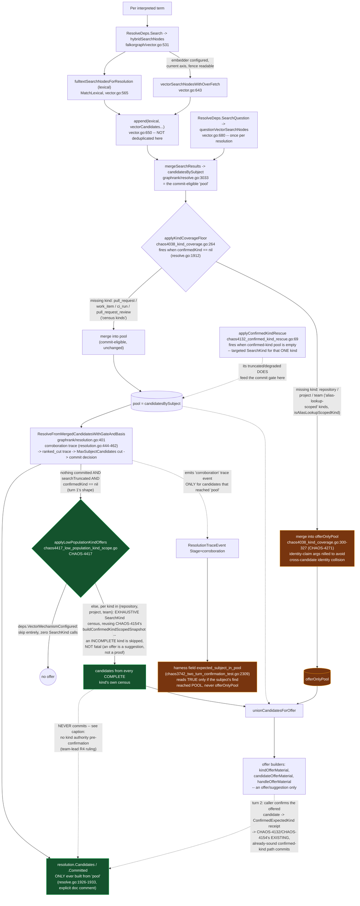

**Caption.** Every resolution builds candidates through two independently
merged mechanisms — ordinary unscoped lexical+vector search
(`hybridSearchNodes`) and a kind-scoped, lexical-only `SearchKind` pass used
by the CHAOS-4038 coverage floor and the CHAOS-4132 confirmed-kind rescue.
The floor's own split (CHAOS-4271, `chaos4038_kind_coverage.go:300-327`) is
the load-bearing fact this diagram exists to draw: a find for one of the
four "census kinds" (pull request, work item, CI run, review) merges into
the same `pool` the commit gate reads, but a find for repository, project,
or team merges into a **separate `offerOnlyPool`** that only ever reaches
offer builders — `ResolveFromMergedCandidatesWithGateAndBasis` builds its
ranked/committed candidates exclusively from `pool`, never
`offerOnlyPool`, by explicit construction (`resolve.go:1926-1933`). This is
also why the harness's `expected_subject_in_pool` field can read **false**
for a repository/project/team subject that was genuinely retrieved and
offered: the "corroboration" trace event that field scans for is only
emitted for candidates in `pool`. `wrong_commit=0` on such a run proves no
*wrong* subject was affirmed — it says nothing about whether the *right*
subject was ever a reachable commit candidate, because an offer-only hit
was never in a position to become one. This split is the mechanism behind
CHAOS-4348 (project/team subjects showing 0/20 "in pool" on 2026-08-26,
`.remember/now.md:73`) and the reason CHAOS-4347's fact-routing work
started from a false premise of unreachability rather than the real
gap — missing facts, not missing pool membership (see diagram 4).

**CHAOS-4417 (repository/project/team, PRE-confirmation, OFFER-only):**
even when a find genuinely reaches `pool`, `resolution.go`'s commit-gate
switch checks resolution-wide `searchTruncated` before LoneFloor/TopFloor
-- a single unscoped `Search`/`SearchQuestion` call truncating on a
HIGH-population kind (e.g. 37,001 `ci_pipeline_run` nodes) forces the
whole resolution `ambiguous`, even for a genuinely lone, low-population
repository/project/team candidate the SAME call also found, and the
shared cut can ALSO crowd such a candidate out of the offer boundary
entirely. CHAOS-4154 already built an isolated-census-and-re-decide
mechanism for a RECEIPT-confirmed kind (`confirmedKind != nil`), but that
mechanism's soundness rests on CALLER AUTHORITY: a confirmed kind makes
every OTHER kind categorically out of scope, not merely improbable, which
is what lets it safely bypass `searchTruncated` for a STATISTICAL
LoneFloor/TopFloor commit. CHAOS-4417 has no such authority
pre-confirmation -- `request.ExpectedKinds` (the only "the interpreted
question implies a kind" signal available) is DELIBERATELY walled off
from candidate-pool narrowing today without the CHAOS-3972
`kindInsensitivityProof` precondition (`ports.go`'s own doc comment) --
so an earlier LoneFloor-commit design for this ticket (codex rounds 1-3,
CHAOS-4417 PR #320) was caught unsound at R3: only STRING EQUALITY can
survive resolution-wide truncation (`internal/contextfabric/AGENTS.md:313`,
CHAOS-3810 -- "no unseen row can outrank it"), never a statistical
ranking decided over a population this ticket cannot prove complete for
every kind that could rank above it.
**Team-lead R4 ruling: this rescue NEVER commits.** It reuses
`buildConfirmedKindScopedSnapshot` PRE-confirmation, for the fixed,
small, identity-census-enumerable kind set (`isAliasLookupScopedKind`)
only, to produce OFFER candidates -- the SAME "additive, never touches
`pool`/`candidatesBySubject`" contract CHAOS-4038's own coverage floor
already carries for these three kinds, just EXHAUSTIVE rather than
bounded/early-exit. An incomplete kind's own census is skipped, not
fatal (an offer is a suggestion, not a proof, so the fail-closed
discipline a commit needs does not apply); a live vector mechanism still
skips the whole pass up front (buildConfirmedKindScopedSnapshot can never
prove completeness there). The offered candidates join `coverageCandidates`
into the SAME `unionCandidatesForOffer` union CHAOS-4038 already feeds --
one bucket, one contract. Commit still happens ONLY through the EXISTING,
already-sound CHAOS-4132/CHAOS-4154 confirmed-kind path once the caller
confirms the offered candidate at turn 2 -- the two-turn shape the corpus
harness measures directly. Follow-up ticket (not built here): "Turn-1
commit under interpretation kind authority requires kindInsensitivityProof
wiring" (CF, Medium, related 4417/3972).

**In-flight fix (not yet merged as of this writing):** `lane-4347-project`
(branch `chaos-4348-project-team-pool`) is building two new search arms
scoped to repository/project/team (`graphrank/chaos4348_reachability.go`,
`falkorgraph/chaos4348_exact_name.go`) that merge into the real `pool`
through the existing identity-collision guard, plus confirms two more
contributing mechanisms not drawn above: ordinary unscoped `Search`/
`SearchQuestion` lose the fulltext ranking race for these kinds against
~34,000+ activity nodes sharing a token (`resolve.go` per-term loop,
~line 1713), and `IsObservationAttributionRelation`
(`graphrank/subject.go:208`) is a closed 2-member set that has nothing to
do with `BELONGS_TO_PROJECT`/`OWNED_BY_TEAM`, so observation-traversal
does not cover the project/team edges either. Update this diagram in the
same PR that merges that fix, per the update rule above.

---

## 3 — Subject hierarchy and graph data model

Node/edge shape verified live against the kiac trial graph (org
`70d529e0-3c06-4597-8480-794fd02328b6`, `GRAPH.QUERY acr-cf-fa7030e2106de7411bfbf8ebce74c620-e2`,
2026-08-26). All nodes carry label `Subject` with a `subject_kind` property;
all edges carry relationship type `Relates` with a `relation_type` property
(never a distinct Cypher relationship type per edge kind).

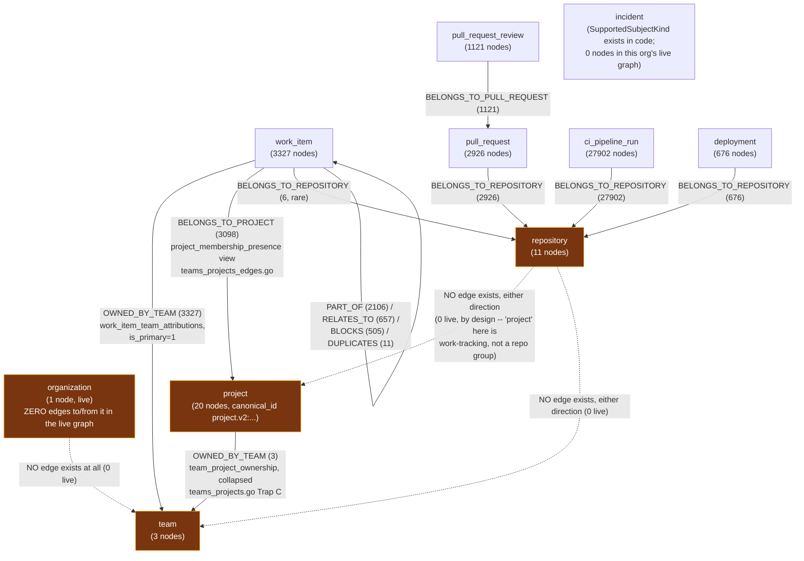

**Caption.** The hierarchy is **not** organization → team → project →
repository → activity. Live data shows organization has zero edges to
anything, and there is **no direct repository↔project or repository↔team
edge at all, by design**
(`docs/design/context-fabric-team-project-subjects.md` §9: "No new fact
providers... project gets zero fact-provider entries... `project` here is a
work-tracking project, Linear-shaped, not a repository group. There is no
direct project↔repository edge"). The only path from a project or team to
a repository-scoped activity kind (PR, review, CI run, deployment) is
**through `work_item`** — `project <-BELONGS_TO_PROJECT- work_item
-BELONGS_TO_REPOSITORY-> repository -BELONGS_TO_REPOSITORY<-
{pull_request, ci_pipeline_run, deployment}`
(`docs/design/context-fabric-fact-scope.md` §1) — and that chain is
explicitly an **activity proxy**, never an ownership claim: "repositories
with at least one project-linked work item," disclosed as such via
`FactScopeBasisActivityProxy`. Producers: work_item edges from
`internal/contextfabric/devhealthsource/teams_projects_edges.go`
(`querySubjectProjectMemberships`, `queryWorkItemTeams`); repository/PR/CI/
deployment/review edges from `devhealthsource/tables.go`; project→team from
`teams_projects.go`. `incident` is a `SubjectKind` the code supports
end-to-end but this org's live graph currently has zero incident nodes —
absence of evidence, not absence of a code path.

**Team authorization (2026-08-28, CHAOS-4390, MERGED #313) and cohort
retrieval (CHAOS-4395, IN FLIGHT, not yet merged as of this writing):** team
nodes' `authorization_repositories` is now derived from `team_repo_ownership`
at projection time (never left empty — an empty list falls back to a shared
wildcard convention that over-exposed every team to every repository-scoped
principal until this fix, #313). Cohort discovery (`DiscoverContext`) still
sources members from `fulltextSearchNodes` only on `main` as of this writing
— #314/CHAOS-4395, which adds `ExactNameCandidates`/kind census so a termless
"which teams..." question can populate a cohort at all, is open but not
merged. Full corrected mechanism, the pipeline this feeds into
(ranking/drivers/Rows), and the score formula:
[context-fabric-subject-model-and-cohort-answers.md](context-fabric-subject-model-and-cohort-answers.md).

**Clarification (CHAOS-4363):** the "NO edge exists" markers above describe
the **graph** projection only. `HealthProvider`'s new project-subject rollup
(diagram 4) reads `team_repo_ownership` directly off **ClickHouse** -- a
real per-team repository-ownership table this package had not read before
-- to chain `project -> team_project_ownership -> team_repo_ownership ->
repository` for the `compounding_risk_daily` repo layer. That is a
ClickHouse fact-producer join, not a graph edge: it does not add a
`REPO -> TEAM`/`REPO -> PROJ` edge to this diagram, and the live trial data
plane currently holds zero `team_repo_ownership` rows for the org above (an
upstream ingestion gap, not a producer defect -- see this ticket's CH
readback evidence).

**Update (2026-08-30, CHAOS-4577):** that zero-row gap also starves
`queryTeams`' authorization join above -- with no CURRENT `team_repo_ownership`
row, every Team node is stamped with CHAOS-4390's fail-closed sentinel
(`acr-context-fabric:no-team-repository-ownership`) instead of real owned
repositories, so a repository-scoped principal (Ask Dev's only kind) is
denied every team and the North Star teams question always terminates
`no_match`. `deploy/local/trial-data.sh seed-team-repo-ownership` now seeds
CURRENT rows for the documented local trial org (`deploy/local/README.md`
traps #10) so a graph rebuilt on this plane authorizes teams as prod does;
run it once after `restore-clickhouse`, before `acr-projector rebuild`. Prod
itself is unaffected (real `team_repo_ownership` rows exist there since
2026-08-29 14:00Z) -- this closes the trial/kiac-only exposure.

**Stale doc comment found (report only, no Go edit per this lane's scope):**
`internal/contextfabric/devhealthsource/teams_projects.go:54` and
`internal/contextfabric/devhealthsource/clickhouse.go:29` both assert,
in a CHAOS-3898-era comment, "live-verified zero project.v2:-shaped nodes
exist anywhere in that org's graph today." The live kiac graph now holds 20
project nodes, every one with a `project.v2:<provider>:<id>` canonical id
(e.g. `project.v2:linear:2fb2c2b3-c52a-441a-b5f6-0453ce894e32`) — a rebuild
has happened since that comment was written (the graph is on lifecycle
epoch 2). The comment is a historical decision record (why the version was
bumped) and is not wrong about *why*, but its present-tense "today" claim is
stale and could mislead a reader checking current graph state.

---

## 4 — Fact data model

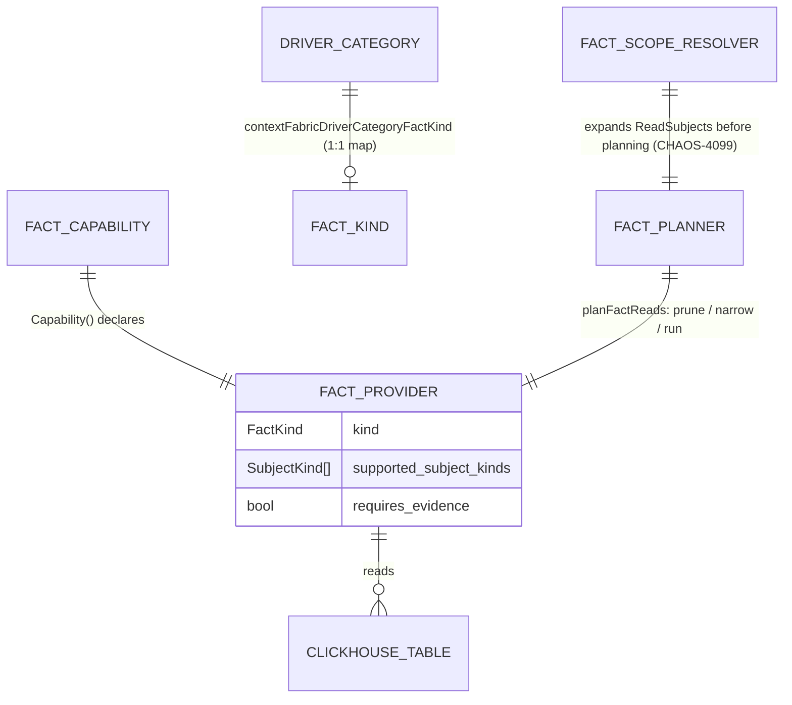

**21 registered `FactProvider`s** (`internal/contextfabric/devhealthfacts`,
wired at `NewProviders`, `providers.go:14-37`; composed at
`internal/runtime/hosted/open.go:597`):

**Updated 2026-08-27 (CHAOS-4364, `lane-4364-flow`):** two NEW v1-additive
FactKinds, `flow` and `landscape` (`flow.go`, `landscape.go`), following
CHAOS-4347's own "widen by a real table join, never a proxy" discipline.
Both are added to `statusCategoryFactKindComposition`'s `team` entry
(`chaos4347_status_category_composition.go`) — hand-merged with CHAOS-4363's
concurrent `investment` addition to the SAME entry, so `team` now composes
`{health, workload, readiness, investment, flow, landscape}` (all six).
`project`'s FIRST entry (codex R2 fix, CHAOS-4364) composes every kind of
those six whose `Capability()` actually supports `SubjectProject` — which
is all six, since CHAOS-4363 already widened health/workload/readiness/
investment to answer for a project directly (see the CHAOS-4363 update
below) by the time this ticket rebased onto it.

**Updated 2026-08-26/27 (CHAOS-4347, `lane-4347-ch`, PR #300):** the
`metrics`/`continuous_integration`/`deployments` rows below are widened by
REAL table joins/reads, never by proxying one kind's data as another's —
see `metrics.go`'s package doc comment
(`internal/contextfabric/devhealthfacts/metrics.go:1-83`) and
`context-fabric-fact-scope.md` §11 for why this is architecturally
distinct from a `FactReadScopeResolver` expansion (the resolver grants a
disclosed READ permission onto a kind a capability does NOT itself
support; this widening gives the capability a genuine second/third
source for the SAME kind).

| FactKind | ClickHouse table | Supported subject kinds |
| --- | --- | --- |
| identity | `repos`, `work_items` | repository, work_item |
| membership | `repos`, `work_items` ⋈ `repos` | repository, work_item |
| status | `work_items` | work_item |
| work | `work_items` | work_item |
| actual_completion | `work_items` | work_item |
| blockers | `work_item_dependencies` | work_item |
| required_children | `work_item_dependencies` | work_item |
| pull_requests | `git_pull_requests` | pull_request |
| reviews | `git_pull_request_reviews` | pull_request_review |
| continuous_integration | `ci_pipeline_runs` (per-run status); **+`cicd_metrics_daily`** (repository aggregate, CHAOS-4347) | ci_pipeline_run, **repository** |
| deployments | `deployments` (per-deployment status/environment); **+`deploy_metrics_daily`** (repository aggregate, CHAOS-4347) | deployment, **repository** |
| incidents | `operational_incidents` | incident |
| metrics | `repo_metrics_daily` — **own raw query (not `readers.ReadRepositoryMetrics`, which collapses to one row), `daily_metrics` per-day Rows table over the caller's own evidence window (explicit Start/End verbatim, else the platform's 90-day default policy width — CHAOS-4418)**; **+`team_metrics_daily`** (team, direct, still one-row scalar); **+`team_project_ownership` ⋈ `team_metrics_daily`** (project, summed-counts rollup, CHAOS-4347) | repository, **team, project** |
| health | `compounding_risk_daily` — scalar `severity`/`compounding_risk` **+ `risk_rules` Rows table, one row per formula component (churn/complexity/ownership/review norm × weight, CHAOS-4418)**, repository and team; **+`team_project_ownership` ⋈ `compounding_risk_daily` (team layer) and +`team_project_ownership` ⋈ `team_repo_ownership` ⋈ `compounding_risk_daily` (repo layer, one hop further), both landing in one `risk_breakdown` Rows table (project, CHAOS-4363)** | repository, team, **project** |
| workload | `capacity_forecasts`; **+`team_project_ownership` ⋈ `capacity_forecasts`, per-team `team_breakdown` Rows, never summed/averaged (project, CHAOS-4363)** | team, **project** |
| investment | `investment_metrics_daily`; **+`team_project_ownership` ⋈ `investment_metrics_daily`, per-team `team_breakdown` Rows, never summed across (investment_area, project_stream) (project, CHAOS-4363)**; **+`work_unit_investments` ⋈ `work_item_team_attributions` (CHAOS-4398), the CANONICAL 5-theme distribution — `theme_*`/`theme_quality_bugfix`/`prior_theme_*` SCALAR fields on the SAME team fact, never `investment_metrics_daily`'s deprecated legacy taxonomy; see §7** | team, **project** |
| readiness | `estimate_coverage_metrics_daily`; **+`team_project_ownership` ⋈ `estimate_coverage_metrics_daily`, per-team `team_breakdown` Rows, never summed across work scopes (project, CHAOS-4363)** | team, **project** |
| operational_deficiencies | `recommendations_daily` | team |
| source_health | `backfill_log` | organization |
| flow (CHAOS-4364) | `work_item_metrics_daily` (team, per-scope Rows; `work_item_cycle_times`'s flow_efficiency is DELIBERATELY NOT read -- ops sink omits it, see flow.go's doc comment); **+`team_project_ownership` ⋈ `work_item_metrics_daily`**, summed/averaged across a team's own (provider, work_scope_id) rows into one row per team (project, codex R2 fix); **+`repo_metrics_daily`** (repository, PR pickup/review timings, distinct shape) | team, project, repository |
| landscape (CHAOS-4364) | `ic_landscape_rolling_30d` aggregated to (team, map_name) — never per-identity (no person-to-person ranking); **+`team_project_ownership` ⋈ `ic_landscape_rolling_30d`** (project, owning-teams rollup) | team, project |

**`FactMetrics`'s project rollup never averages a rate across
differently-sized teams.** Additive counts (commits, after-hours/weekend
commit counts) are SUMMED across the project's current owning teams
(`team_project_ownership`, `valid_to IS NULL` / as-of the requested
instant); each team's own rate (e.g. `after_hours_commit_ratio`) rides
unmodified in a new per-team `team_breakdown` field instead, disclosed via
a `rollup_basis` field on the fact. This is what
`ContextFabricClaimedFact.Rows` / `ContextFabricProjectedFact.Rows`
(new, additive, `context_fabric_types.go` / `context_fabric_answer_projection.go`,
CHAOS-4347) exist for: a renderable table on a fact/claim whose evidence
is genuinely a set of rows, not a lossy single scalar. Deliberately does
NOT touch `ContextFabricScalarValue` itself (also the projection-write
contract's property-value type, which documents "nested objects and
arrays remain disallowed" as a deliberate invariant for THAT surface).
**Updated 2026-08-27 (CHAOS-4355): now wired into synthesis.** A driver's
cited claim now carries `Rows`: `attachCanonicalRows`
(`internal/contextfabric/model_runtime.go`), the one place a `ClaimedFact.Rows`
is ever set, copies it verbatim from the canonical fact each claim cites,
immediately after `SynthesisDraft.ValidateAgainst` passes.
`answerprojection.Project` carries it through unchanged (`project.go`'s
`projectDrivers`, unchanged since #300).

**Updated 2026-08-31 (CHAOS-4637 / S6): the rows now say what they ARE.**
`ContextFabricClaimedFact.table` / `ContextFabricProjectedFact.table` (new,
additive, OPTIONAL) carry the producer's CHAOS-4633 `FactTable` declaration —
`shape` (`time_series` / `breakdown` / `ranking`), the COMPOSITE `key`,
`measures`, `order_by` — beside the rows they describe. `canonicalFieldTable`
reads it off the SAME field `canonicalRowsField` chose for the rows, so the
declaration and the rows can never come from two different fields: a
divergence there would be invisible on the wire and would make the
declaration a lie rather than a guard. Absent means undeclared, and an
undeclared table is never charted (§8).

**Correction, same day (CHAOS-4355 follow-up):** the paragraph above
originally claimed "the prompt itself was NOT changed -- the model is never
told Rows exist." That was never actually true and was never verified
against the running code: `synthesisInputFromDomain`
(`internal/contextfabric/genkitruntime/runtime.go`) put `input.Facts.Facts`
straight into the `canonical_facts` prompt payload, unfiltered, since
CHAOS-4347 (#300) first added `FactValue.Rows` -- any producer's
Rows-shaped field (by CHAOS-4364, six of them: health/workload/readiness/
investment/flow/landscape) was serialized to the model verbatim. This is
exactly what taught the model to echo a fabricated `Rows` array back onto
its own `ClaimedFacts`, which `ValidateAgainst` unconditionally rejects --
the kiac pilot rev 19 3/3 `synthesis_rejected` 422s (CHAOS-4355 diagnosis,
19:10 08-27), live-reproduced again through the Workbench during this
follow-up. The fix: `modelFacingFacts` (same file) drops every Rows-shaped
field from the canonical facts BEFORE they reach the prompt -- the model
still sees every scalar field on the same fact, just never the table --
and `StripModelAuthoredClaimedFactRows` (`internal/contextfabric/model_runtime.go`)
tolerates (strips, with `cf_model_rows_stripped` telemetry) a claim that
still authors `Rows` despite that, rather than rejecting the whole answer.
`ValidateAgainst` itself is UNCHANGED and still rejects a model-authored
`Rows` unconditionally (defense in depth); `diagnoseSynthesisDraftBound`
now mirrors that check so a bypass of the strip is at least diagnosable
(`violated_bound`/`claim_index`, logged server-side, not only in the
response body). The SYSTEM prompt template text (`synthesisSystemPrompt`)
is unchanged, but `modelFacingFacts` genuinely changes what bytes
`synthesisInputFromDomain` sends the model -- codex R1 correctly flagged
that as a "prompt change" under this constant's own standing rule, since
the reuse key binds on it: `DefaultSynthesisPromptVersion` moved
`v12` -> `v13` so a row saved under the OLD (Rows-visible) payload can
never satisfy a reuse lookup as though it were generated under the NEW
(Rows-excluded) one. The sidecar's own answer-rendering
closure test (`internal/sidecar/render_answer_untrusted_test.go`) still
carves out the render-layer half of this: a claim can now carry Rows, but
nothing in `dev-health-web`/Ask Dev renders them yet (see
`context-fabric-fact-scope.md` for the exact projected shape a renderer
would consume).

**Gated off: `evidence` (1 kind, not 8).** `doc.go:37-46` and
`providers_test.go:48-52` name exactly one deliberately unregistered
`FactKind` — no ClickHouse table maps honestly to it (`report_provenance`
exists but is empty in every environment; no subject-ID convention for
`artifact_id`/`plan_id`). `internal/contracts/v1/context_fabric_types.go:313-332`
declares 20 `ContextFabricFactKind` members total: the 19 above + `evidence`.

**Stale claim found:** `internal/contextfabric/AGENTS.md`'s WHERE-TO-LOOK
table (line 45) reads "ClickHouse-backed `FactProvider`s; 8 fact kinds gated
off (no canonical source)." Only 1 is gated off in code today. The "8" most
likely conflates with the 8 unread CH tables below — report to team-lead;
not corrected in this PR (docs-only, different file, out of this page's
scope, flagging per this lane's discrepancy-reporting mandate).

**Update (CHAOS-4347, PR #300): 3 of the original 8 CH tables now have a
reading `FactProvider`** — `team_metrics_daily`, `cicd_metrics_daily`,
`deploy_metrics_daily` (see the widened table above). Their production
column types were verified LIVE off the kiac trial ClickHouse
(`system.columns`, `kubectl exec` into the `trial-clickhouse` pod, ns
`acr-trial-data`) and added to `devhealthschema`'s shared production
declaration, not inferred from the ops migration files alone.

**5 CH tables still have no reading `FactProvider`** (unchanged, repo-wide
`rg`, zero hits in any `internal/contextfabric/**/*.go` read path):
`dora_metrics_daily`, `work_item_metrics_daily`, `issue_type_metrics_daily`,
`user_metrics_daily`, `ai_impact_metrics_daily`. **Correction to this
page's own earlier text:** `dora_metrics_daily` is keyed by
**`repo_id`**, not `team_id` (`repo_id UUID, day Date, metric_name String,
value Float64` — verified against both the ops migration
(`023b_dora_metrics.sql`) and the live kiac schema) — an earlier framing
of this table as team-scoped was wrong; it was out of scope for the
metrics team/project widening for exactly that reason, not merely
unstarted. (One unrelated hit remains: `cicd_metrics_daily` also appears
in a trial-harness table-name classification map,
`internal/runtime/hosted/frontier_trial_live_test.go:1459`, explicitly
commented as not a read or a schema declaration — that reference is
unrelated to the new FactProvider read path above.)

**Category → FactKind is a 1:1 map today, and that is CHAOS-4347's other
half.** `contextFabricDriverCategoryFactKind`
(`internal/contracts/v1/context_fabric_types.go:483-498`) maps exactly 14 of
16 driver categories to exactly one `FactKind` each (`relationship` and
`narrative` map to none — no canonical fact backs either judgment kind).
Because the map is 1:1, `status` routes only to `FactStatus`
(work_item-only, per the table above) — a repository- or project-scoped
"status" question has no fact route by construction, not because the
subject is unreachable (diagram 3 shows it usually is reachable). Ruled
2026-08-26 (`cf-rulings.md:316`, chris): a new v1 `FactKind` (working name
`project_status`) or a widened `StatusProvider.SupportedSubjectKinds` is the
fix, lane's choice; approved in principle, implementation "Phase 2 held
pending trial-case validation" as of 17:42 PDT — **not yet in
`context_fabric_types.go` on `main`**.

**Correction (flagged by lane-4347-ch, not fixed in this PR — out of this
lane's scope): the paragraph above is now stale.** `lane-4335`'s CHAOS-4347
PR #298 (`internal/contextfabric/chaos4347_status_category_composition.go`)
merged as `1e9815c7`, ahead of this page's own cited baseline `569f0f39`.
It does not touch the 1:1 `contextFabricDriverCategoryFactKind` map itself,
but adds a composition step (`composeStatusCategoryRequirements`) between
that map and the providers: a resolved-subject-kind repository/team
`status` requirement now expands into repository→{metrics, health,
identity} / team→{health, workload, readiness} before planning, so
"status routes only to FactStatus" is no longer true post-resolution for
those two kinds (work_item stays 1:1). The `project_status`
new-FactKind-vs-widen-`StatusProvider` decision above is unaffected and
still open — that is a separate, still-unbuilt slice
(`lane-4347-project`, CHAOS-4348 reachability work is currently ahead of
it in that lane's queue).

**Update (CHAOS-4363, 4347-A, routing slice):** `statusCategoryFactKindComposition`'s
`SubjectTeam` entry now also composes `FactInvestment`, so the team leg of
the paragraph above was `team→{health, workload, readiness, investment}`
at this ticket's own tip; CHAOS-4364 (rebased on top, see above) adds
`flow`/`landscape` to the same entry and adds the first `project` entry.
Repository's set is unchanged.

**Update (CHAOS-4363, 4347-A, producer slice — completes this ticket):**
investment/workload/readiness/health (see the widened table above) all now
answer for a **project** subject directly, by a real
`team_project_ownership` join (health also chains one hop further through
`team_repo_ownership`) -- the SAME real-join pattern `metrics.go` set for
`FactMetrics` in CHAOS-4347, never the `FactReadScopeResolver` activity-proxy
route. Unlike `FactMetrics`' commit counts, none of these four sum or
average across owning teams: each source table partitions by a dimension
(`investment_area`/`project_stream`, `work_scope_id`, or the forecast's own
Monte Carlo statistics) that would be meaningless mixed across teams, so
every project-level fact instead carries a `team_breakdown` (or, for health,
`risk_breakdown`) `Rows` table with each contributing team's (and, for
health, repository's) own row verbatim, disclosed via `rollup_basis`. A
project-status question now reaches ≥3 `Rows` tables (investment, backlog
risk via workload/readiness, completion risk via health) with a `team_name`
axis, per this ticket's acceptance criterion. `investment_classifications_daily`
is deliberately NOT read for the "classification breakdown" the ticket
proposed: its live production schema (`system.columns`, kiac trial
ClickHouse, 2026-08-27) carries `repo_id`/`artifact_id`/`artifact_type`, no
`team_id` column at all -- the same "no team-keyed source" gap CHAOS-4347's
disposition inventory found for cognitive load (`user_metrics_daily`).

**Live data gap disclosed, not hidden (CH readback, 2026-08-27, org
`70d529e0-3c06-4597-8480-794fd02328b6`):** investment (6 rows), workload (12
rows), and readiness (17 rows) each returned real, non-zero rows for the
project `linear:CHAOS` is currently owned by. Health's project rollup
returned **zero** rows against this data plane -- verified as a genuine
upstream ingestion gap, not a query defect: `compounding_risk_daily` holds
2455 `repo`-scope rows for this org and **zero** `team`-scope rows, and
`team_repo_ownership` holds **zero** rows across every org in this data
plane. The query itself is proven correct by this package's own unit tests
(synthetic fixtures exercising both UNION branches) AND a real-ClickHouse
integration test (`chaos4363_project_rollups_integration_test.go`) that
seeds both a team-scope and a repo-scope row and asserts both survive in one
read. A "completion risk" Rows table for a project therefore will not
populate on THIS pilot data until Ops backfills team-scope
`compounding_risk_daily` and/or `team_repo_ownership` -- flagged to
team-lead as a follow-up, out of this ticket's ACR-side scope.

**Codex round-1 findings, all fixed (CHAOS-4363):** (1) each project
rollup's breakdown Rows table is now capped at 64 entries
(`maxProjectRollupBreakdownRows`, shared.go) before `RowsFactValue` --
`FactValue.Validate` rejects a table over that bound outright, which would
otherwise turn a large project's fact into a hard read error instead of a
truncated answer; (2) `QueryVersion` bumped `v1` -> `v2` (a conjunctive
answer-reuse key dimension shared by every capability in this package, so
this bump invalidates ALL prior reuse candidates, not only the four changed
kinds -- the safe direction); (3) health's team+repo UNION ALL is now
wrapped in an outer `SELECT ... ORDER BY ... LIMIT`, since appending LIMIT
directly after two UNION ALL'd SELECTs binds only to the second (repo)
branch in ClickHouse, and UNION ALL's own output order is otherwise
unspecified; (4) `readProjectInvestment` now counts (not silently drops) a
row omitted for `churn_loc` UInt64 overflow, folding it into
`OmittedCount`/`Truncated` the same way the team-level read already did;
(5) `team_repo_ownership` added to `devhealthschema`'s production column
declaration and to a new real-ClickHouse integration test -- it had no
production-typed test coverage at all before this fix.

`FactCapability.SupportedSubjectKinds` (`fact_registry.go:50-58`) is set
once, in each provider's own `Capability()` method — code-declared, never
model/phrasing-derived (`internal/contextfabric/AGENTS.md:49`).
`planFactReads` (`fact_planner.go:183`) compares resolved subjects against
that declared set and prunes/narrows before any provider runs; the
`FactReadScopeResolver` (`fact_scope.go`, CHAOS-4099, **activated** —
project and team policies both ruled and shipped, `context-fabric-fact-scope.md`
§9-10) sits one seam earlier, expanding a project/team origin to its
activity-proxy repositories/PRs/reviews so the honest "unexpanded, but
reachable" disclosure replaces a false "pruned, proven absent" one where a
verified typed chain exists.

---

## 5 — Two-turn trial harness measurement map

```mermaid
flowchart LR
  subgraph RES["Resolution hop"]
    A1["expected_subject_in_pool<br/>chaos3742_two_turn_confirmation_test.go:2309<br/>reads 'corroboration' trace -- TRACE-WIDE,<br/>true if reached POOL anywhere in the call<br/>(diagram 2: never true for offerOnlyPool hits)"]
    A2["expected_subject_rank /<br/>expected_subject_at_offer_boundary<br/>reads 'ranked_cut' trace (resolve.go:943-961)<br/>-- CALL-BOUNDARY scoped, after the final cut"]
  end
  subgraph COMMIT["Commit hop"]
    B1["committed_count<br/>= len(SubjectResolution.Committed)"]
    B2["wrong_commit<br/>twoTurnCommittedWrong -- FALSE when<br/>committed_count==0 too, not just when correct"]
  end
  subgraph WGATE["Regime-A window-gate hop"]
    C1["window_gated_count<br/>Turn2=clarification_required AND<br/>TierRoutedCorrectly AND committed_count==0"]
    C2["window_gated_offered / _silent /<br/>_already_widest_count<br/>PRs #292/#293/#294 -- partitions window_gated_count<br/>by whether window_expand was recommended"]
  end
  subgraph SYNTH["Synthesis/terminal hop"]
    D1["false_no_match<br/>expectID!='' AND status==no_match"]
    D2["answer_rate NUMERATOR (CHAOS-4525)<br/>anchored: complete AND claimed_facts&gt;=1<br/>cohort: (complete|partial|degraded)<br/>AND claimed_facts&gt;=1<br/>AND cohort_ranked_member_count&gt;=1"]
    D3["answer_rate DENOMINATOR (CHAOS-4525)<br/>arm==positive AND<br/>(expected_id!='' OR cohort_answer_expected)<br/>cohort_answer_expected = annex<br/>census.terminal_expectation=='aggregate_assessment'"]
    D3 --> D2
  end
  subgraph MISSING["No field exists for this hop"]
    E1["canonical_facts_count -- NOT a real field.<br/>No per-case field measures fact-planning/<br/>ReadFacts output count anywhere in the harness."]
  end

  RES -->|"pool membership proves NEITHER<br/>offer-eligibility NOR commit"| COMMIT
  COMMIT -->|"wrong_commit=0 alone proves only<br/>'no incorrect commit', never 'reachable'"| WGATE
  WGATE -->|"fires only on the regime-A gate;<br/>says nothing about pool or commit"| SYNTH

  classDef gap fill:#78350f,stroke:#f59e0b,color:#ffffff
  classDef fixed fill:#14532d,stroke:#22c55e,color:#ffffff
  class A1,E1 gap
  class B2 fixed
```

**Caption.** Five field families, five different hops, and none of them
implies another. `expected_subject_in_pool` is the crux of the incident this
page exists to prevent a repeat of: it is scanned from a "corroboration"
trace event emitted only for candidates that reached the commit-eligible
`pool` (diagram 2) — a repository/project/team subject correctly retrieved
into the CHAOS-4271 `offerOnlyPool` reads **false** here even though it was
genuinely found and offered. `wrong_commit=0` is the second trap: the field
is `false` both when the commit was correct and when nothing committed at
all, so it certifies safety, never reachability. `window_gated_*` measures
a completely separate concern — whether the CHAOS-4040 regime-A gate fired
and disclosed a window-widening offer — and has no bearing on pool or
commit correctness. **`canonical_facts_count`, named in this diagram's
original brief, does not exist in the harness as a field** — no
`twoTurnCaseResult` field, no `cmd/acr-trial-merge-two-turn/main.go` report
field, projects fact-planning/`ReadFacts` output count. Flagged to
team-lead as aspirational, not a stale-vs-current discrepancy, since no
prior doc claimed it existed.

**The answer-rate denominator is the sixth hop, and it was silently
class-blind until CHAOS-4525.** `answer_rate` (CHAOS-4386) asks "of the
questions whose oracle expects an answer, how many got one" — and it read
"the oracle expects an answer" as `expected_id != ""`. That is a correct
test for an ANCHORED subject question and a false negative for a
discovered cohort: a cohort question's answer IS the ranked cohort, so its
annex entry carries `anchor.positive_key: null` by construction and its
corpus row's `expect_id` is empty. Every `cohort_assessment` case in ext65
therefore sat outside the denominator no matter what it did — including
the North Star's own team-cohort bar question, which CHAOS-4450 (Run J)
found the corpus could not express in an answerable band at all. CHAOS-4525
adds the seeds AND the second gate: `cohort_answer_expected`, read from the
annex's own `oracles.census.terminal_expectation`, admitted only for
`aggregate_assessment`. `witnessed_no_match` (index 61) and
`clarification_required` (index 63) stay out on purpose — their correct
terminal state is a refusal or a question, and counting them as unanswered
would penalise correct behaviour. The two gates are a union: an anchored
case still qualifies on `expected_id` alone.

**The numerator is class-shaped too, for a measured reason.** It required
`terminal_status == "complete"`, which is right for an anchored subject
answer and wrong for a cohort: CHAOS-4522's first successful cohort answer
against real data is delivered as **`degraded`, with claimed facts and three
ranked teams** — a real answer, in the user's hands, that a complete-only
numerator scores 0. `degraded` is the honest status there under North Star
check 12, because some members genuinely have thin evidence; scoring it 0
would penalise the contract for telling the truth about its own coverage and
would make `answer_rate` read "still broken" for exactly the outcome the fix
produces. So cohort rows admit `complete`/`partial`/`degraded` and add a
condition anchored rows do not have: at least one **ranked** member
(`ContextFabricCohortMember.RankingComputed`, never `len(Members)`). That
third condition is what keeps the loosening honest — without it, a delivered
cohort object full of merely-discovered, unscored members would score the
same as a ranked, driver-backed answer. `clarification_required` and
`no_match` remain unanswered for both classes.

---

## 6 — N-turn confirmation-carry class (CHAOS-4360)

The two-turn harness (§5) never sends a third request — every arm it
defines is a fixed two-call shape. CHAOS-4355's live walkthrough (13:40
08-27) found a defect that shape structurally cannot see: the live
Workbench batches window+candidate receipts into one turn-2 call, which
can leave candidate unresolved (superseded by the SAME call's own
window-driven pool change) and forces a third turn redeeming a FRESH
candidate offer. This harness reproduces the underlying CHAOS-4360 gap
directly, WITHOUT depending on that specific supersession path: it
deliberately never batches window and candidate in the same call at all
(codex review round 2, P1 — see `runNTurnCase`'s own doc comment) — window
alone on one turn, candidate alone on a LATER turn — which guarantees any
case needing both members takes a genuine third turn and isolates the
carry gap precisely: nothing carries the confirmed window across that
turn-2→turn-3 boundary server-side (this ticket's own acr half), so it
arrives inferred again and the candidate redemption cannot land.
`chaos4360_nturn_confirmation_test.go` is the harness that walks this —
`TestChaos4360NTurnConfirmationCarry` (live, kiac) and
`TestChaos4360NTurnCarryDetectsCurrentDefect` (fixture, red-first).

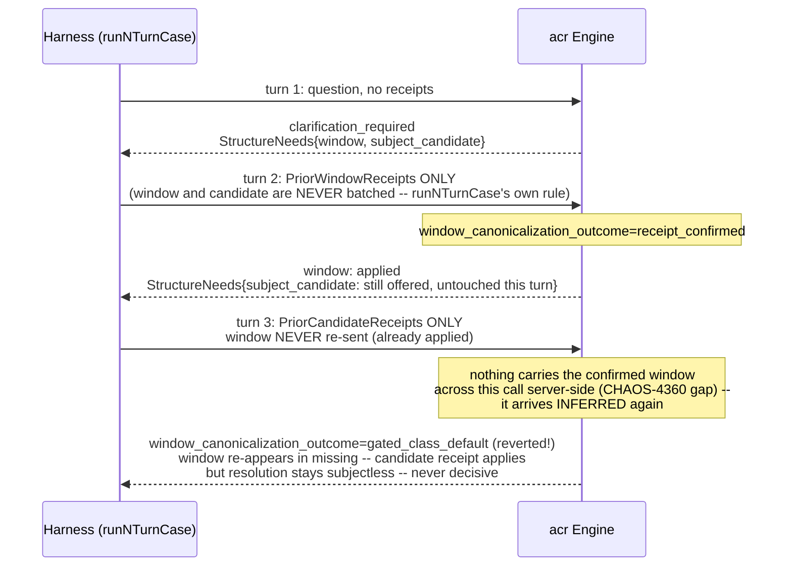

**Carry measurement.** `ContextFabricConfirmedStructureEntry.Source`
already carries a closed pre-CHAOS-4360 vocabulary of exactly three values
(`receipt`, `explicit`, `explicit_unattributed` — `nTurnKnownPreCarrySource`).
Per lane-4360-acr (PR #306, team communication 2026-08-27): a carried
window keeps `Provenance=clarification_confirmed` unchanged and instead
reports the carry on `Source`, a new closed-vocab value `"carried"`. The
harness reads `Source` generically (`nTurnIsCarriedSource`, the primary
signal) and `Provenance` generically as a secondary, forward-compatible
one (`nTurnIsCarriedProvenance`): any value outside the known set on either
field is, by construction, a new carry tier lane-4360-acr mints — the
class runs green on `origin/main` today (neither field can carry an
out-of-vocabulary value yet) and starts measuring the fix the moment it
ships, with no harness-side code change and no coordination on an exact
new spelling.

**RED baseline (2026-08-27, kiac, cases 57/60 — the project-candidate
class this ticket seeds from; indices only, no question text; predates
lane-4360-acr's own carry fix, PR #306, still in review at the time of this
run).** Both safety invariants held (`wrong_commit_count=0`,
`window_unsafe_commit_count=0`); neither case reached the acceptance bar
(decisive AND `rows_count>0`); `carry_hit_count=0` on both, as expected
pre-fix. `resolved_active_epoch=2` (`graph_lifecycle_enabled=true`) —
confirmed live-read via this run's own epoch resolver (codex review round 1
P1 fix; the launcher enables graph-lifecycle mode for every run, so the
report now proves what epoch was actually read instead of silently
defaulting to 0/false).

Codex review round 2 (P1, confirmed) found the first re-run's own
window+candidate BATCHING (both receipts in one call, mirroring the
two-turn harness's `runTwoTurnPositiveArm`) let case 57 stall inside turn 2
alone — the harness never actually attempted the genuine turn-3
candidate-only exchange this class exists to walk.
`nTurnReportExercisedCarryTransition` now fails the run loudly if that
never happens; fixing it required splitting window and candidate across
SEPARATE turns (never batched) — see `runNTurnCase`'s own doc comment.
Re-run with the split algorithm, `candidate_only_turn_attempted_count=1`:

- **case 57** (needs both window and candidate): turn 1 discloses both
  offers; turn 2 sends window ONLY — applies
  (`window_canonicalization_outcome=receipt_confirmed`); turn 3 sends the
  candidate receipt ONLY (window never resent, per the never-resend
  contract) — **this is the literal CHAOS-4360 defect, reproduced exactly**:
  `window_canonicalization_outcome` reverts to `gated_class_default`
  (inferred again) and `window` re-appears in `missing`, even though it was
  genuinely confirmed one turn earlier. The candidate receipt itself
  disposes `applied`, but the overall resolution stays subjectless/
  `clarification_required` — nothing carries the confirmed window across
  the turn-2→turn-3 boundary server-side, so the candidate redemption can
  never stick.
- **case 60** (needs window only, no candidate ever offered): turn 2 sends
  window only, converges to a decisive `degraded` terminal with a
  **retracted** commit (`commit_affirmation retraction final_committed=0`)
  and `rows_count=0` — unaffected by the split (it never needed candidate).

Full artifact:
`.remember/trial-results/gen-trial-chaos4360_nturn-20260827T220625Z-23437.json`
(schema v40).

**GREEN measurement (2026-08-27, kiac, same cases 57/60) — lane-4360-acr's
carry fix, PR #306, SHA `02c44254`, merged to `origin/main`.** Run from a
disposable scratch worktree at `origin/main` (carries #306) with this
harness's own test files copied in — never committed to either branch;
this PR's own branch is untouched and still built against the pre-fix
base. The carry mechanism is **definitively fixed and directly observed**:
case 57 turn 3's `window_canonicalization_outcome` is now `carried`
(was `gated_class_default` pre-fix), `confirmed_structure[].source`
reports `"carried"` for the window member, and — the clearest signal —
**`window` no longer appears in turn 3's own `missing` list at all**
(RED: `[window, expected_kind, subject_candidate, subject_anchor,
subject_handle]`; GREEN: `[expected_kind, subject_candidate,
subject_anchor, subject_handle]`, `window` gone). `carry_hit_count=1`
(was 0). Engine telemetry confirms the mechanism directly: `context
fabric window carry outcome=hit chain_depth=0` on turn 3, vs
`outcome=miss_no_reference` on turn 1 (no earlier confirmation to carry
yet).

Case 57 is still NOT decisive end-to-end (`clarification_required`,
`subject_candidate` still lists `applied` yet reappears in `missing` — a
subjectless/`ambiguous` terminal): the candidate's own commit still needs
something past what redeeming its receipt alone provides, plausibly the
`prior_subject_receipts` reauth path lane-4360-acr's own scope note names
as separate and unmodified in PR #306 ("expected_kind/subject_anchor
carry is NOT built... `prior_subject_receipts` re-verification already
resolves the candidate-commit gap on its own once the window stops being
gated"). This harness's turn 3 sends `PriorCandidateReceipts` only, never
`PriorSubjectReceipts` — flagged to lane-4360-acr/team-lead as a possible
follow-up rather than assumed to be this ticket's own residual gap. Case
60 unaffected (never needed candidate; same decisive `degraded` result
both before and after). Both safety invariants held in the GREEN run too
(`wrong_commit_count=0`, `window_unsafe_commit_count=0`). Artifact (not
committed, reproduced from this doc's own numbers):
`.remember/trial-results/gen-trial-chaos4360_nturn-20260827T221125Z-17687.json`.

---

## 7 — Cohort ranking (CHAOS-4398, PR1+PR2)

`ContextFabricCohort.Members` used to carry only pool order (a fixed
`InclusionReasons` sentence, no score) — "which teams are struggling and
why?" had no DATA behind it, only an offers-only list. `RankCohort`
(`internal/contextfabric/cohort_ranking.go`) is a NEW deterministic pass,
wired between the fact read and `Synthesize` — the same discipline
`attachCanonicalRows` already applies to `ClaimedFact.Rows`: the server
computes a number from facts it already read, the model only ever narrates
a number it was given, never re-derives one.

**Full design (score formula, sub-formula, contract shape, and the P1
resolutions for fact-requirement injection / zero-signal handling /
multi-scope aggregation) lives in
[`context-fabric-subject-model-and-cohort-answers.md`](context-fabric-subject-model-and-cohort-answers.md)
§3–§6 — the ratified, four-round-reviewed source of truth (merged as #316
before this PR). Duplicating it here would create a second copy that could
drift; this section stays a short pointer plus the two diagrams that doc
does not carry.**

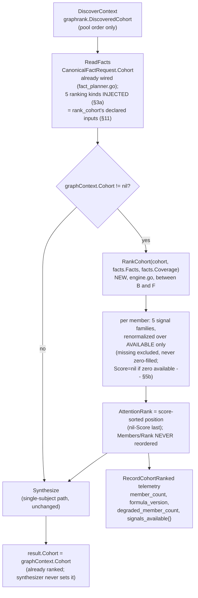

**Updated 2026-08-29 (CHAOS-4522): the cohort → synthesis handoff has TWO
closures, and both were half-wired.** The diagram above stops at
"Synthesize", which hid the fact that `SynthesisDraft.ValidateAgainst`
re-derives its OWN view of what the model was allowed to say, from
`SynthesisInput` — and that view did not match what
`synthesisInputFromDomain` actually SHOWS the model. Two symmetric gaps,
both fatal to every discovered-cohort answer on real data (HTTP 422
`synthesis_rejected`, 6 of 6 attempts, org `70d529e0`):

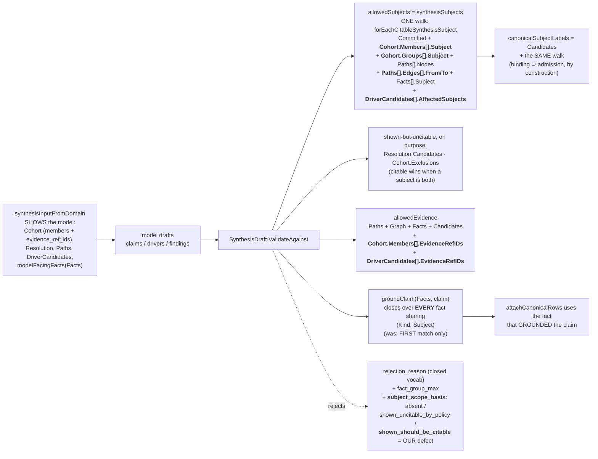

**Why admission and label binding are ONE walk.** A subject admitted to
`allowedSubjects` with no entry in `canonicalSubjectLabels` is citable under
any label the model invents: `requireBoundLabel` is deliberately a no-op for an
id it holds no binding for, because an unbound id is out of bounds and the
membership check has already rejected it. Two hand-maintained lists drifted
apart three times — groups, the payload census, and finally edge endpoints,
which shipped admitted-and-unbound and were caught by adversarial review. So
both consumers now derive from `forEachCitableSynthesisSubject` and a source
added later is admitted and bound in the same edit. Resolution candidates are
the one deliberate asymmetry: bound but NOT admitted, which is the safe
direction.

**Where a refusal on the grouped axis is disclosed:** see §10b, which draws the
grouping refusal and the single bounded path into the answer's `Limitations`.

- **Grounding.** `ClaimedFact` addresses a fact by `(Kind, Subject, Field)`
  only — `CanonicalFact` carries no identifier — and the lookup returned the
  FIRST match. But a cohort's fact bundle holds MANY facts per
  `(kind, subject)`: the live three-team answer carries 40 team-subject
  facts, of which 17 are `readiness|team:CHAOS`, one row per work
  scope/day. `cohort_ranking.go`'s `findFact` already documented that
  ("readiness/workload/deficiency aggregate across every fact of their kind
  … because those producers can legitimately emit several"); CHAOS-4398 gave
  the RANKING that treatment and the validator never got it. The first of
  those 17 carries no `estimate_coverage_ratio`, so every claim about the
  readiness coverage gap — one of the four families the v2 formula is built
  on — was rejected as "not canonically observed" while the value sat in the
  next fact of the same group. `groundClaim` now closes over the group; the
  guarantee is unchanged in strength (a claim is admitted iff some fact the
  model was shown observed that field with exactly that value), only the
  slice-order tiebreak is gone.
- **Evidence.** `synthesisSubjects` has admitted `Cohort.Members[].Subject`
  since CHAOS-4398, but `allowedEvidence` was never widened to match, so a
  member's `EvidenceRefIDs` — shown to the model as part of the Cohort —
  came back as "references unknown evidence". The live cohort ranks
  `team:gh:ops-team`, whose only evidence ref is `acr:v1:team:gh:ops-team`
  and for which no canonical fact exists, so nothing else in the closure
  could ever supply it.
- **Diagnosability.** Every `ValidateAgainst` rejection previously collapsed
  into `outcome=invalid_output` / `failure_classification=synthesis_rejected`;
  `violated_bound` names only the contracts/v1-bound subset, so both defects
  above reached the operator unnamed. Each rejecting statement now carries a
  closed-vocabulary `SynthesisRejectionReason`, emitted on the model
  decision line (with `fact_group_max`, which separates "a multi-fact
  grounding problem" from "the model claimed a field that does not exist"),
  the route failure line, and the 422 body beside `violated_bound`. The
  second defect above was found BY that telemetry, on the first replicate
  after the first fix landed.


**The theme-mix producer is a NEW acr fact read, not a reuse of the existing
`FactInvestment`.** The pre-existing team read (`investment_metrics_daily`,
`readTeamInvestment`) is fed by a **deprecated** legacy rule set
(`ops/src/dev_health_ops/config/investment_areas.yaml`: "do not use this
file for canonical WorkUnit categorization") — its `investment_area` values
are free-form legacy labels, not the canonical 5-theme taxonomy AGENTS.md
fixes. `readTeamThemeMix` (`devhealthfacts/investment.go`) instead reads
`work_unit_investments.theme_distribution_json`/`subcategory_distribution_json`
(computed once at categorization time, never recomputed) via a NEW shared
reader, `readers.ReadTeamThemeMix`
(`github.com/full-chaos/dev-health-go` v0.3.0, `readers/investment_theme.go`),
attributed to teams through the SAME CHAOS-2600 ownership-precedence
majority-vote bridge ops's `investment.py` `build_unit_team_subquery`/
`PRIMARY_WORK_ITEM_TEAM_ATTRIBUTION_SOURCE` already computes for the
Investment view — never `author_membership`/`assignee_membership`
(CHAOS-4321: ownership only, never a person's memberships). The two
`FactInvestment` facts a team can now carry (legacy per-`(area,stream)`
rows, plus one NEW fact carrying the canonical `theme_*` fields) are kept
SEPARATE and found by field PRESENCE, never by list position — mixing them
into one fact would make which one carries the canonical fields a matter of
query result ordering.

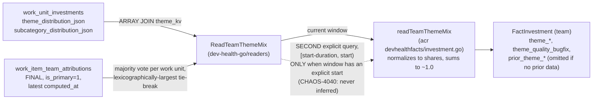

**PR2 (evidence-bearing Drivers, the structured primitive §5a's narration layers on):** each
`CohortMember` gains `Drivers []ContextFabricCohortMemberDriver` — one
entry per signal family `RankCohort` found available for that member,
computed inside `RankCohort` itself (before synthesis, no answer-wide
budget/`Standing` contention): `signal` (closed vocab), `value` (the
family's own `[0,1]` contribution), `weight` (fixed formula weight),
`weight_contributed` (points added to `Score`), `window` (`current` /
`current_vs_prior` — only investment_mix's mix-shift sub-signal makes a
prior-window comparison), `threshold_labels` (the subset of that family's
own `RankingBasis` sub-labels that fired). `Sum(weight_contributed)` across
a member's Drivers reconstructs `Score` exactly — Go-validated
(`validateDrivers`), so a driver can be cited BY NUMBER, never by an
untraceable narrated claim. Per the orchestrator's ruling (§5a), this is the
**primitive** §5a's `ContextFabricDriverJudgment`/50-cap/`Standing` scheme
narrates FROM, not a competing scheme: every narrated entry PR3 emits must
cite a member driver by `(team, signal)` and introduce no number absent
from it.

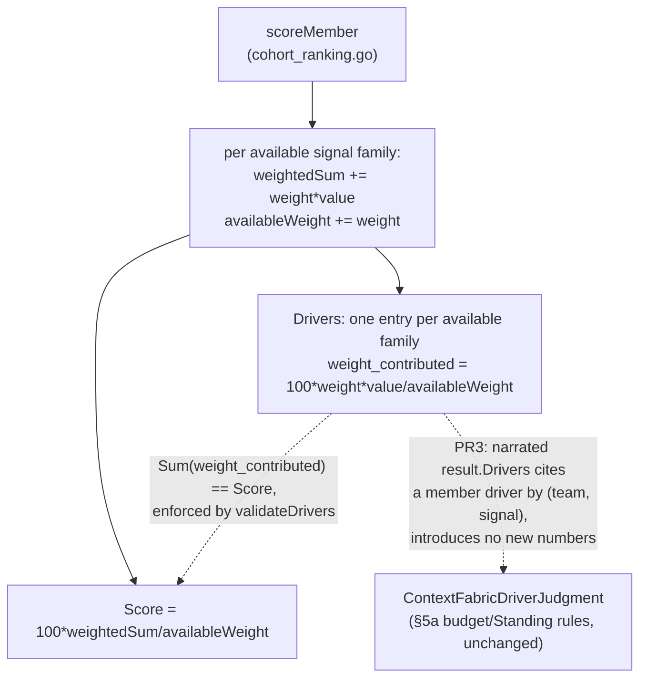

**Not yet built** (tracked follow-ups, subject-model-and-cohort-answers.md
§5a/§7, delivered together in PR3 per the orchestrator's ruling): the
model-NARRATED `ContextFabricDriverJudgment` driver-sentence layer on top of
PR2's structured Drivers (50-cap budget math, post-synthesis timing,
`Standing`/`DriverID` tuned to survive the 5/10 projection-render budget —
all UNCHANGED by PR2); the `RankingTable` Rows panel on
`ContextFabricProjectedCohort` + `ContextFabricProjectedCohortMember`/
`ContextFabricProjectedDriver` extension + synthesis prompt bump (§4a); and
(PR4) the harness cohort-question seeds + ask-dev contract pin bump (per
the 20:50 08-27 standing rule: any acr PR widening the investigation
contract lists an ask-dev pin bump as a follow-up).

**Update (CHAOS-4525, 2026-08-29):** the harness cohort-question seeds are
now built. Two answerable `cohort_assessment`/`team` cases and two
answerable `subject_status`/`project` cases (plus a `no_match` control)
were appended to the trial corpus and its oracle annex by
`scripts/trial/seed-corpus-cases.sh`, which proves every oracle claim
against the live read-only graph before writing and then hands
`expect_kind`/`expect_id` to `cmd/acr-corpus-annex-sync`. Diagram 5's
caption covers the measurement half — the answer-rate denominator had to
widen in the same change, or the cohort seeds would have been rows no
metric could see. Corpus question text is deliberately absent from this
page and every other durable artifact; cases are named by index and band.

---

## 8 — Conditional render shapes (CHAOS-4415 slice 1; CHAOS-4637/S6 made them declaration-driven)

**What it answers.** "Why did this answer get a chart and that one not?" —
and, harder, "how do I know the chart is telling the truth?"

Before CHAOS-4415 the answer surface carried tables only
(`ClaimedFact.rows`, `ProjectedCohort.ranking_table`) and every consumer
decided for itself whether to draw a chart from them. Two consumers reading
one answer could legitimately draw different pictures, or none — which is
what chris reported on 2026-08-29 19:59 PDT: the teams answer showed the
ranked-teams table and nothing else, though it carried a per-team attention
score, a per-driver contribution breakdown, and dated readiness records.

Selection now lives in the service, and a chart is a claimed fact.

**Updated 2026-08-31 (CHAOS-4637 / S6): the last inference is deleted.**
`dated_fact_trend` was withdrawn in #340 rather than fixed a fourth time,
because deciding which columns of a row table are MEASURES and which are
DIMENSIONS cannot be done from the table alone. It is back, and it now reads
a DECLARATION: `ContextFabricClaimedFact.table` (new, additive, OPTIONAL)
carries the producer's own `FactTable` statement — shape, composite key,
measures, order_by — to the wire. Three questions the selector used to guess
at are now looked up:

| question | before (inference, defeated three times) | after (declaration) |
|---|---|---|
| is this a series? | "a distinct same-shaped date column plus numeric columns" | `table.shape == time_series` |
| which column is the axis? | first column that parses as a date on every row | `table.key[0]` — arity 1 by contract |
| which columns are measures? | "numeric, and not id-named" → a numeric `team_id` plotted; a column called `year` walked through | `table.measures ∩ {claim.field}` — exactly one |

A table with NO declaration is never charted (CHAOS-4627's ruled default,
and the behaviour before this change). Exactly one measure is plotted:
several on one value axis would assert a commensurability nothing declares,
which is CHAOS-4625's own designed comparison shape, expressible precisely
because `measures` is a declared list.

The declaration carries NO rows of its own — it describes the rows beside
it. A second copy would double a row table's bytes against the same
`ContextFabricResponseBudget` §10's stage 3 measures, making the declaration
a cause of the refusals it exists to help avoid.

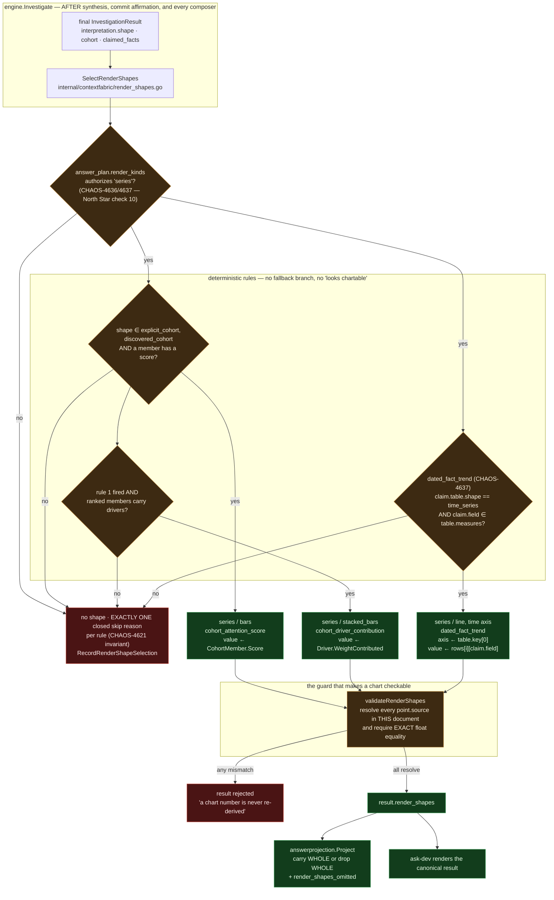

**The five things this diagram is making non-obvious-but-true.**

1. **Selection is downstream of everything.** `SelectRenderShapes` runs on
   the FINAL result, after the commit-affirmation gate, immediately before
   `Validate`. A model has no draft field for a shape, so it cannot author
   one; and a shape can never describe content a later composer removed.
2. **The arrow from a shape to a value is always a COPY.** Each point
   carries a `render_point_source` — `cohort_member_score`,
   `cohort_driver_weight_contributed`, or `claimed_fact_row` — and
   validation resolves it and compares exactly. There is no tolerance,
   because there is no legitimate arithmetic for a shape to do: a derived
   number belongs in a canonical fact, where it gets provenance and coverage
   of its own.
3. **The projection drops rather than degrades.** A projected cohort member
   carries no `drivers` array (CHAOS-4398 PR3 narrowed it deliberately;
   only each member's top-2 driver weights survive as ranking-table cells),
   so the stacked contribution shape usually cannot resolve there. It is
   dropped WHOLE and counted in `projection_budget.render_shapes_omitted` —
   never trimmed to the segments that happen to fit, because a stacked bar
   claims its parts sum to the score, and a stack missing segments claims
   something false. ask-dev is unaffected: it reads the canonical result.

4. **The PLAN gates the KIND before any geometry is consulted (CHAOS-4636,
   extended to the trend rule by CHAOS-4637).** North Star check 10 — "rich
   views are conditional on intent, never default" — is enforced by what the
   question asked for, not by what the data happened to allow. A grouped
   status list plans `render_kinds=[table]`, so it gets no chart however
   chartable its facts are. A NIL plan, and a plan declaring no render kinds,
   authorize everything: inferring a restriction from silence is how a chart
   quietly disappears. The gate is stated TWICE on purpose — once in the
   selector and once in `ContextFabricInvestigationResult.Validate` — because
   a result also arrives from storage, from a replay, and from any future
   producer, and the property belongs to the DOCUMENT rather than to one
   function that happened to check.
5. **Every rule exits through exactly one recorded outcome (CHAOS-4621).**
   Selected, or exactly one closed skip reason; never both, never neither,
   never two. `RenderShapeSelectionEvent.Accounted()` is that invariant as
   code, and the production sink logs its verdict as
   `render_shape_accounting=ok|violated`, so a lost outcome is diagnosable
   from the run's own artifacts. The same defect class — a refusal leaving no
   trace, recording the wrong reason, or going invisible once another rule
   produced a shape — was closed FOUR times case by case before this. A
   trend the shape budget had no room for is a COUNT
   (`render_shape_trends_omitted`), never a skip: a rule that fired cannot
   also be recorded as skipped without the accounting saying two things at
   once.

**What still cannot be charted, and why that is correct.** A fact carrying
BOTH a legacy breakdown and a CHAOS-4645 time series serves the LEGACY
field's rows (CHAOS-4645's ruling, pinned against real data), and the
declaration travels with the rows through the SAME field selector
(`canonicalRowsField`) so the two can never describe different fields. Such
a fact therefore declares itself a `breakdown` and is correctly refused as a
trend. Serving both tables is design §5.1's P2 dual-read cutover — a
separate slice.

**Update rule.** A new render kind's producer updates this diagram in the
same PR. The seven kinds declared but unproduced in slice 1 (`table`,
`quadrant`, `treemap`, `sunburst`, `sankey`, `burndown`, `forecast`) each
have a CHAOS-4415 sub-issue; each adds one rule node and one shape node
here.

---

## 9 — Answer completeness promotion (CHAOS-4413), and the outcome set that now derives it (S7c)

**What it answers.** "Did this answer stop early, and why — and how much of
an answer is actually here?"

Before CHAOS-4413, `terminal_status`/`terminal_reason`/`claimed_facts_count`/
`rows_count` existed only inside `cmd/acr-trial-merge-two-turn`'s
`twoTurnCaseResult` row (CHAOS-4386, PR #315) — a corpus-report shape no
consumer of the real answer ever sees. `coverage` was already public.
North Star check 11 ("the answer contract is richer than the prose") had no
literal field for the other four; ask-dev and any other bounded consumer had
no way to render "missing/stale/partial/unavailable" without reading a trial
report that does not exist in production.

```mermaid
flowchart TD
    subgraph exits["every independent Investigate() exit — five, not one"]
        E1["engine.go — the decisive/synthesized path"]
        E2["unresolved.go — terminalResult (subjectless terminal)"]
        E3["structure.go — structureVetoResult"]
        E4["window.go — windowVetoResult"]
        E5["window.go — windowConfirmationRequiredResult"]
    end

    subgraph stamp["ComputeAnswerCompleteness — internal/contextfabric/completeness.go"]
        CAC["ComputeAnswerCompleteness(result)<br/>pure, reads Status/ClaimedFacts/Coverage/Limitations/Warnings"]
    end
    E1 -->|"immediately before Validate,<br/>AFTER SelectRenderShapes"| CAC
    E2 -->|"immediately before its own Validate"| CAC
    E3 -->|"immediately before its own Validate"| CAC
    E4 -->|"immediately before its own Validate"| CAC
    E5 -->|"immediately before its own Validate"| CAC

    CAC --> TS["terminal_status ← Status<br/>(verbatim, self-contained)"]
    CAC --> TR{"status == complete?"}
    TR -->|yes| TREMPTY["terminal_reason: absent"]
    TR -->|no| TRWHICH{"which channel disclosed why?"}
    TRWHICH -->|"SubjectResolution.ClarificationPrompt<br/>or Interpretation.ClarificationReason"| RC["clarification_reason_disclosed"]
    TRWHICH -->|"Coverage.DegradedReasons non-empty"| RD["degraded_reason_disclosed"]
    TRWHICH -->|"Limitations non-empty"| RL["limitation_disclosed"]
    TRWHICH -->|"Warnings non-empty"| RW["warning_disclosed"]
    TRWHICH -->|"none of the above"| RU["undisclosed"]
    CAC --> CFC["claimed_facts_count ← len(ClaimedFacts)"]
    CAC --> RWC["rows_count ← Σ len(fact.Rows)"]

    subgraph outcomes["S7c — the outcome set: what became of each requirement"]
        SEED["seedRequirementOutcomes(frame, deriver)<br/>calls the SHIPPED RequirementDeriver.DeriveRequirements —<br/>one authority, never a second derivation rule"]
        SEED --> ROWS["PlanRequirementOutcomeRow[]<br/>stage · requirement · obligation · outcome · impact<br/>· cause_* · served/declared"]
        ROWS --> OC{"outcome, closed ×5"}
        OC --> OSAT["satisfied"]
        OC --> ONAR["narrowed"]
        OC --> OUNA["unavailable"]
        OC --> ONAT["not_attempted — UNREACHABLE in this slice"]
        OC --> ONAP["not_applicable — UNREACHABLE in this slice"]
        ROWS --> IC{"impact, closed ×4:<br/>what the reader LOSES"}
        IC --> INONE["none"]
        IC --> ISCOPE["scope"]
        IC --> IDEPTH["depth"]
        IC --> IDIM["dimension"]
        DERIVE["DeriveAnswerCompletenessState(rows)<br/>TOTAL over the whole set — degraded is absorbing"]
        ROWS --> DERIVE
        DERIVE --> SCOMP["complete"]
        DERIVE --> SPART["partial"]
        DERIVE --> SDEG["degraded"]
        DERIVE --> SND["not_derived — the fourth state.<br/>An EMPTY set derives 'complete' vacuously under any<br/>total function over the other three, so an answer whose<br/>outcomes were never derived would claim the strongest<br/>completeness there is"]
    end
    CAC --> SEED
    SCOMP --> ST
    SPART --> ST
    SDEG --> ST
    SND --> ST
    ROWS --> OUTROWS["completeness.outcomes[]<br/>optional, append-only"]
    ST["completeness.state<br/>REQUIRED, closed ×4"]

    TS --> OUT["result.completeness<br/>REQUIRED field, exact-equality validated"]
    TREMPTY --> OUT
    RC --> OUT
    RD --> OUT
    RL --> OUT
    RW --> OUT
    RU --> OUT
    CFC --> OUT
    RWC --> OUT
    ST --> OUT
    OUTROWS --> OUT

    OUT --> REUSE["the REUSE degrade — a narrowing stage like any other.<br/>Strips evidence this caller may no longer see and, when<br/>stripping empties an object the contract requires to carry<br/>evidence, DROPS whole candidates, members, drivers,<br/>findings and paths. APPENDS one row (stage=reuse,<br/>cause=reuse_auxiliary_refs_stripped) and re-derives.<br/>Impact is decided by WHAT was lost: depth for references<br/>alone, scope when whole objects went."]
    REUSE --> OUT
    OUT --> PROJ["answerprojection.Project — APPENDS a row per cut it makes,<br/>then RE-DERIVES state from the extended set.<br/>SUPERSEDES 'copied verbatim, never re-derived' for the<br/>outcome layer only: a copied block cannot carry a NAME it<br/>never had, and naming the reduced requirement is the point.<br/>The counts below are still copied verbatim, un-clamped."]
    OUT --> HARNESS["cmd/acr-trial-merge-two-turn's chaos4525StampTerminal<br/>now reads result.completeness — no longer a side channel"]
    OUT --> ASKDEV["ask-dev renders result.completeness<br/>(pin bump required before this is consumed)"]

    classDef fixed fill:#123d1c,stroke:#3fa45b,color:#e8ffe8
    classDef gate fill:#3d2a12,stroke:#c08a3e,color:#fff3e0
    classDef unreachable fill:#3a1b1b,stroke:#a4453f,color:#ffe8e8
    class OUT,PROJ,REUSE,HARNESS,ASKDEV,ST,OUTROWS fixed
    class TR,TRWHICH,OC,IC gate
    class ONAT,ONAP unreachable
```

**The two things this diagram is making non-obvious-but-true.**

1. **There is no single funnel.** Unlike a naive reading of `engine.go`
   alone, `Investigate()` has FIVE independent result-construction-and-
   validate exit points (the decisive path plus four veto/terminal paths in
   `unresolved.go`/`structure.go`/`window.go`), each with its OWN `Validate`
   call. `Completeness`, like every other required field, has to be stamped
   at each one — a promotion that only patched the decisive path would 500
   on every clarification/no-match/veto answer the moment the field became
   required.
2. **`claimed_facts_count`/`rows_count` are the UN-CLAMPED totals, always.**
   The projection copies them verbatim from the canonical result rather than
   counting its own `key_facts` — a budget-clamped projection's array length
   answers "how much of the answer did THIS bounded read keep", never "how
   much did the investigation actually produce". A consumer that wants the
   full total reads `completeness`, not `len(key_facts)`.

3. **Completeness is DERIVED LAST, from the outcome set, at the surface that
   serves the answer.** Two invariants hold the layer together, and together
   they forbid the failure it exists to prevent — measuring completeness and
   then shrinking the document somewhere the measurement cannot see:

   > **APPEND.** Every narrowing stage between planning and the served
   > document appends outcome rows. No stage rewrites or removes another
   > stage's row.
   > **DERIVE LAST.** Completeness is a pure function of the whole set,
   > computed at the surface that serves the answer.

   The shrink is *itself* a row the measurement reads. This is why the
   `answerprojection.Project` edge above changed direction: under a census the
   old copy-verbatim rule was coherent, because counters travel with the
   document they describe. Under an outcome set it is not — every row could
   read `satisfied` while the served document had lost members and whole
   groups.

4. **`not_derived` is a state, not a missing field.** No frame, or no
   deriver, and the answer says its outcomes were never derived rather than
   that nothing was lost. The two unreachable outcome tokens
   (`not_attempted`, `not_applicable`) are marked as such deliberately: both
   need the post-resolution requirement-refinement step, which belongs to the
   requirement-derivation seam, and a vocabulary member no producer can reach
   is a promise rather than a member.

5. **The stage vocabulary has FOUR members, and the fourth is the one that
   proves the rule.** `planning`, `assembled_result`, `projection`, `reuse`.
   The reuse degrade was missed on the first pass and found by adversarial
   review, serving an answer that had lost six of seven evidence references
   and three whole objects while still reporting `complete`. It is a WORSE
   instance than the assembly case this layer was built for — assembly
   refused, reuse serves — and it gets its own member rather than borrowing
   `assembled_result` because a reader must be able to tell which surface cut
   the answer: a budget the caller can widen is a different problem from an
   authorization that changed underneath a cached answer.

   The reuse stage also re-derives INSIDE the degrade, not only at the
   serving surface. That looks redundant and is not: the degrade validates
   the payload before anything is served, and the single-authority check
   rejects a block whose state disagrees with its own rows — so appending
   without re-deriving would turn every degraded reuse into a refusal,
   trading a usable narrowed answer for a disclosure gap.

**Not every `assembled_result` row is a narrowing.** The outcome set is also
where a COMPUTED obligation states its server step's result: the `count`
requirement's row carries the `membership_cardinality` step's cardinality in
`served`/`declared`, appended by `finalizeResult` (§11). A reader can tell it
from a reduction by its outcome token — an exact count is `satisfied`, and
the validator forbids a `satisfied` row from naming a cause or claiming an
impact. That is why the state derivation is unaffected by it: a satisfied row
contributes nothing to the running state, so an answer that served its count
in full still reads `complete`.

**Update rule.** A new `Investigate()` exit path (a sixth veto/terminal
shape) must stamp `Completeness` before its own `Validate`, in the same PR,
and add its box to this diagram. **Any narrowing surface between planning and
the served document APPENDS its own outcome rows and re-derives the state —
it never rewrites another stage's row — declares its own member of the stage
vocabulary, and adds itself to this diagram in the same PR.** The reuse stage
is here because that rule was applied to a surface nobody had counted as a
narrowing stage; the next one will be found the same way if it is not
declared.

---

## 10 — The grouped cohort and the three-stage budget (CHAOS-4636 / S5), and stage 3's two decision arms (S7c)

```mermaid
erDiagram
  ANSWER_PLAN ||--|| QUESTION_FAMILY : "resolved to"
  ANSWER_PLAN {
    QuestionFamily Family "closed, 8 members -- promoted to the wire by S5"
    QuestionFamilySource FamilySource "closed -- model / consensus / CARRIED / fallback"
    string FamilyVersion "question-family.v1, the reuse-key fence"
    SubjectKind GroupKind "grouped family ONLY; never read off another family"
    SubjectKind MemberKind "stamped from the cohort the graph returned"
    bool RequireDrivers "grouped_cohort_status: true"
    bool RequireRanking "grouped_cohort_status: FALSE -- a cross-group ranking was not asked for"
    RenderKind_list RenderKinds "authorizes; a shape outside it is refused, not drawn"
    FactKind_list FactKinds "WIDENING ONLY -- may add a kind, never remove one"
    PlanBudget Budget "the ceiling it was built against"
    PlanNarrowing_list Narrowing "every step actually taken -- this IS the disclosure"
  }
  ANSWER_PLAN ||--|| PLAN_BUDGET : declares
  PLAN_BUDGET {
    int MaxItems "effective: service config narrowed by the caller"
    int64 MaxSerializedBytes "effective: min(service, caller) -- what the route enforces"
    int MaxMembers "stage 1's pre-read clamp = MaxItems - SynthesisHeadroom"
    int SynthesisHeadroom "reserved for what synthesis will ADD -- MEASURED, not derived"
    NarrowingBasis NarrowingBasis "declared even when stage 1 does not act"
  }
  ANSWER_PLAN ||--o{ PLAN_NARROWING : records
  PLAN_NARROWING {
    PlanNarrowingStage Stage "cardinality / synthesis_input / assembled_result"
    NarrowingBasis Basis "canonical_id_lexical / largest_group_round_robin / attention_rank"
    int Before
    int After
    bool Groups "true only if GROUPS were dropped -- D2 makes this rare"
    BudgetOverrun Overrun "items / bytes; absent at stage 1, which measures nothing"
  }
  ANSWER_PLAN ||--o{ PLAN_REQUIREMENT_OUTCOME : "discloses (S7c, append-only)"
  PLAN_REQUIREMENT_OUTCOME {
    OutcomeStage Stage "planning / assembled_result / projection / reuse -- ITS OWN vocabulary, NOT the plan's"
    string Requirement "the obligation/role/subject COORDINATE, never a minted id"
    AnswerObligation Obligation "wire-mirrored, both-directions parity test"
    PlanRequirementOutcome Outcome "satisfied / narrowed / unavailable / not_attempted / not_applicable"
    AnswerImpactKind Impact "none / scope / depth / dimension -- what the READER loses"
    BudgetOverrun CauseOverrun "the DECLARED CEILING, not a selection order: no selection ran"
    CoverageDetailCode CauseCoverage "carried from the derivation's own reason, never re-classified"
    bool CauseObserved "false means DEFAULTED -- a defaulted cause may never read as an observed one"
    int Served "must be strictly less than Declared on a narrowed row"
    int Declared
  }
  COHORT ||--o{ COHORT_MEMBER : "flattened union (authoritative)"
  COHORT ||--o{ COHORT_GROUP : "group axis, absent on every flat cohort"
  COHORT {
    SubjectKind Kind
    bool Complete "CONJUNCTION over groups when grouped"
    bool Truncated "disjunction over groups when grouped"
  }
  COHORT_GROUP {
    SubjectRef Subject "the GROUP entity (a team), never one of its members"
    string_list MemberCanonicalIDs "references into Members -- not nested copies"
    bool Complete "the group's OWN completeness"
    bool Truncated "mutually exclusive with Complete, as on the cohort"
    int Total "size BEFORE narrowing"
  }
  COHORT_GROUP }o--o{ COHORT_MEMBER : "MANY-TO-MANY, deliberately"
```

**Why the group axis is many-to-many.** Ownership is a relation, not a
function: `devhealthfacts/shared.go`'s project rollups order
`team_project_ownership` by `source`, so a project's native and manual
ownership rows can both be current, and every rollup "must dedupe by
team_id". A validator forbidding a member in two groups would force the
engine either to drop a true ownership or to pick one silently. Member
IDENTITY stays unique — the flattened list is one entry per member, so the
item budget charges each member once.

**Why groups are references, not nested members.** The flattened list stays
authoritative, so a consumer that never learned about groups reads one member
list rather than two that could disagree; and a grouped cohort is exactly the
shape that strains the byte budget, so paying for every member twice would
make the grouping the cause of the refusal it exists to avoid.

**Where the grouping comes from, and why it is the inverse of the design's own
phrasing.** §6.2 describes resolving groups then their members. That direction
is not reachable for a subjectless cohort: `hopWalk` runs only for committed
subjects and Q-A commits nothing, the subjectless path
(`chaos4348ExactNameCandidates`) never touches `Paths`, and CHAOS-4099's
eligibility table has no team↔project policy and rejects that direction in its
own "deliberately absent" block. What IS available, free, at the right moment:
the owning team sits inside the project-subject facts the plan already reads —
`metrics.team_breakdown`, `workload`'s breakdown, `health.risk_breakdown` rows
where `scope == "team"`, and `flow`'s scope rows. So the group is read off the
members' own facts. **The consequence, stated rather than hidden: groups exist
only AFTER the fact read**, which is why the pre-read stage can clamp nothing
but the flat member cap and why member-first narrowing lives in stages 2 and 3.

**Why three stages.** Each budget becomes knowable at a different moment, and
§6.3a records three earlier specifications that all failed the same way —
enforcing a budget where the quantity did not yet exist, or where the measuring
code was not reachable. Stage 1 knows only cardinality. Stage 2 cannot count
the answer because synthesis is what *creates* the drivers, findings and claims
the budget charges. Only stage 3 can measure, and it measures with a
`contracts/v1` function both planes import — the route's 413 gate is an
assertion over the same numbers, not a second measurement.

### 10a — Stage 3's decision arms after S7c: narrow instead of refusing

**What it answers.** "This answer is over the ceiling. What happens next, and
if we still refuse, WHY did every lever fail?"

Before S7c the answer was short: the cohort is the only lever stage 3 has, so
a single-subject question arrived at `!canNarrow` with its entire repertoire
empty and refused — while the unresolved `SubjectResolution.Candidates`,
charged against that same ceiling, sat untouched.

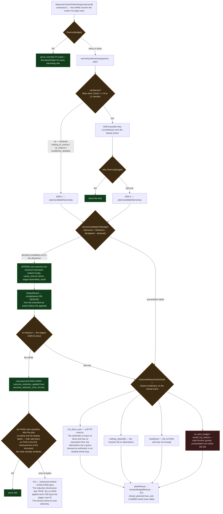

**Why the candidates and nothing else.** Drivers, findings and claimed facts
are cited by the composed judgment; dropping one leaves prose describing
content that is no longer present, which this seam may not introduce.
Resolution candidates are alternatives the resolver did NOT commit to —
nothing in the answer cites them — so removing them changes how many options
the caller is shown and nothing else. That is a real loss, which is why it is
disclosed as one rather than performed silently.

**Why the reduction's dimensions stop short of the final outcome.** The
stage's fit check is not the last word: the plan re-stamp (carrying the
narrowing step just appended) and the coverage display labels both add bytes
afterwards, so the final assertion is the first measurement of the document
the route serializes. An earlier revision published a single
`outcome_narrowed_instead_of_refused` flag, which asserted the answer was
SERVED — something this emitter cannot observe, and measurably false in the
~50-byte window drawn above. The dimensions now report what the stage itself
decided; the refusal, when it comes, carries its own telemetry.

**Why `refusal_planned` is decided AFTER the arm, not before.** The retry
arm used to build and emit its event before asking the outcome layer, so every
investigation the reduction went on to serve with a 200 also published
`refusal_planned=true` — a refusal counter counting answers that were never
refused. The decision is now taken first and the event describes the answer
that is actually served.

**Enforcement versus quota, as the boundary is drawn.** S7c owns
ENFORCEMENT — what happens when a quota is blown — for every shape, grouped
included, because the outcome set is the single disclosure authority. The
QUOTA side (per-group item attribution, the single allocator, `itemsPerGroup`,
`predicted_items`) belongs to the allocator seam, which will expose per-group
over-quota counts at assembly for this layer to act on. The candidates-only
reduction term above is S7c's; nothing here allocates, predicts or
apportions.

**Half of that seam has landed and half has not — see 10c**, which carries the
per-bucket item attribution now on every assembled-result line, and the reasons
the apportioning half was deliberately left out rather than shipped.

**What this does NOT deliver.** Assembly still MEASURES and then reduces.
Bounding assembly BY CONSTRUCTION — planning against declared caps so the
unfittable shape is never created — is a separate, larger change. A post-hoc
cap on candidates that called itself a plan would be that change renamed
rather than made.

### 10c — Item attribution: what the charged items were about, and why the allocator that would apportion them was not built

**What landed.** `AttributeContextFabricResultItems` splits exactly the
quantity `CountContextFabricResultItems(...).Budgeted()` reports into four
buckets from a closed vocabulary — `global`, `member`, `group`,
`multi_group` — and `MeasureContextFabricResponse` computes the split and the
count from ONE document in ONE call, so the two can never describe different
answers. The four counts ride on every `assembled_result` plan-narrowing line,
served and refused alike.

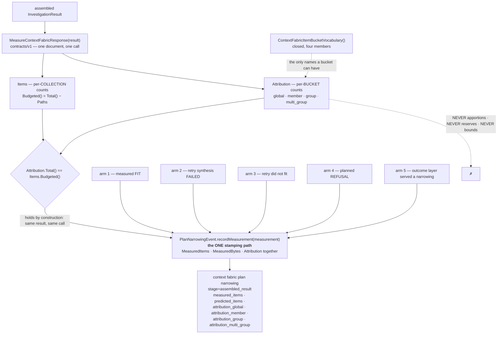

**Why one stamping path.** The five arms above each construct their own event.
Every decision dimension this seam has added was, at some point, present on
some arms and absent from others — written at three sites and read at none,
then reaching the served emitter and dropped on both refusal arms, then dropped
on the retry-that-fits path. Each fix was correct for the arm it addressed and
the omission moved one branch over. So the three numbers that describe one
measured document are written together by one method, and an AST walk over the
package fails the build if any arm assigns them directly again. That is a
structural remedy for a class four behavioural tests did not catch.

**Why the buckets, and not a flat total.** `measured_items=34 max_items=30`
tells an operator the answer was four items too big and nothing about where
the thirty-four went. Whether one group's items dominated, whether the cohort
rows alone consumed the ceiling, or whether cross-cutting drivers are landing
in a bucket nobody expected are different problems with different fixes, and
none of them is visible in a per-collection breakdown, because a collection
count does not know what an item is ABOUT.

**Attribution is not pricing.** An item naming several groups is ONE item and
is charged ONCE, to `multi_group`. What such an item would COST under some
per-group apportioning rule is a separate question, and answering it here would
break the totals-sum invariant the moment the rule changed. The invariant is
the only property this split must hold, so nothing that could threaten it lives
in the same function.

---

#### The allocator: a decision, recorded

The change that added the split was scoped to add an ALLOCATOR beside it — a
function apportioning `MaxItems` into per-bucket pools, publishing a per-group
`itemsPerGroup`, deriving the narration budget from the plan instead of the
static contract caps, and exposing per-group over-quota counts for enforcement
to act on. **That half was cut and is not in this codebase.** It was cut
because three consecutive adversarial reviews of it each found the same two
classes, and the fourth attempt would have been the fourth patch to a shape
whose failure mode is structural. The reasoning is written down here rather
than left in a branch, because the next person to reach for a per-group quota
will reach for the same shape.

**The shape that failed: partition with a remainder.** The allocator published

```
Reserved + NarrationBudget + TotalPooled() + Remainder == MaxItems
```

as an exact invariant, swept over ceilings {1, 2, 5, 30, 45, 300} × groups 0–4
× members 0–10. It is exact, it is well tested, and it is **structurally
incapable of catching a wrong pool**, for two independent reasons.

1. **`Remainder` is defined as whatever is left.** Any error in any pool is
   absorbed by it and the equation still balances. The only thing between that
   and a silent under-allocation is the remainder's own bound — which was set
   to the bucket VOCABULARY size (4) where the correct bound is the number of
   pools actually active (2 when there are no groups), so the guard was
   weakest in exactly the regime the live defect lived in. A mutation that
   under-allocated the member pool by one passed both packages green.
2. **It is an invariant over the PLAN, not over the RESULT.** It says the
   allocator's own numbers add up. It says nothing about whether the answer
   that gets built stays inside them — and `Budgeted()` charges quantities the
   partition never modelled. An answer with ten cohort member rows, nine global
   items, nine member-attributed items and six narration items satisfies every
   published pool and totals **34 against a ceiling of 30**.

**The class history, because one instance reads as carelessness and four read
as a property of the design.**

| class | round 1 | round 2 | round 3 |
|---|---|---|---|
| **A — a charged quantity with no pool** | narration: the whole budget apportioned, then narration given a share on top (39 vs 30) | the **member bucket** had no pool at all (34 vs 30) | member **ROWS** are charged to `Budgeted()` and never debited (34 vs 30) |
| **B — a quota written, never read at the line** | written at 3 sites, read at **none** | reached the served emitter, dropped on **both refusal arms** (round 1's pin was lexical, so it proved the text existed, not that anything consumed it) | both arms pinned only lexically again; and the **retry-that-FITS** path emitted zeros |

Four findings in each round. Each fix was correct for the instance it
addressed, and the class simply moved. The second revision made *"a bucket in
the vocabulary with no pool"* structurally unexpressible by deriving the pools
from the bucket vocabulary itself — and class A promptly reappeared as a
charged quantity **that is not a bucket at all**. That is the lesson in one
sentence: **an invariant that can only see the quantities it enumerated will
keep missing the ones it did not.**

**The candidate shape, for whoever builds it: a LEDGER, asserted on the real
result.** Instead of apportioning a budget into pools up front, record every
quantity that reaches `Budgeted()` — member rows, narration, and each bucket —
as a DEBIT against one budget, and make the invariant

```
Σ debits == CountContextFabricResultItems(result).Budgeted()
```

checked on the **served document**, never on the plan. This closes class A by
construction: a charged quantity with no debit makes the sum disagree, and the
sum is checked against what was actually measured, so a quantity nobody
modelled cannot hide. It also removes the second-authority problem — exposure
and allocation read one structure rather than computing the same number twice.

Its honest costs: a ledger is a *reconciliation*, and deciding a per-group
quota before synthesis runs still requires a forward projection, so a ledger
validates an allocator rather than replacing one. It also needs a ruling on
what happens when the ledger disagrees, and that is ENFORCEMENT, which §10a
draws as S7c's. The attribution above is the ledger's measuring half, built
first and on its own, which is why it asserts its total against `Budgeted()`
rather than against any plan.

**What stays broken, said plainly rather than left to be rediscovered.**
Narration still reads the static contract caps — 50 drivers and 250 claimed
facts — which say what a document may legally CARRY and nothing about what the
item budget can AFFORD. Measured by calling the function itself:
`cohortDriverNarrationBudget(50, 4, 250, 0)` returns 15 members at 3 drivers
each, so with four drivers from synthesis it authorises **45 narrated judgments
and as many minted claims — 90 items on top of synthesis' four, against a
ceiling of 30**. (A live cohort narrates only members carrying a ranked driver,
so a given run charges less than the authorisation; the authorisation is what
the caps permit and what the item budget never sees.) It is a second spender on
one ceiling and it is the largest single source of the overrun. **It is not
fixed here and it is tracked separately**; the split above is what makes it
visible from a run's own artifacts for the first time, which is the whole
reason this half was worth shipping before the half that would bound it.

**And one arithmetic fact that reframes the fix for whoever takes it on.**
`planBudget` sets `MaxMembers = MaxItems − SynthesisHeadroom`, and the grouped
headroom is a CONSTANT 20:

```
ceiling 30 (the rig default)  → MaxMembers 10 → 20 items left for everything else
ceiling 45 (the prod overlay) → MaxMembers 25 → 20 items left for everything else
```

The non-member allowance is **20 at both ceilings** — five per group at four
groups, identically. Raising `MaxItems` buys member slots and exactly zero
extra items for drivers, claims, findings and candidates, so no amount of
raising the ceiling relieves the per-group squeeze. Group-aware headroom
(equivalently: lowering `MaxMembers` when groups are present) is the lever;
expecting a bigger ceiling to make grouped answers fit is an arithmetic mistake
rather than a measurement question.

**Update rule.** Any change to the bucket vocabulary,
`AttributeContextFabricResultItems`, `MeasureContextFabricResponse`'s
measurement shape, or the arms that stamp it updates this sub-diagram in the
same PR. A new spender on the item budget is the class this section exists to
record: it belongs in one place that can see every claimant, never given a
ceiling of its own.

### 10b — The grouping REFUSAL, and how its disclosure reaches the reader

The group axis is read off the members' own facts, so the plan's declared
`GroupKind` and the kind the fact rows actually carry can disagree. When they
do, grouping is refused **wholesale** — keeping the members whose source
happened to agree would present a partial axis as a complete one — and the
question is answered flat.

A flat answer to a grouped question is only honest if the reader is told. That
is the half this sub-diagram exists to make visible, because it is the half
that broke: the disclosure was composed correctly and then silently **dropped**
by a later composer, and nothing in this document showed that such a thing
could happen.

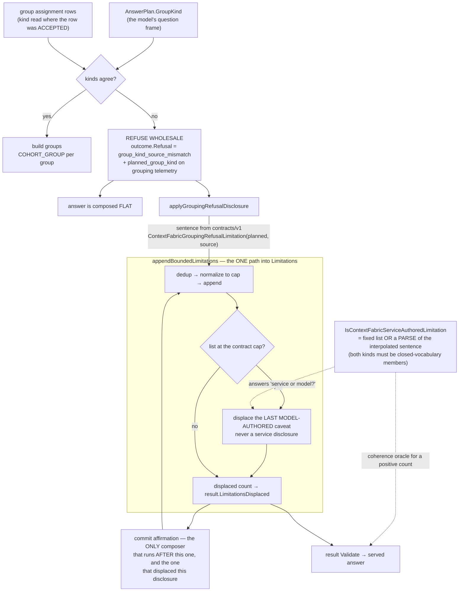

**Assembly order, because "a later composer" is only checkable if the order is
written down.** Every one of these appends through the bounded appender, in
this sequence inside `synthesizeAndAssemble`:

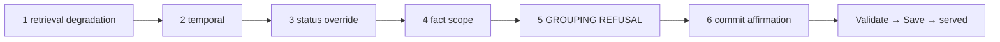

So the grouping refusal is fifth of six, and **commit affirmation is the only
composer that runs after it** — which is precisely why that one, and no other,
was able to displace it. Retrieval degradation, temporal and fact scope all run
BEFORE the refusal and can only contribute to the list it finds already full;
they are not candidates for having dropped it.

**The defect this drawing would have prevented.** The refusal sentence is
**interpolated** — it names the axis asked for and the axis the facts support —
so the exact-match registry of service-authored disclosures could not hold it.
To the displacement rule an unrecognised disclosure is a model caveat, so on a
full limitation list the commit-affirmation composer displaced it and the
served flat answer said nothing about having been answered on a different axis.
The dotted edges are the fix: recognition is a **parse** whose two interpolated
segments must be closed subject-kind vocabulary members, so a model caveat that
merely opens with the same wording cannot become undisplaceable and take a real
caveat's slot.

**Two properties worth reading off the shape.** Every arrow into `Limitations`
passes through the bounded appender — there is no second door — and every
displacement is counted, because a displaced list and a list that simply had
room are the same length and end the same way, so the count is the only record
the dropped caveat existed.

**Update rule.** Any new service-authored disclosure, any new composer that
runs on a composed result, or any change to the recognition rule updates this
sub-diagram in the same PR. An **interpolated** disclosure additionally needs a
sole composer and a parse-based recogniser; a list of constants cannot hold it.

**Update rule.** Any change to `PlanAnswer`, the narrowing stages,
`ContextFabricCohortGroup`, the outcome row, or stage 3's decision arms
updates this diagram in the same PR.

---

## 11 — Obligation → requirement derivation, and what a COMPUTED obligation consumes

The requirement layer crosses a validated frame's derived obligation set with
the registry's own declarations and produces one row per cell. Each obligation
is classified READ or COMPUTED (the §13.2.3 kinds table): a read row names the
fact kinds that can serve it, a computed row names the SERVER STEP that
satisfies it.

**The amendment this diagram records (§13.2.3, seam S7b-ii).** A computed row
used to name its step and nothing else. The derivation's own rule said a
computed obligation "is unavailable only when ITS INPUTS ARE" — while naming
no inputs, so nothing could act on it. The six-authority parity proof was the
first thing that had to: it could not rule that a fact kind lost by retiring a
planning authority was *not* an input of a computed step, so it had to assume
every such loss might be, and **no authority was retirable on that evidence.**

A computed step now declares what it consumes, as a CLASS plus (for the
fact-reading class) the kinds:

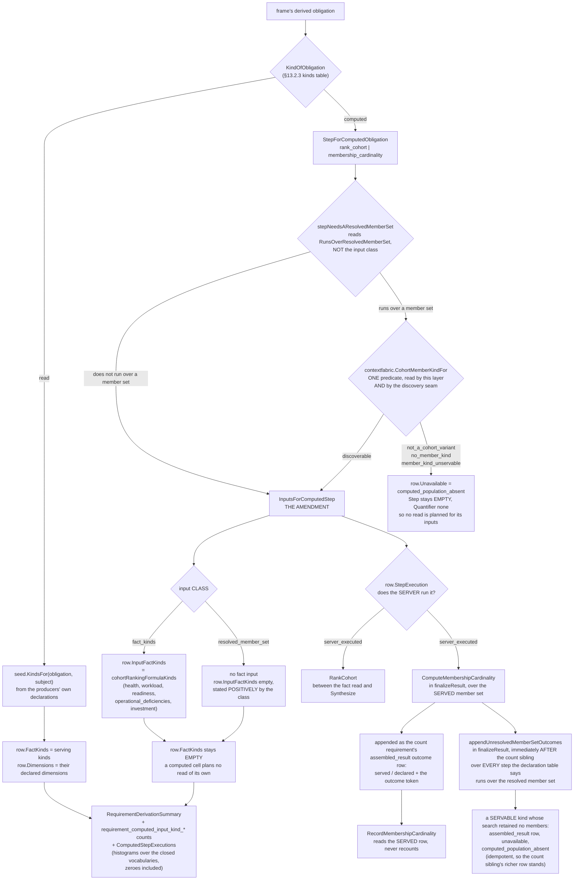

**Why the class exists, rather than just a kinds list.** `membership_cardinality`
counts the resolved member set and reads no fact. Spelling that as an empty
kinds list would be indistinguishable from "nobody has declared this step's
inputs yet" — the silent emptiness the seam exists to forbid, reproduced
inside its own fix. The class makes "consumes no fact" an assertion.

**Why producibility is decided in TWO places, and why that is not two authorities.**
A computed step that runs over the resolved member set can fail to run for four
reasons, and only three of them are knowable before retrieval: the expression
enumerates nothing, it declares no member kind, or it declares a kind no
discovery arm serves. Those three are one closed decision,
`CohortMemberKindFor`, and it lives in `internal/contextfabric` beside the
subject-kind vocabulary precisely so BOTH readers can reach it — this
derivation, and the discovery seam one layer up, which imports this package and
could never be imported back. It was rebuilt by hand here once, a conjunct per
review round, and over the fifteen published subject kinds the two answers
disagreed for TWELVE: a ranking row named `rank_cohort` as its server while the
seam refused to build the cohort, so nothing computed the ordering the answer
claimed.

The FOURTH reason is a runtime fact nobody can decide at derivation time: a
perfectly servable kind whose search retains no members. `DiscoveredCohort`
returns a nil cohort in that case, so the correction belongs on the served
document, and `finalizeResult` makes it beside the count sibling — for every
step the declaration table says runs over the member set, not for the two that
exist today. The two places are one decision each, taken where its fact lives;
what is not duplicated is the predicate.

**Why the inputs are NOT folded into `FactKinds`.** `FactKinds` means *kinds
that can SERVE this cell*, and every existing reader — the plan projection
included — treats it as a planned read. A computation's inputs are facts some
*other* cell is responsible for reading. Two fields keep both statements true
at once: this cell reads nothing, AND these are the kinds its step consumes.

**Where `rank_cohort`'s inputs come from.** Not from its docstring, which
claimed it "depends on the read obligation `principal_drivers`". `RankCohort`
reads no obligation: its five signal families each read one named fact kind
(`investmentMixSignal` → `FactInvestment`, `healthRiskSignal` → `FactHealth`,
`deficiencySeveritySignal` → `FactOperationalDeficiencies`,
`readinessGapSignal` → `FactReadiness`, `workloadPressureSignal` →
`FactWorkload`). Those five are `cohortRankingFormulaKinds`, already named
once in this package — the SAME set §7's diagram shows the engine injecting
unconditionally whenever the resolved graph context carries a cohort. The
declaration references that variable rather than restating it, so the engine's
injection and the step's declared inputs cannot drift.

**Declaring an input is not planning a read**, and the parity proof depends on
the difference. A lost kind that is a declared input *and* unserved by any read
row still blocks a retirement (`computed_step_input_unserved`), because
retiring the authority would remove the only thing planning to read it. What
changed is that this is now decided per cell against the declaration, instead
of assumed for every loss on any frame with a computation.

**Declaring a step is not running one, and that is the second half of the
amendment.** A computed obligation's row also declares its EXECUTION.
`membership_cardinality` was `declared_only` — named by the vocabulary and
satisfied by nothing, so the count reached a reader through the model
narrating over whatever facts the plan happened to read. Under that mechanism
retiring an authority's reads CAN change the answer, which is exactly what a
`superior` ruling asserts it cannot; the parity proof therefore blocked five
cells on `computed_step_not_wired` rather than clearing them on the strength
of a step nobody ran.

**Where the step now runs.** `ComputeMembershipCardinality` counts the
resolved member set, and `finalizeResult` states the result on the served
document as the `count` requirement's own `assembled_result` outcome row —
`served` and `declared`, with the row's closed outcome token distinguishing a
count exact over the resolved set (`satisfied`) from one served over a set a
stage narrowed (`narrowed`, which the row's validator forces to name the
mechanism that cut it). It runs in `finalizeResult` and nowhere earlier
because stage 3 can narrow the cohort and re-synthesize: a cardinality
computed before that would name a member set the reader never receives.

**What the count does NOT claim.** It counts the RESOLVED member set, which is
the step's own declared input. Whether that set is the whole population is a
coverage question, and `Cohort.Complete`/`Cohort.Truncated` already answer it
— they ride the telemetry line beside the number for that reason. A count
over a cohort the graph read stopped short of is a true count of the resolved
set and a lower bound on the population. Making the population itself
countable needs a census the pre-read clamp (§10) makes unobservable.
Synthesis prose is also still the model's: this makes the count a server
result, it does not stop the model stating a number in words.

**Update rule.** Any change to the obligation kinds table, the computed-step
table, the input declaration, the EXECUTION declaration or where a
server-executed step runs, or `DerivedRequirement`'s fields updates this
diagram in the same PR.

---

## Sources

- Live code via `codegraph_explore` / `rg` on `dev-health-acr`: `engine.go`
  (`Investigate`), `chaos4234_offers_only.go`, `chaos4038_kind_coverage.go`,
  `chaos4132_confirmed_kind_rescue.go`, `graphrank/resolve.go`,
  `graphrank/resolution.go`, `falkorgraph/vector.go`, `falkorgraph/reader.go`,
  `fact_planner.go`, `fact_registry.go`, `fact_scope.go`,
  `internal/contracts/v1/context_fabric_types.go`,
  `internal/contextfabric/devhealthfacts/*.go`,
  `internal/contextfabric/render_shapes.go`,
  `internal/contextfabric/chaos4636_answer_plan.go`,
  `internal/contextfabric/chaos4636_grouped_cohort.go`,
  `internal/contextfabric/chaos4636_budget_stage3.go`,
  `internal/contextfabric/chaos4636_synthesis_assembly.go`,
  `internal/contextfabric/chaos4636_plan_carry.go`,
  `internal/contracts/v1/context_fabric_response_budget.go`,
  `internal/contracts/v1/validate_context_fabric_render_shapes.go`,
  `internal/contextfabric/completeness.go`,
  `internal/contracts/v1/context_fabric_completeness.go`,
  `internal/contextfabric/unresolved.go`, `internal/contextfabric/structure.go`,
  `internal/contextfabric/window.go`,
  `internal/contextfabric/devhealthsource/teams_projects.go`,
  `internal/contextfabric/devhealthsource/teams_projects_edges.go`,
  `internal/contextfabric/devhealthsource/clickhouse.go`,
  `internal/runtime/hosted/chaos3742_two_turn_confirmation_test.go`,
  `internal/runtime/hosted/chaos4234_regime_a_harness_test.go`,
  `internal/runtime/hosted/chaos4360_nturn_confirmation_test.go`,
  `internal/runtime/hosted/chaos4360_nturn_confirmation_redfirst_test.go`,
  `cmd/acr-trial-merge-two-turn/main.go`, `scripts/trial/run-n-turn.sh`.
- Live kiac trial graph: `kubectl -n acr-trial-data exec pod/trial-falkordb-...
  -- redis-cli GRAPH.QUERY acr-cf-fa7030e2106de7411bfbf8ebce74c620-e2 "..."`,
  2026-08-26, counts only, org `70d529e0-3c06-4597-8480-794fd02328b6`.
- Design docs: `docs/design/context-fabric-team-project-subjects.md`,
  `docs/design/context-fabric-regime-a-offers.md`,
  `docs/design/context-fabric-fact-planning.md`,
  `docs/design/context-fabric-fact-scope.md`,
  `docs/design/context-fabric-vector-retrieval.md`,
  `internal/contextfabric/AGENTS.md`, `acr/AGENTS.md`.
- Session state (cited as session notes, not committed fact):
  `.remember/context-fabric-reset-handoff.md`,
  `.remember/context-fabric/cf-rulings.md`, `.remember/now.md`,
  `.remember/today-2026-08-26.md`, `.remember/retro-4061-diagrams-draft.md`
  (diagram-style precedent reused here).
