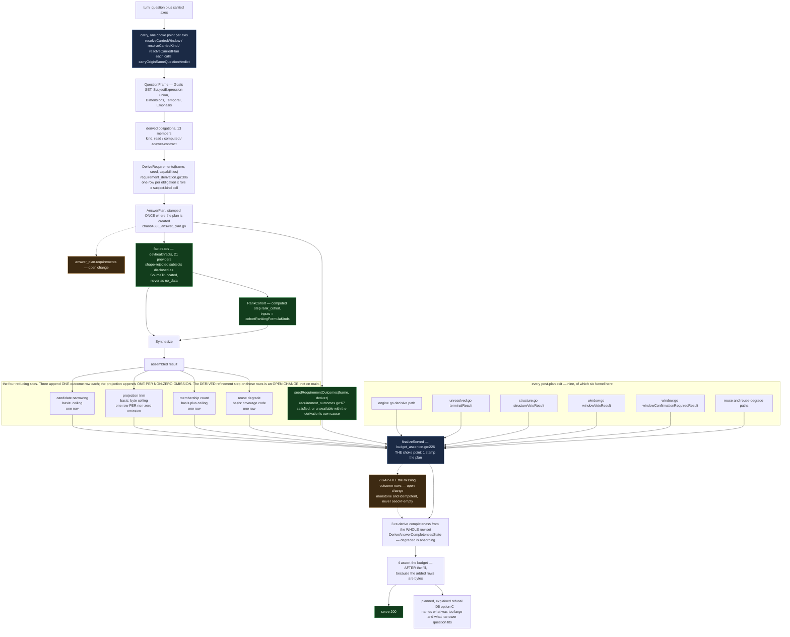

# Context Fabric intent engine — build state and decisions since 2026-09-01

Companion to the architecture-diagram page and to the intent-engine design of record. The design of
record (stage 1, sections 0-12) was settled 2026-08-30; its stage-2 amendment (section 13, the
compositional `QuestionFrame`) was finalized 2026-09-01. This page is the after-the-fact decision
record for everything built since, so the architecture documentation describes the system that
exists rather than the system that was designed.

The tracker holds the tickets; this page holds the architecture and the decisions. Where a ticket
is the right pointer it is named by what it is about, never by id, per this repository's
open-source-surface rule.

Section numbering below matches the design of record, where this material lands as section 14.

---

**Written 2026-09-04.** This section extends the intent-engine design of record. Stage 1 (§0–§12)
was decided 2026-08-30; the stage-2 amendment (§13, `QuestionFrame`) was finalized 2026-09-01.
Everything after that date lived only in session records, ticket comments and pull-request bodies.
This section is that material, promoted, so the design of record describes the system that exists.

**Evidence rule for this section.** Every "shipped" claim below was checked against `origin/main`
of the acr repository on 2026-09-04: the merge commit was confirmed an ancestor of `origin/main`
with `git merge-base --is-ancestor`, and where a claim names a file or symbol, that path was
confirmed to exist on `origin/main`. A record was never taken over the code. Claims that could not
be verified this way are marked **[UNVERIFIED]** and say why. Numbers are copied exactly from the
artifact that produced them.

**What is deliberately not here.** No text from the private evaluation corpus. Cases are named by
index, band or case label only.

`origin/main` at the time of writing: `255eb412` (PR #427). The section was drafted against
`34718732` (PR #429) and rebased onto `255eb412` when PR #427 merged; every claim below was
re-checked against the later SHA.

---

## 14.1 Seam status

One row per seam. "Shipped" means merged and confirmed on `origin/main`.

| seam | ticket | state | shipped (PR · merge SHA · date) | what it changed in the design | evidence | deviation from the 08-30 / 09-01 design |
| --- | --- | --- | --- | --- | --- | --- |
| **S1** pin the interpret sampler; measure the `Shape` distribution | the intent-engine epic S1 | Done (pre-09-01) | — | Nothing new. D3's *N distinct derived seeds* amendment is the shipped form. | — | none |
| **S2** `QuestionFamily` vocabulary + precedence + N-sample consensus, shadow only | the intent-engine epic S2 | Done (pre-09-01) | — | Family is the routing projection stage 2 then demoted to a derived value. | S2 measured 12/12 stability at N=1; 0/28 no_match with an 11% garble class. | none |
| **S3** declared `FactTable` (composite `Key`) + per-subject-kind `FactKind` declarations | the intent-engine epic S3 | Done (pre-09-01) | — | Producers declare shape; the requirement layer reads those declarations rather than a category map. | — | none |
| **S4** family `ApplicableAxes` gates the offer builders before they run | the intent-engine epic S4 | Done (pre-09-01) | — | Nothing new in this window. | — | none |
| **S5** `AnswerPlan` + three-stage budget + grouped/scoped cohort + carry family across turns | the intent-engine epic S5 | Done (pre-09-01) | — | The carry S5 introduced is what the chain-identity row below contains. | — | none |
| **S6** render selection reads the plan and the declared table shape | the intent-engine epic S6 | Done (pre-09-01) | — | Nothing new in this window. | — | none |
| **S7a** stage-2 design amendment (§13 `QuestionFrame`) | the intent-engine epic | Finalized 2026-09-01 | design only | Frame becomes the single semantic object; family becomes a lossy derived projection; `Goal` became a **set** (§13.2.3). | Round 2 and round 3 both hit RE-FIND STOP; finalized by the independent Fable 5.1 reviewer after round 4. | none |
| **S7b-i** frame layer — `QuestionFrame`, `SubjectExpression` union, derived family (shadow), seam 7 | the frame-layer ticket | In Progress | PR **#407** · `eaec310a` · 2026-09-03 (seam-7 PR-B) | Seam 7 (frame → resolution/discovery) is the seam §13.8b says the frame currently dies on; PR-B is the first half. | binding CI + fullstack acceptance, 21 jobs, 0 non-success | Seam 7 was **added by the independent review (R1)** after the six-seam list was frozen; §13.8's own rule now says the seam list is a floor, never a total. |
| **S7b-ii** obligation → requirement derivation | the requirement-derivation ticket | In Review | PR **#384** `f51d096e`; PR **#390** `adab4d8e`; PR **#421** `f32432266c06` 09-04; PR **#424** `5631984f164c` 09-04; PR **#426** `e5e781449c82` 09-04 | The requirement row replaces the flattened `FactKinds` set as the planning object. §13.2.3 amended: a computed obligation now declares what its server step **consumes** and whether anything **executes** it. | Parity artifact: **98 cells** (14 frames × 7 authorities) — subsumed 18, not_subsumed 14 (8 superior, 6 blocking), not_applicable 10, disclosed drops 56, **0 authorities retirable**. Batteries: #421 11/11, #424 19/19, #426 12/12 killed. | The design assumed the parity proof would retire authorities. It retired none. Two revisions claimed authorities retirable and **both were retracted** (#424's first cut; #426's intermediate branch). |
| **S7c** requirement outcomes; completeness derived from them | the minimal-answer-floor design ticket / the assembled-result narrowing ticket | PR1 shipped | PR **#422** · `7c6eda591fb5` · 2026-09-04 | Answer completeness is now **derived from the outcome set**, not inferred by synthesis. Adds a fourth completeness state, `not_derived`. Stage 3 gains a second decision arm: narrow candidates instead of refusing. | Acceptance shape 18 candidates + 12 claimed facts + 5 drivers = 35 items → refused; after: 30 items / 9,586 bytes / 200. Minimum answer floor 1,001 → 1,023 bytes. 12 findings, each red-at-parent; battery 10/10. | D5 ruled "C now, A ticketed". S7c does **not** deliver A (the bounded minimal-answer floor): it delivers a *reduction arm before* the planned refusal. The floor remains the minimal-answer-floor design ticket. |
| **lever-2** item ceiling as configuration | the grouped-budget ticket | Live | PR **#409** · `3d9692a6` · 2026-09-03 | `ACR_MAX_ITEMS` is the D4 raise lever §12 C4 named. | prod = **45**; rig = **30** (a record saying "45 live on rig" was a plan, corrected 09-04 07:1x). | D4 deferred the magnitude to S5's measurement. The measured answer is that raising the ceiling buys **member slots only** — grouped headroom is a **constant 20 non-member items** at both 30 and 45. |
| **lever-3** grouped-cohort budget | the grouped-budget ticket | PR1 and PR2B shipped; allocator descoped | PR **#415** · `c39f3364af85` · 2026-09-04 (PR1) · PR **#427** · `255eb4121a82` · 2026-09-04 (PR2B, observing half) | PR1 makes the cohort's own group entity a citable synthesis subject. PR2B adds a closed four-member item-attribution vocabulary. | PR1 interleaved ABBA, 60 chains / 30 per arm: revert arm served 13/30 with 3× 413 and 35× `driver_subject_out_of_scope`; fix arm served 29/30 with 0 and 0. Battery 12/12 + 7 re-run. PR2B battery 23/23. | The allocator half of PR2B is **descoped** — see D7. |
| **chain identity** — a request names the result it follows | the chain-identity ticket | Done | PR **#428** · `5a3ab55b588f` · 2026-09-04 | Same-question containment moves from a path property to a producer property: one choke point per axis. | 18 findings; battery 23/23 on the merged tip; 3 adversarial rounds + one executed confirmation, CLEAN. | Not in the 08-30/09-01 design at all. It is the containment layer under the cross-turn carry S5 introduced. |
| **subject-shape disclosure** | the subject-id-shape ticket | Done | PR **#429** · `347187320d6f` · 2026-09-04 | A wrongly-shaped subject id is disclosed as `SourceTruncated` with reason `subject_id_shape_rejected`, never as `no_data`. Directly serves North Star check 12 (*missing is not healthy*). | 39 call sites across 17 files; **21** providers; **35** (provider, kind) cells pinned at `internal/contextfabric/devhealthfacts/subject_shape_rejection_test.go:312`; battery 8/8. | none — it closes a defect the design's fact vocabulary implied but never stated. |
| **plan requirement rows on the artifact** | the plan-requirement-rows ticket | In Progress | PR **#430** OPEN | The persisted `answer_plan` gains `requirements`; the outcome row gains `refinements`. Makes the artifact self-describing: what the requirement *was*, not only what became of it. | Battery 25/25 on the reviewed tip; PG store parity PASS, 17 subtests; bytes ≤ **46,648** worst case, items **+0**. | The design said the plan carries requirement rows. Ruling (d) on the requirement-derivation ticket PR3 recorded that as of that slice **"the persisted answer_plan carries no requirement rows"** — #430 is the correction. |

---

## 14.2 Decisions since D5

§10's form is the target: the choice, the options and what each costs, the ruling, who ruled and
when, and where it is recorded. **Four of these eight do not reach it, and saying which is part of
the record rather than a gap to paper over.**

| | D6 | D7 | D8 | D9 | D10 | D11 | D12 | D13 | D14 | D15 | D16 |
| --- | --- | --- | --- | --- | --- | --- | --- | --- | --- | --- | --- |
| costed options | ✓ | ✓ | ✓ | ✓ | — | — | — | — | ✓ | — | — |
| named decider + date | ✓ | ✓ | ✓ | — | — | — | — | — | — | ✓‡ | ✓‡ |

**D6, D7 and D8 are decisions in §10's full sense** — a live choice, options costed on both sides, a
named ruler and a date. **D9 carries costed options but no named ruler**: it is a lane-level
engineering ruling recorded on its ticket and its pull request, not an owner ruling, and the page
should not dress it as one. **D10 through D13 are not choices at all.** They are amendments and
records: an allow-list replacing a deny-list, a disclosure mechanism, a negative result about a CI
migration, and a folded-in erratum. Each has a rationale but no rejected alternative that was ever
live, so an options table would be manufactured. A costed-options table that only costs the losers
is not a decision record, it is a justification — so where there was no real contest, this section
says so instead of inventing one.

**D14 is D9's shape, not D6-D8's.** Three options were costed directly on the computed-step-inputs ticket, but the
ruling is a team-lead ruling made inside the seam the requirement-derivation ticket already owns — engineering-level, like
D9, and the page does not dress it as an owner ruling either. **D15 and D16 are amendments chris did
not actively rule on.** Both were put to him as a decision with a stated default in the
astra-synthesis proposal (E-3, E-8); both defaults **stood by silence** at the 2026-09-04 15:00 PDT
reply deadline. The `✓‡` marks that: a named decider and a date exist, but the decision was reached
by a default standing unopposed, not by a costed, argued ruling — the same distinction D9 draws for
"named decider" in the other direction, applied here to "how a decider decided."

One consequence worth stating plainly: **D9's own chosen option is described by what it buys, not by
what it costs.** Its cost is real and is stated in the section body rather than the table — the
gap-fill runs on every serve, adds up to 46,648 bytes to a document that may already be near its
ceiling, and moves the budget assertion later than it used to run.

### D6 — chain-identity containment: per-hop property, or one choke point per axis?

**Context.** S5's cross-turn carry lets a turn inherit a confirmed axis (window, expected kind,
plan) from a prior result named by `parent_result_id`. That field is a **bearer reference**: any
result id in the caller's own organization can seed it. A same-question gate is what stops a
caller inheriting an axis from an unrelated investigation. That gate was written three times and
failed review three times, each time for a different reason, always the same class — the property
was carried edge-by-edge along a traversal, and a property propagated edge-by-edge is forgotten on
the next edge someone adds.

| option | cost |
| --- | --- |
| **(a) one choke point per axis** — restructure so each carry result is produced at exactly one place, and compare question identity there | Most work (~1.5–2 days estimated). The only version the lane trusted, because the property becomes true **by construction** rather than by sweep. |
| (b) drop the same-question gate | Rely on org-scoped `Get`, the graph epoch, value-confirmation and 128-bit ids; accept that any in-org result id can seed any axis. Cheap, and it keeps the bearer model already on the wire. |
| (c) server-minted continuation token | Bind the token to org/subject/parent/purpose. Correct end state; a contract change, best made **before** the bearer field ships. |

> ### DECIDED by chris, 2026-09-04 04:34 PDT — **(a), the choke point.**
>
> The bearer field **stays for this merge**; the continuation token is filed as its own ticket
> (the continuation-token ticket). Recorded in the session rulings and on the chain-identity ticket; shipped as PR #428, merge
> `5a3ab55b588f`.

**What shipped, verified in code.**

* Three producers, one per axis: `Engine.resolveCarriedWindow`, `resolveCarriedKind`,
  `resolveCarriedPlan`. Each calls `Engine.carryOriginSameQuestionVerdict`. The pure-traversal
  walks contain **no question hash at all**.
* **Two seeds, two walks.** `carryReferencedResultIDs` collects receipt-named result ids only;
  `parent_result_id` is deliberately excluded. A receipt is an *acceptance of an offer the server
  chose to show this caller*, so a carry rooted in one is ungated. `parent_result_id` is a bearer
  reference, so a carry rooted in one is gated on question identity at the producer. "Is this hit
  parent-rooted?" then falls out of *which walk produced the hit* instead of being propagated.
  Verified at `internal/contextfabric/chaos4360_carry.go:182`.
* The verdict widened from a boolean to four states: `same_question`, `drifted`, `unverifiable`,
  `indeterminate_question`.
* **The punctuation-only predicate.** `CanonicalizeQuestion` strips trailing terminal punctuation,
  so `"?"`, `"!!"` and `"..."` all canonicalize to the empty string and hash alike. A question with
  no identity was previously read as "same question". `IdentitylessQuestionHash` now refuses it and
  reports it as its own basis — *nothing was shown to differ; the comparison has no identity to
  work with* (`chaos4360_carry.go:137`, `structure_axis_carry.go:117`,
  `chaos4636_plan_carry.go:87`). A module-wide consumer registry requires every question-hash-
  touching function to declare a disposition: `guards` / `guarded-upstream` / `not-serving` /
  `identity-safe`.
* A second sweep **by operation** found the same punctuation-collision class live at two further
  sites (structure-priors read/keying; structure/clarification selection capture) — both fixed in
  the same change.
* The plan-carry axis had **no containment gate at all** before this, because nobody had enumerated
  it as a producer; it gains one, plus `PlanCarryMissQuestionDrift` and `RecordPlanCarryOutcome`.
* A byte/rune bound mismatch was found in round 3: three authorities state the stored parent-id
  bound (the migration `CHECK` uses `char_length`, the wire contract uses
  `utf8.RuneCountInString`, the Go store used `len`) — opposite-direction failures for multibyte
  ids. The field itself is bounded 8..256, matching `prior_*_receipts[].result_id`.
* **The completeness proof is an AST closure, not a sweep.** It enumerates every composite literal
  of the three carry-result types whose `Outcome` is that axis's `*Hit` constant across
  `internal/contextfabric`, and asserts each one lives inside the gated producer or its sole-caller
  helper, failing with `file:line` otherwise. A salted-positive check confirms the walk actually
  finds the three known producers rather than finding nothing and passing. That is what "by
  construction" means here, and it is the property the three failed path-based versions could not
  have.
* Durable ancestry is stored as **metadata, not a wire field**: migration **0037** adds
  `StoredInvestigationResult.ParentResultID`, stamped at all five `Save` sites — five, not six,
  because the supersession veto shares the structure veto's `Save`, and that population was
  verified from the compiler rather than from grep.

**What the carry evidence does and does not cover — the lane's own words.** Every rig hit on both
axes landed at `chain_depth 0`: window axis 11 hits, kind axis 7 hits. *"No rig number here is
evidence the walk works beyond depth 0."* The bounded multi-hop walk is covered by **unit tests
only**, and the corpus cannot exercise it: no corpus row reaches a turn that names a prior result
*and* has a confirmed kind behind it, so the chain had to be constructed synthetically. Four
further defects were found in the containment design's own review and **deferred regardless of the
ruling**: a pre-validation structure veto still records a disproved receipt as ancestry
(`internal/contextfabric/engine.go:1172` on `origin/main` — the lane's note cited `:1152`, which was
its own commit's line, MEDIUM); two arms of the laundering test **pass without the behaviour
happening** — the lane's own note reads *"The F1 results I reported are weaker than I presented
them"*; an AST forwarding check proves "read", not "forwarded"; and a stale count comment beside a
pin.

**What it does not close.** `parent_result_id` remains a bearer reference (the continuation-token ticket). The
plan-carry asymmetry — a carried `NarrowingBasis` still applies on a turn that resolved its own
family, while the carried family is correctly refused — is out of scope and filed as the plan-carry asymmetry ticket.
The change's own text enumerates the evasions its static aids cannot catch: cross-package
indirection needing type resolution, a hit routed through an interface or a generic, and "any
shape not in this table".

---

### D7 — PR2B: build the per-group item allocator, or descope to the observing half?

**Context.** Grouped cohort questions graze the 30-item ceiling and the 60 s deadline. Lever-3's
PR2B was to add a per-group item quota so the answer is apportioned rather than refused. Three
consecutive adversarial reviews each returned four findings that collapsed into the **same two
classes**: **A** — a charged quantity with no pool; **B** — a quota written but never read at the
consuming line.

**The diagnosis, which is the reason this is a design decision and not a bug list.**
Partition-with-remainder is *structurally unable* to catch a wrong pool: `Remainder` absorbs any
pool error, and the invariant is checked against the **plan** rather than the **served result**.
The measurement: the invariant was swept over ceilings {1, 2, 5, 30, 45, 300} × groups 0–4 ×
members 0–10, and a mutation under-allocating the member pool by one **left both packages fully
green**. A constructed answer of 10 member rows, 9 global, 9 member-attributed and 6 narration
items satisfies every published pool and still totals **34 against a ceiling of 30**.

| option | cost |
| --- | --- |
| (i) one ledger | Every charged quantity becomes a debit against one budget; the invariant is `Σ debits == Budgeted()` **on the real result**, and quota exposure comes from the same ledger. The right shape; a fourth implementation attempt on a design that has failed three times. |
| **(ii) descope PR2B to prediction + telemetry**; give the allocator its own ticket with a design review first | The observing half ships now and is provable on its own. The apportioning half waits for a design it has not had. |

> ### DECIDED by chris, 2026-09-04 04:34 PDT — **(ii).**
>
> "The per-group item allocator is not built; its measuring half ships alone." The allocator is
> the item-allocator ticket, and a `gpt-5.6-sol` xhigh **design review is required before any fourth
> implementation attempt**. Recorded on the grouped-budget ticket and in PR #427's own decision record, which is
> written into `docs/design/context-fabric-architecture-diagrams.md` §10c.

**What the observing half is.** A closed four-member vocabulary — `global`, `member`, `group`,
`multi_group` — and a function splitting *exactly* the quantity the item budget charges, stamped
through one path (`recordMeasurement`) on all five assembled-result arms. No wire change:
`git diff origin/main -- contracts/` is 0 lines, and per-request budgets move by 0 on items, bytes
and tokens. The invariant, read off a real emitted line: `5 + 4 + 3 + 2 = 14 = measured_items`.

**The cut is proved, not asserted:** the allocator symbol pattern returns **0** matches over every
tracked file on the observing branch and **196** on the branch that holds that work.

---

### D8 — the S7c reduction arm has not been observed to fire through Ask Dev. Raise the client's candidate cap, or leave it?

**Context.** S7c's reduction arm drops unresolved `SubjectResolution.Candidates` when an answer
overruns the item ceiling. It can only fire when candidate fan-out is large enough to matter. The
Ask Dev client hardcodes `max_subject_candidates: 10` — verified by reading the client source at
`src/lib/acr/client.ts:245` in the ask-dev checkout — while acr's contract ceiling is **50**
(`internal/contracts/v1/validate_context_fabric_request.go:271`) and acr's own MCP default is **20**
(`internal/mcp/investigate_question.go:37`, itself raised 10 → 20 earlier).

**Correction (2026-09-04, astra-synthesis B-5).** This section previously said the client's cap of
10 makes the arm "structurally unreachable" / that it "never fires through the product surface".
That overclaimed the mechanism. The reducer's own arithmetic is
`allowance = MaxItems − (Budgeted() − declared)` (`narrowCandidatesToBudget`,
`internal/contextfabric/requirement_outcomes.go:241-242` on acr main `439ca3fb`, clamped at 0 on
`:243-245`), and it narrows whenever `allowance < declared`. Reachability is a function of that
arithmetic against whatever the other charged items total — not of the client's candidate cap in
isolation. At ceiling 30 the arm fires whenever the other charged items exceed 20, at any candidate
count above the resulting allowance, 10 included. The measured fact stands unchanged: 0 hits in
1,246 archived artifacts. What changes is the reason given for the 0 — a config/traffic fact, not a
structural one.

**Measured** on `dh_0830`, org `70d529e0` (3 teams / 11 repos / 19 projects; 1,246 archived
artifacts, 447 measured lines): the maximum candidate count ever seen through Ask Dev is **10**,
and `outcome_reduction_applied: true` has **0 hits ever**.

| option | cost |
| --- | --- |
| raise the client cap | Makes the arm reachable, and trades for more budget pressure on single-subject questions — the fan-out is charged against the same ceiling the arm exists to protect. |
| **leave at 10** | The arm stays correct and unexercised through the product surface; acceptance proof must be taken on the acr path directly. |

> ### DECIDED by chris, 2026-09-04 09:31 PDT — **leave at 10.**
>
> Filed as the client candidate-cap ticket, Backlog. The acceptance proof for the assembled-result narrowing ticket is taken on the acr path at
> candidate counts 50/20 instead.

**Consequence, stated plainly:** the assembled-result narrowing ticket's live proof is **NOT EVIDENCED** through Ask Dev at
today's client cap and today's traffic — a config-and-traffic fact, not a structural one; the arm
itself is reachable arithmetic away. The canned single-subject rig row has candidate fan-out 3, so
the arm does not fire there either; a corpus case with fan-out ≥ 18 at `max_items` 30 is needed.

---

### D9 — where do requirement outcome rows get seeded, and what does that cost?

**Context.** S7c seeds an outcome row per derived requirement so the answer can say what became of
each. The seed ran on the planning path. Nine post-plan exits can serve a document, and four of
them — the two window vetoes, the structure veto and the subjectless terminal — call the
completeness derivation **before** the plan is stamped on the result, so a derivation reading the
plan sees nothing on exactly the exits the defect is about. Measured, file and line:

```
structure.go   1336 completeness  ->  1348 finalize (stamps plan)
window.go      1257 completeness  ->  1269 finalize
window.go      1590 completeness  ->  1602 finalize
unresolved.go   425 completeness  ->   439 finalize
```

All four pinning tests set the plan on their own fixture, so none could observe the ordering they
existed to protect.

| option | cost |
| --- | --- |
| teach the join to tolerate the terminal | Rejected. The join **is** the invariant; weakening it lets any future exit publish a requirement nothing accounts for, silently. |
| seed-if-empty at the choke point | Leaves the quieter case broken: an exit that accounted for *some* requirements and not others. |
| **gap-fill at one choke point in **`finalizeServed` | Monotone, so the append invariant holds; idempotent, so it is safe at a funnel every exit reaches. |

> ### RULING (F1, the plan-requirement-rows ticket / PR #430) — **every post-plan exit is reconciled by a GAP-FILL at one
> choke point in **`finalizeServed`**, and the budget is asserted AFTER the fill.**
>
> Ordering is not incidental: the added rows are bytes. Asserting first and completing the account
> afterwards would measure a smaller document than the one served — the "stamp every late writer,
> then measure" class. The open change's own text counts **seven** prior instances of that class
> and calls this the eighth, caught before it shipped; that count is the change's, not a
> measurement of this section's. What *is* verified on `origin/main` at `255eb412`:
> `finalizeServed` is at `internal/contextfabric/budget_assertion.go:226`, it stamps the plan and
> then asserts the budget, and its own header already records the two defects that made it
> necessary — the decisive path measuring the wrong document (label composition adds 324 bytes on
> the fixture), and four of the five fresh-result exits never being measured at all. Six of the
> nine post-plan exits funnel through it today.

**Requirement rows are stamped at exactly one site** — the same place the plan itself is created,
so every terminal downstream of planning carries them. That is why the population is "every exit"
and not "the exit that derives them". Two anchors, because they are two different lines and an
earlier revision of this section ran them together: on `origin/main` the plan is created at
`internal/contextfabric/engine.go:1486` (`plan := PlanAnswer(PlanAnswerInput{`); the stamp that
attaches the requirement rows to it, `plan.Requirements = …`, sits at `:1507` **on the open
plan-rows change only** — line 1507 of `origin/main` is an unrelated comment. An earlier revision of
the branch claimed a **single**
derivation in capitals; that claim is **withdrawn** — there are two call sites (the plan site, and
the outcome seed in `finalizeResult`), and they agree because the derivation is a pure
deterministic function of the same frame and registry both times, checked in fact by a join test on
the served document.

**Where the derived content and the refinement records attach, and why they are split.** Three
shapes were weighed. Putting both on `answer_plan.requirements` was rejected because per-row
refinements there would duplicate identity and obligation already on the outcome row — *two
authorities for "which requirements existed this turn", the exact drift `requirementIdentity`'s own
doc comment refuses.* Putting both on the outcome row was cheapest and keeps one authority, but does
not honour "in the answer plan". **The split won:** derived content (a plan-time constant) on
`answer_plan.requirements`; refinement records (which stages append) on the outcome row; joined by
the identity both already carry, so **neither array mints an id**. That split is what honours both
S7c invariants at once — every narrowing stage **appends**, and completeness is **derived last**
from the whole set at the surface that serves the answer. The document-level join
(`validateRequirementJoin`, `internal/contracts/v1/validate_context_fabric_result.go`) is **total**
in both directions: every attributed outcome identity must name a planned requirement, and every
planned requirement must be accounted for. Both arrays are bounded at **200**
(`ContextFabricPlanRequirementsMaxCount`, `ContextFabricPlanRequirementOutcomeMaxCount`).

**Four reducing sites, one derivation — the derivation is an OPEN CHANGE.** A sweep of every site
that reduces a requirement and states `served` and `declared` found four, and they are named rather
than described: candidate narrowing (`requirement_outcomes.go`) names a **ceiling**; the projection
(`answerprojection/outcome_append.go`) names a **byte ceiling**; the membership count
(`membership_cardinality.go`) carries a **basis and a ceiling**; the reuse degrade
(`answer_reuse_degrade.go`) names a **coverage code and nothing else**. A two-cause refinement could
represent three of four.

**The four sites do not all append the same number of rows, and the difference is deliberate.**
Three append one row each. The projection appends **one row per non-zero omission** — it iterates
its own omission set and appends a row for each — because it cuts by a byte budget over the finished
document and does not know which requirement a dropped item was serving. Its rows therefore carry
**no requirement identity at all**, which the code states positively rather than leaving to
inference: attaching the nearest plausible requirement would be a wrong attribution, and a reader
acts on those. Verified on `origin/main` at
`internal/contextfabric/answerprojection/outcome_append.go` (`appendProjectionOutcomes`).

The refinement mirrors the enclosing row's full cause model — ordering, ceiling, coverage, at least
one required — and **one** derivation reads a row's own counts and causes and returns the step they
imply. Four hand-built chains would have been four chances for a step to contradict the row it sits
on. **This derivation is NOT on `origin/main`.** The field, its validator and the
`ContextFabricReductionRefinement` / `ContextFabricWithReductionRefinement` helpers in
`internal/contracts/v1/context_fabric_requirement_outcome.go` all arrive with the open plan-rows
change; reading `origin/main` for either name returns nothing.

**Bounded growth, measured.**

* **Items: +0 exactly.** The item count charges a closed enumeration — candidates, drivers, paths,
  remaining work, readiness gaps, conflicts, claimed facts, cohort members. The outcome set is not
  among them. Read off the function, not inferred from a run.
* **Bytes: ≤ 46,648 worst case,** over the maximal fixture's 200 published requirements:

| arm | rows | array bytes | worst row |
| --- | ---: | ---: | ---: |
| all unavailable (carries a coverage cause and the observed flag) | 200 | 46,636 | 249 |
| all served | 200 | 38,036 | 206 |

  Plus ~12 bytes for the outcomes key. That is **4.4%** of the 1 MiB maximum and **5.7×** the
  8 KiB minimum a request may legally set — bounded, but not negligible. Realistically a plan
  carries one row per frame coordinate, not 200: roughly **300–500 bytes**.
* An overrun is **detected**, because the assertion runs after the fill, and returns the same
  refusal sentinel the decisive path's planned refusal already uses, with telemetry naming the exit.

**Two further defects found inside the fix, both recorded rather than quietly repaired.** The
plan-side seed was first written as a fresh copy of the derivation-side seed *and* a fresh copy of
its cause table — it built and would have tested green, and the two tables would have drifted on
the first new reason token; both seeds now call one row builder and one cause table. And the fill
appended onto the carried slice: the result arrives by value but its slice header still points at
the caller's backing array, so it wrote rows into the caller's spare capacity, mutating a function
documented as pure, and only for some capacities.

**Read-path consequence → the read-path fill ticket.** The read surface re-derives completeness, so a document
saved **before** this change gains its rows at serve time, **outside any budget assertion**,
bounded by the same ≤ 46,648 bytes. For documents saved after, the read-path fill is a no-op. The
alternative — serving a legacy document whose own plan describes requirements nothing accounts for
— is what the total join refuses. Three options are open on the read-path fill ticket and **none is ruled**:
backfill once; assert the budget on the read path and refuse; or accept it as bounded and document
it.

---

### D10 — which outcomes may carry a refinement chain?

**Context.** A refinement records one reduction step on an outcome row: which stage narrowed, on
what declared basis, from what count to what count. The first rule was a **deny-list** naming the
two lossless outcomes. That let `unavailable` and `not_attempted` carry a chain reducing a
population they never served — declared 4, served 1, chain 4 → 1 reconciles, and was accepted.

> ### RULING (the plan-requirement-rows ticket / PR #430) — **only **`narrowed`** may carry a reduction chain**, enforced
> by an **allow-list** in both the derivation and the validator.
>
> A refinement says this requirement was served over a population that shrank from before to after,
> and that sentence is only true of `narrowed`: the vocabulary's own comments say the other members
> lost nothing, could not be served at all, or were stopped before any read. An allow-list rather
> than a longer deny-list, **because the vocabulary is CLOSED and a deny-list permits its next
> member by default.** Both tests iterate the vocabulary, so a sixth outcome is covered the day it
> is added, and each case first asserts the same row validates *without* the refinement, so a
> rejection cannot be attributed to another clause.

A consequence worth recording because it inverts an earlier "maximal" claim: the maximal outcome
rows were `unavailable` with `served = declared = 0`, correctly the largest legal row when written.
Under this rule an unavailable 0/0 row can hold no refinements at all, so the maximal rows became
`narrowed` with a full-length chain, which strictly dominates.

---

### D11 — how does a fact provider disclose a wrongly-shaped subject id?

**Context.** `subjectIndex` strips a row-key prefix (e.g. `team:`) and silently `continue`d any
subject whose `CanonicalID` did not match, so a caller passing a bare id read back
`facts=0 state=no_data` — **indistinguishable from a subject that genuinely has no data**. That is
North Star check 12 failing at the producer: *missing is not healthy, and unknown ≠ zero*.

> ### RULING (the subject-id-shape ticket, shipped as PR #429, merge `347187320d6f`) — **every provider discloses a
> shape rejection positively, on every return path, by construction.**
>
> `subjectIndex` / `v2Index` return a third value, `rejected int`. Widening the return arity forced
> a compile error at **39 call sites across 17 files**, sweeping the whole package rather than the
> sites someone remembered. `applySubjectShapeRejection` promotes the state to `SourceTruncated`
> (already distinct from `SourceNoData`) with reason `subject_id_shape_rejected` and emits
> telemetry. All **21** `ReadFacts` methods use a **named return plus a single **`defer`, so the
> disclosure runs on every return path and a forgotten call is no longer possible. No wire change:
> `SourceTruncated` and the coverage `reason` are already published.

**Why the structural form and not a call at each site.** Round 1 found the answer:
`SourceHealthProvider.ReadFacts` had **three** separate success-shaped returns, and deleting the
disclosure call on the third — the real ClickHouse path — **compiled and survived every existing
test**. Twenty of the twenty-one providers had one success-return and were trivially fixed; one did
not, and that one is the whole argument for the `defer`.

**Coverage is pinned by count, not by inspection:** `TestEveryProviderDisclosesShapeRejectionAlongsideItsOwnSubjectKind`
exercises **35 (provider, kind) pairs**, iterating every entry of each provider's
`SupportedSubjectKinds` rather than the first, and fails if the number moves
(`internal/contextfabric/devhealthfacts/subject_shape_rejection_test.go:312`, read on
`origin/main`). Battery 8/8 killed; rounds 1 and 2 found and fixed five findings, round 3 CLEAN.

**Scope boundary, stated not fixed:** error-shaped returns — genuine query failures — are
deliberately excluded from the `defer`'s effect.

---

### D12 — runner-routing contract v1.6 (build decision, **not** a design change)

Recorded here so the reviewer does not have to wonder whether it moved the design. **It did not.**
PR **#419** (`7cdbb0416af6`, 2026-09-04) migrated five CI jobs to hosted/self-hosted job pairs
under an exact-complement condition and deleted the v1.5.1 cross-workflow poller. It touches
`.github/workflows/ci.yml` and `scripts/ci/test-workflow-contract.sh` and no Context Fabric code.
Two decisions inside it are worth knowing because they bound what evidence CI can produce:

* **`unit` and the four race shards stay hosted-only by default.** A real pool run failed with
  three `internal/sidecar` CodeGraph-guard failures not seen on hosted — an environment difference
  in the self-hosted checkout, not a concurrency artifact. Moving them is the CI pool-routing follow-up ticket, gated on
  measuring under load first.
* **Measured pool wall times under load** (the sizing input): `mirror-preflight` 36–41 s,
  `scripts` 21–51 s, `build` 4 m 30 s – 4 m 52 s, `contracts` 8 m 23 s, `race-devhealthschema`
  9 m 51 s – 11 m 30 s. Sizing rule: self-hosted `timeout-minutes` = max measured wall under load
  × 2, inner timeouts strictly shorter.

A related fix, PR **#425** (`054ff82ee46a`), is included in the ledger because it explains a class
of false CI failure that could otherwise be read as evidence: under `set -euo pipefail`,
`job_block | grep -q` races writer against reader — `grep -q` exits on first match and closes the
pipe, and when the matched block exceeds the 64 KB pipe buffer with the match early in it the awk
writer takes SIGPIPE, giving pipeline status 141 on a check that **actually matched**. Twenty
`| grep -q` sites were converted to capture-then-here-string; the red repro failed 20/20 and the
control passes 20/20 on a 1,449,029-byte block.

---

### D13 — §13.2.3 amended, and the §13.8a errata folded in

**The §13.2.3 amendment (PR #424, `5631984f164c`).** A computed obligation's row named its server
step and nothing else, while the derivation's own rule said a computed obligation "is unavailable
only when ITS INPUTS ARE" — naming no inputs, so nothing could act on it. The six-authority parity
proof was the first thing that had to: it could not rule that a fact kind lost by retiring an
authority was *not* an input of a computed step, so it had to assume every such loss might be, and
**no authority was retirable on that evidence.**

> ### RULING — **a computed step declares what it consumes, as a CLASS plus (for the fact-reading
> class) the kinds, and separately declares whether the server EXECUTES it.**
>
> Input class: `fact_kinds` / `resolved_member_set`. Execution: `server_executed` / `declared_only`.
> `rank_cohort`'s declared inputs reference the existing `cohortRankingFormulaKinds` variable
> rather than restating it, so the engine's unconditional injection and the step's declared inputs
> cannot drift. `row.FactKinds` stays **empty** on a computed cell — a computed cell plans no read
> of its own — and the inputs live in their own field, because `FactKinds` means *kinds that can
> serve this cell* and every existing reader treats it as a planned read.

**Why the class exists rather than just a kinds list:** `membership_cardinality` counts the
resolved member set and reads no fact. Spelling that as an empty kinds list would be
indistinguishable from "nobody has declared this step's inputs yet" — the silent emptiness the seam
exists to forbid, reproduced inside its own fix. The class makes "consumes no fact" an assertion.

**Result of the amendment, stated honestly: it retired nothing.** Still **6 blocking cells, 0
retirable** — the same count as before, now split into 5 `computed_step_not_wired` +
1 `computed_step_input_unserved`, each with its own fix. An earlier revision of that same PR
claimed authorities 1 and 5a **retirable** and that claim is **retracted** in the PR's own text:
declaring "consumes no fact kind" is not proof the answer needs nothing, because nothing
production-side actually satisfied `count`.

**Then the membership-count ticket wired the step** (PR #426, `e5e781449c82`): `ComputeMembershipCardinality` counts
the resolved member set in `finalizeResult`, and the answer states it as the `count` requirement's
own `assembled_result` outcome row. Loss-cause histogram before → after:
`not_required_by_any_obligation` (superior) 7 → 10; `computed_step_not_wired` (blocks) 5 → **0**;
`computed_population_unavailable` (blocks, new) 0 → 2. No authority's blocking count rises; each of
the three affected authorities went 2 → 1. Budget cost: **+169 bytes, 0 charged items** per counted
requirement. A second retraction sits here too: an intermediate branch reported two authorities
retirable, corrected after review — `organization_scope` derives a count coordinate legitimately
but the population is **undiscoverable**, so narration still fills the gap. Serveability is
therefore read **per frame**, not from the declaration alone.

**The §13.8a errata (chris, 2026-09-04 02:31), folded in verbatim.** The six-authority list in
§13.8a is corrected in three places:

1. **Source 5 is two mechanisms, not one:** a declared per-cohort-kind table
   (`graphrank/cohort_fact_requirements.go`, **frame-determined**) and edge-derived requirements
   (`graphrank/discover.go`, **not** frame-determined).
2. **Authority 3 (`planFactKinds`) no longer unions family-declared kinds.**
   `QuestionFamilyDefinition` has no `FactKinds` field; its only contribution is the ranking-formula
   set gated on `SubjectAxis` — so authorities 3 and 4 have **partially merged**.
3. **Authority 1 (`composeStatusCategoryRequirements`) is a transform of authority 2**, firing only
   on a model-emitted bare `FactStatus`. It is not an independent source.

The parity proof reached the same three corrections independently, by executing rather than by
reading the design — which is the reason they are errata and not a disagreement.

---

### D14 — computed-step inputs are planned by a CONSUMER, not by rows

**Context.** The §13.2.3 amendment (D13) gave a computed obligation's row two new statements: what
its server step CONSUMES, and whether anything EXECUTES it. It said in the same breath that
declaring an input is not planning a read — correctly, because nothing read the declaration. The
six-authority parity proof was the first thing that needed to: it recorded the gap as
`computed_step_input_unserved` on C4 / authority 3, `operational_deficiencies` being a declared
`rank_cohort` input that no derived read row served, so retiring authority 3 would have dropped a
real read. That was the proof's last blocking cell outside the population causes. H1 below asked the
question this decision answers: *is "derive a read row for every declared computed-step input" the
right closure, or does it plan reads nobody needs?*

| option | cost |
| --- | --- |
| a read row per declared input, under a NEW answer-obligation member | Rejected. A row needs a coordinate; a coordinate is `obligation/role/subject`; that string is the wire join key both published arrays carry, and `ranking/member/team` is already the computed row's identity. The frame layer offers no second role or subject for that cell, so a read row needs a fourteenth member in `AnswerObligation` — "the closed vocabulary of what an answer must ESTABLISH" (§13.2.2). A fact read only so RankCohort can order a cohort is not something the answer establishes; minting an obligation for it puts a non-answer into the answer's own vocabulary. |
| a read row routed to an EXISTING obligation that serves the kind | Rejected, and it is H1's own worry realised. `principal_drivers/member/team` does serve `operational_deficiencies` for a team, but deriving that coordinate makes a rank-only answer responsible for ESTABLISHING drivers — changing what the question asked — and drags in every other kind that obligation's seed carries. That is planning reads nobody needs, measured rather than feared. |
| **a CONSUMER of the declaration already on the row** | The declaration becomes the plan. No new row, no new vocabulary member, no wire change: `input_class`, `input_fact_kinds` and `step_execution` already exist and are unchanged. |

> ### RULING by team-lead, 2026-09-04, inside the requirement-derivation ticket (S7b-ii) — **the declared inputs of a
> SERVED, SERVER-EXECUTED computed row are planned as reads by the plan stage, and the six-authority
> proof measures what the rows CAUSE TO BE READ.**
>
> `ComputedStepInputReads` (`internal/contextfabric/requirement_derivation.go`) is the single
> source, deduplicated in fact-kind vocabulary order. `planFactKinds` consumes it as a third
> widening source, running last so the existing first-kind-wins order is unchanged, and the engine
> derives the turn's rows ONCE and reads them twice on adjacent lines — the plan input, then the
> published array. The parity proof's `derivedFactKinds` and `classifyLoss` CALL that same function
> rather than hand-rolling a union, so the proof reads the plan that exists.

**Status, 2026-09-04: the ruling is decided; its code is an OPEN CHANGE.** `ComputedStepInputReads`,
its two guards, `planFactKinds`'s third widening source and the proof numbers below are verified on
branch `s7b-ii-computed-inputs` (PR #432, stacked on the plan-requirement-rows change PR #430) at its
current tip `0cce5c69` — **none of this is on `origin/main` yet.** Reading `origin/main` for
`ComputedStepInputReads` returns nothing. The decision itself (what gets planned, and why) is ruled;
the mechanism and the measured result are this open change's own until it merges.

**Two guards, and neither follows from the other.** The row must be SERVED — an unavailable cell
runs nothing, so reading its declared inputs fetches facts for a computation that cannot happen —
and the step must be SERVER-EXECUTED (`declared_only` is exactly the read nobody needs). Each guard
is pinned by a fixture differing from the planned case in ONE field.

**Result on the proof.** `computed_step_input_unserved` 1 → 0. 98 cells: subsumed 18 → 19,
not_subsumed 14 → 13, blocking 3 → 2. The two remaining blocking cells are authorities 1 and 5a
under `computed_population_unavailable`, the organization-scope population question — not this
decision's ground. **What it retired: NOTHING** — authority 3 moves from `NOT RETIRABLE` to
`RETIRABLE on this evidence`, and `RETIRABLE on this evidence IS NOT A RETIREMENT`; both retirements
stay gated on §13.9's B7/B9 labelled-set rig programme, a separate ticket.

**Budget.** +0 requirement rows, +0 charged items, +0 bytes on a cohort turn, at most +87 bytes on a
non-cohort turn whose frame derives a served ranking — bounded for all time at the five kinds the
step table declares.

---

### D15 — the completion quantifier is fixed by (obligation, dimension), never by producer count

**Context.** `quantifierForCardinality` derives the evidence standard a read requirement must meet
(`at_least_one` / `corroborated` / `exact` / `all`) from how many producers the registry currently
declares for that fact kind — two or more declaring producers reads `corroborated`. §13.15.2 froze
that as law L3: "`corroborated` cannot be met by a one-kind seed." The astra-synthesis review (E-3)
found the inversion: **removing a producer lowers the evidence bar instead of raising a gap**, and a
duplicate adapter can manufacture corroboration that never existed. On `origin/main`,
`Quantifier` has exactly one consumer today — telemetry (`requirement_telemetry.go:128`,
`telemetry.go:858`) — so the defect is latent; it becomes P1 the day D14/the read-requirement evaluator ticket starts enforcing
it.

> ### DECIDED by chris, by silence at the 2026-09-04 15:00 PDT reply deadline, on the
> astra-synthesis decision table's stated default (E-3) — **amends §13.2.2a law L3 / §13.15.2:**
>
> *The completion quantifier of a read requirement is fixed by (obligation, dimension) — `count`
> exact, `ranking` all, evidence-bearing reads `at_least_one` unless the obligation's table says
> `corroborated` — and never by the number of declaring producers. The registry answers "which
> producers can serve each part"; where fewer independent sources exist than the standard demands,
> the evaluator emits a qualified `narrowed`/`unavailable` row with an observed cause, and the
> standard is not lowered. Two fact kinds backed by one observation are one source; the registry
> declares the observation key so the evaluator can tell.*
>
> This reverses §13.15.2's derived-L3 rule (quantifier from registry cardinality). No wire change:
> the vocabulary is unchanged, only which value the derivation is allowed to compute. Enforcement
> rides the read-requirement evaluator ticket, not this amendment; until then the law is stated but not checked.

**Acceptance, folded into the read-requirement evaluator ticket's.** Removing a producer cannot improve completeness; a
duplicate adapter cannot create corroboration; swapping equivalent producers changes no row.

---

### D16 — one `EffectiveContext`, resolved once, before `PlanAnswer`

**Context.** S5's cross-turn carry resolves window, kind and plan independently, each at its own
producer (D6). The astra-synthesis review (E-8) named the shape underneath the asymmetry D6/H7
already recorded: `engine.go:1800-1801` applies a carried `NarrowingBasis` on any `PlanCarryHit`,
while `applyCarriedPlan` (`chaos4636_plan_carry.go:258-264`) separately refuses the carried family
when the turn resolved its own — two axes independently checked, at two different points, with no
single place where "is this turn's context internally compatible" is asked once. the plan-carry asymmetry ticket tracks
the concrete asymmetry; this decision is the design premise it closes inside, not a fourth
per-axis gate.

> ### DECIDED by chris, by silence at the 2026-09-04 15:00 PDT reply deadline, on the
> astra-synthesis decision table's stated default (E-8) — **design amendment, recorded as the
> design premise of the continuation-token ticket, not a new program:**
>
> *Before `PlanAnswer`, the engine resolves ONE `EffectiveContext` {subject/population bindings,
> scope+window, comparison/ranking basis, validated frame, provenance and accepted overrides,
> authorization} from the request, receipts and any accepted carry; axes may miss independently, but
> compatibility is checked once at this point, so a refused plan carry cannot leave a carried
> `NarrowingBasis` behind (closes the plan-carry asymmetry ticket by construction, not by a fourth gate). The
> continuation token binds this context and the allowed continuation operations.*
>
> A `gpt-5.6-sol` xhigh design review is required at the continuation-token ticket's design stage — carry unification is
> outside any named seam. Implementation has not started; it rides the continuation-token ticket (Backlog).

**What stays open (E-9, deferred).** Whether a `drifted` question that names a recognised
transition (a window shift, an operand selection) should be admitted as a typed transition rather
than refused by containment is a separate product question. Chris's default was **defer**: keep
refusing until the continuation-token ticket's design stage; recorded here as open rather than answered.

---

## 14.3 Known holes and open questions — the list for an external reviewer

Ordered by how much of the design rests on them. Nothing here is hidden in a ticket; each names
what is *not* known.

**H1 — the six-authority parity proof retires nothing, and the design assumed it would.**
98 cells, 0 authorities retirable, twice measured and twice retracted when a revision claimed
otherwise. One blocking cell remains after the membership-count ticket: authority 3's `computed_step_input_unserved`
— `operational_deficiencies` is a declared `rank_cohort` input that **no derived read row serves**,
so retiring authority 3 would drop a real read (the computed-step-inputs ticket). Until that lands, §13.8a's "one source
of semantic truth" holds at the **semantic** layer and *not* at the planning layer, exactly as
§13.8 row 3 says. **The reviewer's question: is "derive a read row for every declared computed-step
input" the right closure, or does it plan reads nobody needs?**

**Answered by D14.** No — a read ROW is not the right closure, because the only coordinates
available either invent an answer obligation or borrow one whose seed is wider than the need. The
right closure is a CONSUMER of the declaration the row already carries: `planFactKinds` reads
`ComputedStepInputReads` as a third widening source. `computed_step_input_unserved` is 0 on the
proof as of D14, **on PR #432 — not yet on `origin/main`**, see D14's status note; the two remaining
blocking cells are a different cause (`computed_population_unavailable`).

**H2 — the allocator, and the narration over-spend under it (the item-allocator ticket, the narration over-charge ticket).** The
apportioning half of the grouped budget is unbuilt after three failed attempts under two shapes.
Narration still reads **static contract caps — 50 drivers and 250 claimed facts — unrelated to the
item budget**, which makes it *"a second spender on one ceiling and the single largest source of
the overrun."* Verified red at source: narration charged **64 items (32 drivers + 32 claims) on top
of synthesis' 4, against a plan ceiling of 30.** The observing half ships visibility and **does not
bound it**. A second worked example, executed: at `MaxItems=30` with 0 groups and 10 members, the
apportioning produced 10 cohort rows + 9 global + 9 member + 6 narration = **34 against a ceiling of
30**, while satisfying every published pool. Per-group identity — *which* group is over — was never
built. A per-member rate model is explicitly **forbidden**: the evidence is too narrow to assert
either direction. The candidate replacement is a ledger whose invariant is
`Σ debits == Budgeted()` **on the served result**, and it has not had its design review.

**H3 — the empty-list reach-probe class, removed from PR #427 rather than fixed.** PR #427 carried
a rule that an "unreachable arm" claim must name a reach probe. It guarded a register that was
**empty**, and it was defeated **four times running**, each fix a tighter source-reading check on a
claim only execution can settle: the entry must name a test → the test must be a probe → the probe
must be compiled (a `//go:build never` file registered as valid) → the probe's assertion must
actually run (defeated by a prepended `t.Skip`). An earlier revision of that PR body enumerated the
rule's evasions and **missed that one** — the same defect class the rule existed to prevent. The
rule, its register, its helper and its control file were **removed**. What carries the guarantee
now is that all five arms are driven end to end plus an exact reconciliation of driven arms against
`recordMeasurement` call sites. **The reviewer's question: is "if an arm cannot be driven, the
reconciliation fails and says so" a sufficient replacement for an unreachability claim?**

**H4 — the green-for-the-wrong-reason class, six instances on PR #430.** Two found by review
rounds, two by the lane's own sweeps, one by a later round, and one **inside the fix for the class
itself** — the first fix for the unaccounted-requirement defect was inert, and four new tests
passed against it, because they set the plan on their own fixture and so could not observe the
ordering they existed to protect. Closed by four named shapes, each with its own remedy, applied at
every site in the diff: **A** an equality two empty sides satisfy (assert both sides non-empty
first); **B** a loop whose body may never run (count what reaches the assertion, fail at zero);
**C** a count where the content is the point (compare content, not length); **D** a fixture that
satisfies the guard under test (every case asserts the precondition that makes its arm reachable).
The session record's own tally of this class on that PR says *four* instances at one point and the
PR body says *six*; **six** is the PR's final count and is the number used here.

**H5 — the saturation probe is blind to an empty slice of validated structs (the saturation-probe ticket).** The
maximal-fixture guard grows a slice by appending a **zero** element; for a struct carrying its own
validator that element is invalid, so "cannot grow while staying valid" is indistinguishable from
"already at its bound". Measured **both directions**: the bound suite passed with the new array
empty *and* with it filled to its bound. A second blindness was then found: growing an empty
closed-vocabulary string field writes a one-rune value that makes the document invalid, so an
omitted enum-valued field also reads as saturated. Consequence, stated by the ticket: **"any new
bounded struct array can ship unmeasured with every guard green."** Only a remedy sketch exists.

**H6 — the read-path fill runs outside the budget assertion (the read-path fill ticket).** See D9. Three options,
none ruled.

**H7 — the bearer-token asymmetry (the continuation-token ticket / the plan-carry asymmetry ticket).** `parent_result_id` is a bearer
reference: any result id in the caller's own organization can seed an axis carry. The choke point
gates it on question identity, which is containment, not authorization — and the containment gate
failed review three times before reaching that shape. The server-minted continuation token is the
end state and is **a contract change best made before the field ships**; it has not shipped. The
plan-carry asymmetry (the plan-carry asymmetry ticket) is a live inconsistency, re-verified on `origin/main` at
`255eb412`: `engine.go:1800-1801` reads `planCarry` directly, checking only
`Outcome == PlanCarryHit && NarrowingBasis != ""`, while `applyCarriedPlan`
(`chaos4636_plan_carry.go:258-264`) additionally requires that the turn resolved no family of its
own. So on a turn that classified its own family the carried family is correctly refused and the
carried `NarrowingBasis` still applies.

**H8 — the assembled-result narrowing ticket's live proof has not been observed to fire through the product surface at today's
client cap (the client candidate-cap ticket).** See D8. Ruled LEAVE. **Corrected 2026-09-04 (astra-synthesis B-5):** this
entry, D8's own text and the client candidate-cap ticket's title previously said the arm was "structurally unreachable" /
"cannot fire". The reducer's arithmetic (`allowance = MaxItems − (Budgeted − declared)`,
`requirement_outcomes.go:241-246`) shows reachability depends on the other charged items, not on the
client's cap alone — the measured 0-hits fact stands, the "structural" framing does not. The
acceptance proof exists on **one constructed input**; "a table test does not close it" is the PR's
own phrasing. Two further cautions belong with it.
the assembled-result narrowing ticket's **own filed repro is no longer reproducible from any log on this host** — it ran on a
different private rig and almost certainly through a path that did not send the client's cap. And
the planning-narrowing telemetry line reading `after:18` **is not evidence of real candidate
fan-out and must not be cited as such**; the corpus scan of 1,246 archived per-attempt artifacts
puts the maximum candidate count ever observed at **10**, and the 447 served-measurement lines agree
(98 hits at `items_candidates` = 10).

**H15 — the refinement `basis` reaches the wire as an unrestricted string.** The closed vocabulary
is enforced by the Go validator on both surfaces, but the published schema declares a bare string,
because the reused-shape gate requires a shape embedded in two documents to be *identical* and the
neighbouring cause field is already published that way. So a consumer reading the schema alone
cannot see the vocabulary, and a non-vocabulary value is rejected by the server rather than by the
contract. Stated here rather than left to be found; the enum is published for the *outcome* basis,
not for the refinement's.

**H9 — grouped questions have three failure classes and only one is closed.** Measured over 26
grouped attempts (2026-09-03): 9× 504, 5× 422 synthesis, 5× 422 interpretation, 2× 413, **1
served**. PR #415 closed the synthesis-rejection class on the ABBA rig (29/30 vs 13/30). The
interpretation class — 422 `interpretation_rejected`, reason `fact_requirement_kind_invalid`, ~19%
(5 of 26), fired **before any cohort is built** — is unresolved and it is not known whether the
planner or the model emits the invalid kind (the interpretation-rejection ticket). Two further grouped-synthesis failures on
a private leg at `5631984f` / `max_items` 30 are unclassified (the grouped-synthesis-failure ticket). And the 413 class is
config-sensitive rather than fixed: a sweep at 10 chains/cell showed `ACR_MAX_ITEMS` 30 → 45
removes the 413 class and `ACR_REQUEST_TIMEOUT` 60 → 180 s removes the 504 class, leaving 100%
422 residue.

**H10 — a failure mode moved rather than disappeared.** PR #415's own text: some
`driver_subject_out_of_scope` rejections now surface as `driver_claim_ungrounded`, because
`requireGroundedClaims` still demands that a driver's claims cite its own affected subjects. The
real fix — teaching the model to name members — is a follow-up. The same PR records that **the
prompt overstates the per-answer item budget by roughly tenfold against the item ceiling.**

**H11 — nondeterminism the design routes around but does not remove.** Scoped-set retrieval
surfaces the team anchor candidate on **1 of 3 identical requests** (the scoped-anchor nondeterminism ticket), with identical
model input by `request_id` across the three replicates. Cohort member order out of discovery is
map-iteration nondeterministic (the cohort member-order ticket), which §11 round 3 recorded as pre-existing and *not*
created by this design. `resolveCarriedWindow` returns `hits[0]` before consulting truncation, so a
conflicting window in an unvisited or unloadable sibling is never seen — the kind axis was fixed in
PR #413 and the window axis deliberately left alone (the window-carry truncation ticket).

**H12 — costs that were argued rather than measured, and say so.** PR #423's widened reuse bypass:
*"Please do not read 'small' as a measurement"* — no telemetry existed that could count it; the new
`prior_result_reference` counter answers it within a day of running. PR #421's red-first tests fail
at the parent as **build** failures, not behavioural reds, and the PR says so: *"a bare `-run` of
these test names at the parent prints 0 `=== RUN` and exits 0, which reads exactly like green."*

**H13 — things the records call out of scope for this design.** The group-relative `AttentionRank`
contract major (the group-relative ranking ticket); the byte-bound defect where one `ClaimedFact` exceeds 1 MiB
(the byte-bound measurement ticket), explicitly *"not absorbed by S7c"*; stage-3 telemetry emitted before the final
serialized-size assertion (the stage-3 telemetry ordering ticket); `CohortGroupingOutcome` silent when no member can be placed
— with 0 groups and 1 ungrouped member every field is zero-valued, so "no member carried
group-scoped rows" and "grouping was never attempted" are indistinguishable (the grouping-outcome silence ticket); narration
counting again instead of consuming the served count (the narration-count ticket); the reuse-degrade member-drop
branch unreachable under the contract's own bounds (the reuse-degrade dead-branch ticket); a duplicate `driver_id` served as
HTTP 500 rather than a retryable 422 (the duplicate-driver-id ticket); an inner model-call timeout surfacing as a
request-budget 504 (the inner-timeout misclassification ticket); and three of fourteen mermaid blocks in the acr architecture
diagrams failing to render, with no render check in docs lint (the mermaid-render ticket).

**H14 — process facts a reviewer should weigh when reading the evidence.** Reviews were frozen
mid-programme by an external credits outage (2026-09-04 17:0x onward), and several rounds are
recorded as **no-verdict** rather than clean. Two merges shipped without a further round by
explicit ruling: PR #424 (round 3 waived after a test-layer class re-find) and PR #422 (a
schema-required change). Both are recorded as such. Round 1 of PR #430 **could not run Go** — 64
exec blocks, zero test runs — so all three of its findings arrived as reasoning; each was
reproduced before anything moved and all three held. One mutation battery run was reported **VOID
rather than green** (no `-v`, so no `=== RUN` lines existed; the count was recorded rather than
gated on; `go test -run` exits 0 printing "no tests to run" when its regex selects nothing) —
eight "survivors" were unproven, and a zero-RUN result is now a harness error by construction.

**H16 — completeness can read `complete` while no requirement of the read kind was ever evaluated
against evidence (astra P1, the read-requirement evaluator ticket).** `seedRequirementOutcomes` mints `Satisfied` from
serveability, not from a read; `Served()` is just `Unavailable == ""`; nothing on `origin/main`
appends an assembled-result row for a READ requirement, so a seeded planning-stage row can be the
LAST row an identity ever gets. `DeriveContextFabricAnswerCompletenessState` returns `complete` from
satisfied-only rows. Mitigated today because Ask Dev's `CompletenessPanel` does not read `state`
(see H8's sibling finding below), but any other consumer of the published field is reading a claim
the server cannot back. the read-requirement evaluator ticket (Backlog, parent the requirement-derivation ticket): append one evaluated row per served,
server-executed read requirement, and refuse `complete` from planning-only rows. the narration-count ticket is
sequenced behind it — see H18.

**H17 — the gap-fill mints `satisfied` on exits that read nothing at all; #430 is held on it
(E-1).** the plan-requirement-rows ticket's gap-fill (`accountForPublishedPlanRequirements` →
`SeedOutcomesFromPublishedPlanRequirements`) reuses the planning-stage seed's default. By
construction it only ever fires on exits where the seed never ran — the two window vetoes, the
structure veto, the subjectless terminal — so its `Satisfied` default is wrong on every row it adds.
The immediate fix chris is holding the plan-requirement-rows ticket/#430 for: widen `not_attempted`'s doc comment to "a cap
**or a veto** prevented the attempt" (wire token unchanged) so `DeriveState` reads `partial` instead
of `complete` on these exits. That is a stopgap on the existing five-token vocabulary, not the
honest fix — the honest fix is an evaluator that can tell "never read" apart from "read and
satisfied" by cause, which needs a new coverage code and is the read-requirement evaluator ticket's scope, the same ticket as
H16.

**H18 — a count over a truncated or clamped population reads `satisfied`/`exact` → `complete`
(astra P1, the count population-qualification ticket).** `ComputeMembershipCardinality` initializes `Served = Declared = len(Members)`
and consults neither `Cohort.Complete` nor `Cohort.Truncated` — the file's own comment calls the
result "a lower bound … and this file does not pretend otherwise," but the emitted row does pretend:
`Satisfied`, quantifier `exact`. Truncation setters with no member-narrowing step to catch them: the
discovery clamp (`falkorgraph/reader.go:810-817`) and the reuse degrade
(`answer_reuse_degrade.go:418-419`); the synthesis-input narrowing path is counted correctly today.
The row validator's own lossless rule (D10) forbids `narrowed` with `Served == Declared`, so there is
currently no legal row shape for "exact count, population unknown." the count population-qualification ticket (Backlog, parent
the requirement-derivation ticket): a `population_truncated` coverage code, and a validator exception admitting `narrowed`
with `Served == Declared` only under a census cause. **the narration-count ticket now waits on the read-requirement evaluator ticket and
the count population-qualification ticket**: it consumes the served count, and must consume a qualified one.

**H19 — the 413 refusal's typed continuation never reaches the user (the 413-continuation-rendering ticket).** acr already
serves a closed, no-free-text payload on a 413 —
`error.details{overrun, measured_items/bytes, max_items/serialized_bytes, question_family,
retry_attempted, narrower_continuation{family, axis}}`
(`internal/api/context_fabric_routes.go:279-303`) — but Ask Dev's `parseUpstreamError`
(`src/lib/acr/client.ts:342-346`) never reads `details` and maps every 413 to a generic rejection
message. No acr change and no pin bump (`details` is an open object). the 413-continuation-rendering ticket (Backlog, Ask Dev):
render `narrower_continuation` as client-authored copy plus a one-click narrower re-ask — the engine
still authors no user language, per the standing rule.

**H20 — a regex is a second, undeclared authority for what kind was asked (the kind-noun demotion ticket).** Ask Dev's
`kind-nouns.ts` pattern-matches project/repository/team nouns to `expected_kinds` on chat and
workbench, entering the request as `question_stated`; MCP and every other surface keep the same hint
at `inferred_default`/`explicit_unattributed` — a deliberate DP12(b) split
(`investigation-request.ts:1533`), not an accident, but the regex's own motivating defects — the kind
offer omitting the declared kind (the repository-question kind-offer ticket, the named-subject kind-offer ticket) — are now both Done. the kind-noun demotion ticket (Backlog, Ask
Dev): demote the regex hint to
`explicit_unattributed` on every surface, then remove it once the kind-offer regressions still pass
without it.

**H21 — the completeness panel is staged behind H16/H18, not built early (the completeness-panel ticket).**
`CompletenessPanel` today renders `terminal_status`, the item/row counts and `terminal_reason`, and
reads neither `state` nor the outcome rows — deliberately: exposing them before H16 and H18 land
would show a UI-visible field the server cannot yet back. the completeness-panel ticket (Backlog, Ask Dev, staged after
the read-requirement evaluator ticket and the count population-qualification ticket): render `completeness.state` and the outcome rows beside `terminal_status`.

---

## 14.4 Build ledger since 2026-09-01

§11's form: what it changed, the review rounds and their verdicts, and the merge. All merge SHAs
were confirmed ancestors of `origin/main` on 2026-09-04.

> **Every date in this section is UTC**, taken from the forge's own merge timestamps, which is also
> what the session merge ledger recorded. This needs saying because the commit metadata carries a
> `-07:00` offset, so `git show -s --format=%cd` prints a **local** date one calendar day earlier
> for nine of these rows: `12a3f7e8`, `d54d4358`, `7cdbb041`, `905571e2`, `f3243226`, `3f325aad`,
> `c39f3364`, `054ff82e` and `5631984f` all read `2026-09-03` locally and `2026-09-04` in UTC.
> Neither reading is wrong; an undeclared one is. The dates below are not changed — the timezone is
> now stated, so a reader checking with `git show` knows why the two disagree.

| PR | seam | change | rounds / verdicts | merge · date |
| --- | --- | --- | --- | --- |
| #406 | S7b-i kind offer | thread the declared kind into the kind-offer material | binding CI 22/22 | `248d7ca0` · 09-03 |
| #407 | **seam 7** (the seam-7 retrieval ticket) | serve a repository cohort; name the kind a refusal refused | CLEAN; ci + fullstack acceptance, 21 jobs, 0 non-success | `eaec310a` · 09-03 |
| #408 | lever-3 | predict the grouped-cohort item budget in telemetry beside what was measured | — | `d1b2166a` · 09-03 |
| #409 | lever-2 | prod `ACR_MAX_ITEMS` 45, model timeout 120 s | — | `3d9692a6` · 09-03 |
| #411 | S7b-i | carry the scope anchor's kind into retrieval; reserve its slot | r1 NOT CLEAN (6 test-gap findings) → r2 NOT CLEAN (1, RE-FIND ⇒ STOP) | `01f18169` · 09-03 |
| #412 | S7b-i | read the named-subject frame's declared kind for the kind offer | r1 NOT CLEAN (backfill-ordering bug) → r2 CLEAN | `af87a0fe` · 09-03 |
| #413 | structure memory (the cross-turn kind carry ticket) | hold a confirmed structure kind across a clarification chain | 3 codex rounds + Opus delta CLEAN + sol design (2 blockers fixed) + Fable FINAL "YES WITH CONDITIONS" | `12a3f7e86579` · 09-04 |
| #417 | providers (the model env-var gating ticket) | split identity vs tuning model env vars; startup WARN names ignored ones | terra r1 **CLEAN**, no findings | `d54d4358b955` · 09-04 |
| #419 | CI | runner-routing contract v1.6, five job pairs; poller deleted | no codex round (CI-YAML tooling exemption); actionlint + contract gate + shellcheck clean | `7cdbb0416af6` · 09-04 |
| #420 | structure memory (the compare-and-drop ticket) | compare a carried kind against this turn's pick instead of standing down for it | r1 source-trace only (1 LOW) → r2 EXECUTED, no functional defect | `905571e24201` · 09-04 |
| #421 | S7b-ii (the requirement-derivation ticket) | six-authority parity proof — measurement only, nothing deleted | 1 adversarial round NOT CLEAN (zero-rows classifier gap, fixed as a class); battery 11/11 | `f32432266c06` · 09-04 |
| #423 | reuse (the reuse-before-carry ticket) | bypass answer reuse for every turn a same-conversation carry could serve | 6 findings, red-first; two-directional mutation proof (over-broad fix also killed) | `3f325aad4b3d` · 09-04 |
| #415 | lever-3 PR1 (the grouped-budget ticket) | make the cohort's own group entity a citable synthesis subject | r1 NOT CLEAN → r2 NOT CLEAN (RE-FIND STOP) → r3 terminal NOT CLEAN, 2 High → Fable FINAL "YES" | `c39f3364af85` · 09-04 |
| #425 | CI | SIGPIPE/pipefail false failures in the workflow contract gate | scripts-only, no codex round; deterministic control 20/20 | `054ff82ee46a` · 09-04 |
| #424 | S7b-ii (§13.2.3) | declare what a computed obligation's server step consumes | 2 rounds, "dead instrument" found twice + a third by self-sweep; round 3 **waived by ruling**; battery 19/19 | `5631984f164c` · 09-04 |
| #422 | S7c PR1 (the minimal-answer-floor design ticket/the assembled-result narrowing ticket) | say what became of each requirement; narrow instead of refusing | 12 findings closed red-first; 3 terra rounds + 1 confirmation; shipped without a 4th round **by ruling**; battery 10/10 | `7c6eda591fb5` · 09-04 |
| #426 | S7b-ii (the membership-count ticket) | count the resolved member set on the server and say so on the answer | 3 adversarial rounds + confirmation, **all NOT CLEAN with real findings**; r3's 3 findings all in code the branch had just added; battery 12/12 | `e5e781449c82` · 09-04 |
| #428 | chain identity (the chain-identity ticket) | contain same-question carry at one choke point per axis | 3 adversarial rounds (4 / 3 / 1 findings) + executed confirmation CLEAN; battery 23/23 on the merged tip | `5a3ab55b588f` · 09-04 |
| #429 | providers (the subject-id-shape ticket) | disclose shape-rejected subjects instead of `no_data` | r1 and r2 fixed (5 findings across `ReadFacts` return paths), r3 CLEAN; battery 8/8 | `347187320d6f` · 09-04 |
| #427 | lever-3 PR2B (the grouped-budget ticket) | say what an answer's charged items were about — **observing half only** | **6 rounds**; each found a distinct instrument gap; battery 23/23 (M12 survived the first battery) | `255eb4121a82` · 09-04 |
| **#430** | plan rows (the plan-requirement-rows ticket) | publish the derived requirement rows and say what refined each | r1 could not run Go (findings reasoned, all three reproduced and held); r2 NOT CLEAN; battery 25/25 final, one earlier run **VOID** | **OPEN** |

Consumer pins in the same window: ask-dev #45 pinned acr `7c6eda59`; ask-dev #46 pinned
`5a3ab55b`. PR #430 widens the published contract, so a further pin bump is **owed** before any
consumer reads the new fields.

**One pull request in this ledger is still open: #430.** PR #427 merged as `255eb4121a82` while
this section was being written, and its rows above are stated as shipped. Two ledger facts about
#430, recorded because they change how its evidence should be read.
PR #430's round 2 **died mid-review** on an external credits exhaustion after 348,717 tokens with
no verdict file, and does not count as a round; the retry (r2b) returned **NOT CLEAN with four
findings**, and the final round's verdict is **not preserved** in the lane's evidence directory, so
its outcome is not available from the records. That review-tooling failure also exposed a wrapper
defect worth fixing everywhere it is used: **the wrapper printed a verdict path for a file it never
wrote**, so a round with no verdict could read as a round with one. PR #430 is also
`mergeStateStatus: BEHIND` and owes another merge from main.

---

## 14.5 The path as it now stands

Planning → facts → outcome row → completeness → serve, with the four reducing sites and the
`finalizeServed` choke point. Solid boxes are on `origin/main` at `255eb412`; the two dashed steps
are in the open plan-rows change.



**How to read it.** Three things are load-bearing and easy to miss:

1. **The requirement rows are stamped once, at plan creation** — not at the exit that derives them.
   That is why every terminal downstream of planning carries them, and why the gap-fill population
   is *every* exit.
2. **The gap-fill runs before the budget assertion.** Reversing those two measures a smaller
   document than the one served. That class has beaten this programme eight times.
3. **The refinement is derived, not hand-built at each of the four sites.** Four hand-built chains
   would be four chances for a step to contradict the row it sits on.

**Update rule for this section.** Any change to the carry choke points, the requirement derivation,
the four reducing sites, or the order of operations inside `finalizeServed` updates this diagram in
the same change — the same standing rule the architecture-diagram page already carries.
