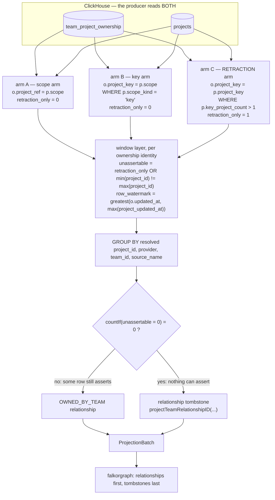

# Context Fabric: retracting a suppressed `OWNED_BY_TEAM` edge (CHAOS-4565)

Short design note, the companion to
[`context-fabric-work-item-ref-healing.md`](context-fabric-work-item-ref-healing.md):
both are cases where this producer has to REMOVE something it previously
projected, and both do it with a `ProjectionTombstone` rather than by
omission. Read that note first if you have not — the idempotent-unconditional
tombstone shape is the same, and this note assumes it.

Owning code: `internal/contextfabric/devhealthsource/teams_projects_edges.go`
(`projectTeamsStatement`, `queryProjectTeams`, `projectTeamRelationshipID`).

## 0. The defect

`queryProjectTeams` refuses to assert an ownership row in two cases:

| path | decided | since |
| --- | --- | --- |
| **ambiguous key** — the `project_key` names more than one project | in SQL, upstream: `readers.ProjectIdentityJoinSQL` emits no key scope row for `key_resolution_count > 1` | v7 |
| **conflicting identity** — the row's `project_id` resolves project A while its `project_key` resolves B | in the scan, `edge_suppressed = 1` | v8 (CHAOS-4542) |

In both cases the producer emitted only a progress candidate. But
**incremental graph application does not delete an absent relationship** —
`internal/contextfabric/AGENTS.md` states the rule the other way round:
*full-snapshot deletion semantics require an explicit complete-enumeration
proof*, and an incremental page is not one. So an `OWNED_BY_TEAM` edge
projected BEFORE its row became suppressed stayed live indefinitely, and only
a full rebuild cleared it.

**Suppression is a decision not to assert. It is not a retraction — and the
graph cannot tell the difference.**

## 1. Why a tombstone, and not a closed validity window

The ticket offered three shapes. A closed `valid_to = now` is the one worth
arguing about, because this producer already models ownership as an interval
and `ownershipValidity` already states both ends explicitly.

It is rejected because it asserts the wrong KIND of fact. Closing the window
says *"this ownership ended at T"* — a temporal claim about the world, which
the source never made and which nothing here can substantiate. What actually
happened is epistemic: *"we can no longer tell which project this ownership
names."* The ownership may well still be true; we have lost the ability to say
so. Writing a temporal fact to express an epistemic loss puts a statement into
the graph that a reader would be right to believe and wrong to act on. It
would also leave the edge present for any read path that does not filter on
`valid_to`, which is the acceptance criterion inverted.

Making suppression a rebuild trigger was rejected on amplification: one
ambiguous key would rebuild an organization's whole graph.

So: a `ProjectionTombstone{Kind: "relationship"}`. No contract widening — the
tombstone path, `applyTombstone`'s single `MATCH … DELETE` with the staleness
guard folded into the `WHERE`, and the batch's `Tombstones` slice all already
exist.

## 2. The mechanism



Three properties carry the design, and each is load-bearing.

### 2.1 One group decides once

`edge_suppressed` is a GROUP property, and the relationship id is DERIVED FROM
the group key (`provider`, resolved `project_id`, `team_id`, `source_name`). A
group with one asserting row is not suppressed, so no single group both asserts
and retracts. That matters because falkorgraph applies tombstones AFTER
relationships: a batch holding both for one id would write the edge and
immediately delete it.

**And that argument is weaker than it first reads — say the quiet part.** It
holds per group. Turning it into "a batch can never assert and retract the same
edge" needs one more premise: that DISTINCT GROUPS GET DISTINCT IDS. They do
not. `projectTeamRelationshipID` is a colon concatenation over id spaces that
themselves contain colons (`projects.id` is routinely
`{org}:gitlab:71133891`, team ids are routinely `gl:full.chaos`), so two
different groups can land on one id — and then one group's tombstone deletes
the other group's live edge.

An earlier draft of this note asserted the batch-level invariant without
checking that the encoding carried it. It was found on this change's own
certification review. Two things came out of it: the root fix, making the ids
injective via `identity.DeriveRelationship` (CHAOS-4635 — it must land before
any v9 rebuild, while the id change is still free), and a contract-level guard
shipped here, `validateProjectionRelationshipTombstoneCollision`, which rejects
a batch that asserts and tombstones one relationship id. The guard does not
make the collision impossible; it makes it LOUD, so the failure is a held
checkpoint rather than an ownership edge that quietly disappears while every
counter reports success.

Generalising the old `identity_conflict` flag to `unassertable` is what lets
ONE mechanism cover BOTH suppression paths. Fixing only the conflicting-identity
path would have left the older ambiguity hole open — live since v7, and
invisible only because every intervening source-version bump happened to
rebuild.

### 2.2 Arm C exists because the ambiguity path is otherwise invisible

An ambiguous key is filtered out inside the identity expansion, so a key-only
ownership row produces **no result row at all** and the scan has nothing to
retract. Arm C resolves the key across the AMBIGUOUS key partition — one row
per project sharing that key — flagged `retraction_only = 1` so `unassertable`
is forced true and it can never assert.

**How arm C knows a key is ambiguous, and the trap in the obvious answer.**
Not `key_resolution_count`. The expansion emits two scope rows per project, and
the ID row hard-codes `toUInt64(1) AS key_resolution_count` (readers v0.5.5,
deliberately: `projects.id` is unique, so an id match is unambiguous by
construction, and emitting the project-level number there had already made a
consumer discard every unambiguous Linear id match). The KEY row carries the
real count but is emitted only when it equals 1. So for an ambiguous key **no
row anywhere in the expansion carries a count above 1**, and
`p.key_resolution_count > 1` matches nothing, always. That is not hypothetical
— it is what the first version of this arm did, and it made the entire
ambiguity half of the fix dead code that every unit test still passed. Only
executing the integration subtests against a real ClickHouse caught it.

Ambiguity is therefore re-derived from the expansion's OWN output rather than a
second read of `projects`: count the projects that answer to each
`(provider, project_key)`, one layer out (`ambiguousProjectIdentitySQL`). The
`scope_kind = 'id'` filter there is a de-duplicator, not a narrowing — the
expansion collapses a project whose id equals its `project_key` into one row
labelled `'key'`, but that collapse requires the KEY branch to have emitted,
which requires the key to name exactly one project. Every member of a genuinely
ambiguous partition is therefore labelled `'id'`, so filtering on it cannot
undercount an ambiguity into invisibility.

Those projects are exactly the candidates the edge could have been projected to
while the key was still unambiguous, so tombstoning every one of them retracts
the real edge and no-ops on the rest. That is the same unconditional shape as
the ref-form healing, for the same reason: this producer is backend-neutral and
cannot ask the graph what is there, so it never knows whether a retraction is
"necessary" — and `applyTombstone`'s `DELETE` matching zero rows is what makes
the never-projected case and the re-run case the same no-op.

`retraction_only` is IN the window partition key. Without it, arm C's extra
resolved projects would land inside arm A/B's own `min()`/`max()` comparison and
read as an identity conflict, so an ownership row with a perfectly good
`project_id` would be suppressed the moment its UNUSED `project_key` became
ambiguous — turning a retraction feature into an edge-deletion bug.

### 2.3 The cursor had to grow a `projects` side, or arm C is dead code

The keyset watermark was `max(o.updated_at)` over `team_project_ownership`
alone. But ambiguity usually arrives because a NEW project starts sharing an
existing key — **that writes `projects`, not `team_project_ownership`**. The
ownership row's own `updated_at` never moves, the group stays behind the
checkpoint, and no incremental tick ever re-reads it. The retraction would be
emitted by code that is never reached. The same applies to a conflicting
identity that arrives because some OTHER project's `project_key` changed.

So the watermark is `greatest(the ownership row's own updated_at, the newest
updated_at among every project this ownership row's identity values can
reach)`. The window partition is the ownership row's own identity and the arms
are unioned BEFORE it, so "every project this row can reach" is not a second
query — it is exactly the rows already present.

**The bound on that claim, stated because an earlier draft of this note
over-promised it.** A `max` over a MUTABLE SET only detects changes that RAISE
the max, and the keyset filter is strict. So a projects-side write brings the
affected groups back over the cursor **when it raises the partition's
maximum** — which covers project creation and every project UPDATE, since
`projects` is `ReplacingMergeTree(updated_at)` and an update that loses on
`updated_at` does not win `FINAL` either. It does NOT cover an INSERT whose
`updated_at` sits below the partition's existing maximum: a backfill, a
replayed sync, or a partition already dominated by a future-dated row.

Note where that actually bites, because it is not this producer. The
projection cursor is SHARED by every table in this source, and `queryProjects`
(`teams_projects.go`, ordered on `projects.updated_at`) is what admits a
future-dated timestamp into it — unchanged by this work. This producer now
shares the cursor's fate rather than being immune to projects-side changes
altogether, which is strictly more coverage than before, not less. The bound is
pinned in BOTH directions by
`TestOwnershipProducerAgainstRealClickHouse`'s "retraction only follows
max-raising project writes", so this paragraph cannot quietly drift from the
behaviour. Widening it needs a durable record of key-partition membership,
which is not derivable from current state; that is tracked with the
membership-LEAVING case in §6.

`projectIdentityWithWatermarkSQL` carries `projects.updated_at` alongside
`readers.ProjectIdentityCatalogSQL`'s expansion. The library expansion is
wrapped in a `SELECT *` subquery before being joined, because its SQL ends
`) AS p` and this producer's own alias must also be `p`
(`ProjectIdentityMatchSQL` hard-codes `= p.scope`); enclosing it keeps the two
`p`s in separate scopes rather than relying on shadowing resolution, which this
file has already lost a live round to on ClickHouse 24.8.

## 3. The one thing that would make this decoration

`applyTombstone` matches on `relationship_id`. A tombstone whose canonical id
differs from the projected edge's **by one byte** deletes nothing, returns no
error, and is counted as applied — so every log, receipt and counter in the
pipeline reports a successful retraction while the stale edge is still there.

`projectTeamRelationshipID` is therefore the single definition, used by the
assertion and the retraction, and the test that guards it does not spell the id
out as a literal: it runs the SAME group twice, once asserting and once
suppressed, and requires the two ids to be equal. Both spellings would have to
be wrong in the same way to pass.

## 4. Telemetry

Counted on the existing `ambiguityLedger`, logged beside the existing
suppression line, under the closed vocabulary `ambiguous_key` /
`conflicting_identity`:

```
devhealthsource tombstoned project ownership edges
  org_id=<hashed> source=dev_health_teams_projects
  ownership_edge_tombstones_ambiguous_key=N
  ownership_edge_tombstones_conflicting_identity=M
```

Two naming decisions are deliberate:

- **A separate line from `logConflictingIdentities`**, which says an ownership
  was NOT ASSERTED. This one says an ownership that HAD been asserted was TAKEN
  BACK. Folding them together would restore the exact ambiguity this change
  removes.
- **"tombstones", not "retracted edges".** Retractions are emitted
  unconditionally (§2.2), so the number is an UPPER BOUND on what was removed.
  A count that claims more than it can support reads as coverage.

Counts and the closed reason vocabulary only — never a project id, key, team id
or row key, the same budget as its siblings.

## 5. Source version v8 → v9, and what the rebuild is for

The mechanism only reaches an edge whose group crosses the checkpoint. An edge
that went stale BEFORE this deploy went stale without moving its group's
watermark — which is precisely why nothing retracted it. **Those already-live
stale edges are unreachable to the mechanism that removes them.**

The version bump is what clears them, once per organization, exactly as v7 → v8
paid it. Note what it does NOT mean: the rebuild is not how retraction works, it
is how the pre-existing backlog is drained. CHAOS-4565's acceptance — *no
rebuild is required, and no checkpoint is reset* — is about the steady state
after this deploy, and that path is rebuild-free.

## 6. What this slice does not do

- It does not tell you whether a tombstone actually removed an edge. The
  producer cannot see the graph; the receipt's `TombstonesApplied` counts
  tombstones sent, not rows deleted. Closing that would need a backend-side
  signal from `applyTombstone`, which no other tombstone in this pipeline has
  either.
- It does not attribute an omission to a specific ownership row for the
  ambiguity path — CHAOS-4566 carries that, and its absence is why the catalog
  ambiguity count is a fact about the catalog rather than a claim about edges.
- It does not change `BELONGS_TO_PROJECT`, `queryWorkItemTeams`, or the team
  authorization scope. Only the project↔team ownership producer suppresses, so
  only it needs to retract.
- **It does not close the REVERSE direction: re-asserting an edge after the
  ambiguity is resolved.** Say key `K` becomes ambiguous because project `Q`
  starts sharing it, the edge to `P` is retracted, and the cursor advances past
  that group. If `Q` is later re-keyed away, `K` is unambiguous again and `P`'s
  edge should come back — but `Q` has left the key partition, so the group's
  watermark falls back to values already behind the checkpoint and nothing
  re-reads it until the ownership row itself is written.

  This is stated plainly rather than glossed, but note what it is and is not.
  It is not a regression: on the parent commit a `projects`-side write moved
  this producer's cursor for NO group at all, so re-assertion after healing was
  equally unreachable, and the edge was simply left stale instead. What changes
  is the shape of the wrong answer — from "a stale edge is present" to "a
  correct edge is absent until the next ownership write" — which is the safer
  of the two, because the graph no longer makes a claim it cannot substantiate.
  Closing it properly needs a watermark over every project that has EVER shared
  a key, which is not derivable from current state, so it is a separate piece of
  work and not a patch to this one.
- **It does not detect a projects-side change that fails to RAISE the key
  partition's maximum `updated_at`** — see §2.3's bound. Same root cause as the
  bullet above: the cursor is a max over a mutable set, so it sees membership
  and value changes only when they push the maximum up. Membership LEAVING and
  membership JOINING BELOW THE MAX are the two faces of it, and they are
  tracked together as one follow-up rather than as two symptoms.
