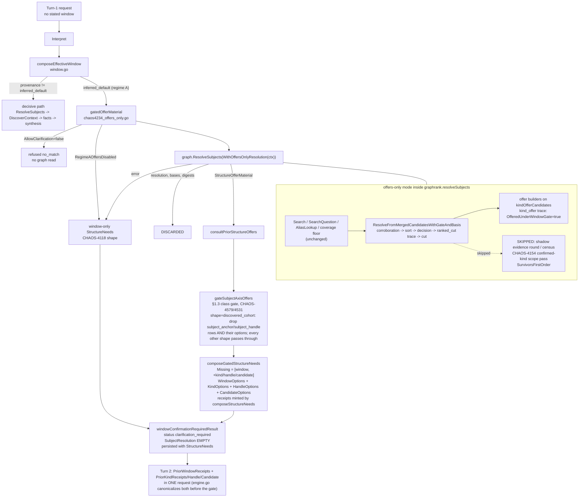

# Context Fabric turn-1 window gate: offers beside the window offer (CHAOS-4234)

Short reference note. Covers: what the class-default window gate ("regime
A") returns on turn 1 after CHAOS-4234, the offers-only resolution that
feeds it, what that pass skips and why, and the trace/report fields a
trial artifact carries for it. Design ruling and safety argument live in
`internal/contextfabric/chaos4234_offers_only.go`'s own doc comment;
sibling note: [`context-fabric-result-semantics.md`](context-fabric-result-semantics.md).

## 1. Why

Before CHAOS-4234 the class-default window gate (`engine.go`,
`WindowCanonicalizationGatedClassDefault`) returned before `ResolveSubjects`
ever ran, so `windowConfirmationRequiredResult` could only compose a
window-only disclosure (CHAOS-4118 option (a)). On the two kiac replicates
of record that made regime A the whole "ranking-budget wall": 45/50 and
43/48 positive-arm `expected_kind` offer misses and 14/25, 13/24
`subject_handle` misses were rows with no candidate pool at all, and a case
that spent turn 1 on the window and turn 2 on the kind never answered inside
the two-turn harness.

Ruling (team-lead, 2026-08-24): run `ResolveSubjects` under the gate in an
offers-only mode, keep its `StructureOfferMaterial`, discard every
commit-bearing output, compose kind/handle/candidate offers beside the
window offer. Ratified with it: offers minted under an inferred window are
non-decisive disclosure, the same class as the window offer itself. The
CHAOS-4040 bar (no committed material under an inferred window, gate order
unchanged, `window_commit_count` stays 0) is untouched; CHAOS-4118(a) is
extended, not reversed; CHAOS-4039's noninterference proof is untouched.

## 2. Turn-1 gated path

The pass is window-agnostic by construction: the inferred window lives in
`effectiveWindow`, never in `interpretation.TimeContext`, and the graph
request handed to `ResolveSubjects` is the same `graphRequest` the decisive
path would use. Cost per gated request equals a regime-B turn 1 (per term:
one fulltext, one embedding, one KNN, plus alias lookup, question search,
and the coverage floor) minus the census round.

## 2a. The §1.3 class-conditional gate (CHAOS-4579 / CHAOS-4531)

`anchorOfferMaterial` and `handleOfferMaterial`
(`graphrank/chaos3900_structure_offers.go`) decide their `Missing` row from
the candidate pool alone; neither has ever been told what CLASS of question
it is building offers for. That gap was recorded in the code as the
unimplemented "P1.C' §1.3 class-conditional gate".

Live consequence (chris, kiac Ask Dev rig, 2026-08-29 19:59 PDT, acr
`70c4a846` / ask-dev `428f46768`, epoch 4): turn 1 of *"What teams are
struggling and what are the contributing factors?"* resolved `kind=team`
correctly and then disclosed
`missing = [window, subject_anchor, subject_handle]` with empty
`anchor_options` and `handle_options` — the UI rendered "Which repository,
project, or team?" and "Which specific item?" with no candidates behind
either. Turn 2, carrying only the window receipt, produced the correct
`discovered_cohort` answer: the investigation understood the plural intent,
the clarification planner did not.

`gateSubjectAxisOffers`
(`internal/contextfabric/chaos4579_cohort_structure_gate.go`) closes it at
the composition boundary, applied at BOTH `composeStructureNeeds` call
sites — this document's gate-2 path (`gatedOfferMaterial`, after
`consultPriorStructureOffers` and before the `StructureNeedsWouldDisclose`
check) and the subjectless terminal (`unresolved.go`'s `terminalResult`,
ahead of its own `schemaVersion` dispatch).

| Interpreted shape | Subject axis | `subject_anchor` / `subject_handle` |
| --- | --- | --- |
| `discovered_cohort` | none — the question names no subject | **dropped**, rows and options together |
| `single_subject` | one | disclosed, standing zero-candidates ruling unchanged |
| `explicit_cohort` | plural, but NAMED — an anchor says which named things were meant | disclosed, unchanged |
| `open` | makes no claim about its own structure | disclosed, unchanged |

Three properties the implementation depends on:

- **One signal, reused.** `InterpretedQuestion.Shape` is the same
  model-set field `graphrank.DiscoveredCohort` gates the whole cohort
  ranking path on (`discover.go:256`) and the same one
  `classStructurallyCompatible`/`fallbackClass` class the window on
  (`chaos3900_window_class.go`). There is deliberately no plural-noun scan
  or question-text heuristic: a wrong shape is an interpret-stage defect
  with one place to fix it, not a disagreement between two detectors.
- **Rows and options are one decision.** Dropping only the row would leave
  options on the wire with no member asking for them (a receipt redeemable
  against a need never disclosed); dropping only the options leaves exactly
  the empty-offer shell CHAOS-4579 was filed about.
- **`AnchorOptionsRequireV2` is cleared with the options.** It is the sole
  signal promoting a result to the v2 semantic major, and both call sites
  dispatch `schemaVersion` off it.

Gate 1 (explicit-unconfirmed) needs no gate: it fires before `Interpret`
and never builds anchor or handle material at all.

CHAOS-4452's question-family investigation-planning stage is the structural
home for this decision — a family would carry, per class, the whole set of
axes that are even applicable, and every offer builder would consult it
rather than each disclosing unconditionally and being filtered afterwards.
This gate is the narrow fix, placed at the composition boundary so 4452 has
one call-site pair to absorb rather than a scattering of per-builder class
checks.

## 3. Reversibility

`EngineOptions.RegimeAOffersDisabled` (zero value = enabled) restores the
window-only disclosure and skips the graph read entirely. The engine-side
discard is the load-bearing safety layer; the ctx mark
(`contextfabric.WithOffersOnlyResolution`) is a cost optimisation a
`GraphReader` may ignore without producing a wrong outcome.

## 4. Telemetry (same change)

| Where | Field | Meaning |
| --- | --- | --- |
| `EngineTelemetry.RecordGatedOfferResolution` | `composed` / `empty` / `failed` / `disabled` / `refused` / `not_projected` | once per class-default gated request; `not_projected` (codex round-2 finding #2) distinguishes a never-projected org from a genuinely empty pool, same as `subjectlessTerminalReasons`' `graph_not_projected` does for the decisive path |
| `EngineTelemetry.RecordCohortStructureGate` | `applied` / `no_op` / `subject_bearing` + the `shape` it fired for | once per composed `StructureNeeds`, at both call sites; `applied` = the anchor/handle rows were removed, `no_op` = axis-less shape with nothing to remove, `subject_bearing` = the shape has a subject axis and the material passed through. Both outcomes AND the denominator are reported, so "cohort vs subject clarification" is a countable split rather than an inference from a missing log line |
| `kind_offer` trace event | `OfferedUnderWindowGate` | this resolution ran in offers-only mode |
| `ranked_cut` trace stage (`resolution.go`) | `Subject`, `Rank`, `Survived` | one event per candidate, in rank order, before the `MaxSubjectCandidates` cut; `Rank==1` opens a batch, readers keep the last batch |
| `ranked_cut` companion (`resolve.go`) | `CoverageBypass=true`, `Rank 0` | a coverage-floor find the cut dropped but `unionCandidatesForOffer` still hands to the offer builders |
| two-turn report row (schema v29) | `turn1_offer_composed_under_window_gate`, `expected_subject_in_pool`, `expected_subject_rank`, `expected_subject_at_offer_boundary`, `turn2_window_receipt_attached` | subject-level twins of `expected_in_pool` / `expected_kind_at_offer_boundary`; harness semantics flag |
| two-turn report (schema v29) | `regime_a_offer_composed_count`, `regime_a_turn2_answered_count` | summed by `cmd/acr-trial-merge-two-turn`, no bar |

Harness semantics change (schema v29): on a regime-A case the positive
arm's turn 2 carries the oracle's window receipt beside the member receipt.
`offer_miss_count` stays an engine-only aggregate across the bump; turn-2
aggregates carry the harness change as part of the lever.

## 5. Measurement

Kiac replicate pair at tip against the schema-27 pair of record
(`gen-trial-chaos3742_twoturn-parallel-20260824T163241Z` /
`...T175417Z`). Must move: `offer_miss_count.expected_kind` (50/48),
`offer_miss_count.subject_handle` (25/24), `regime_a_turn2_answered_count`
up from 8/46, 8/41 window rows. Must not move: `wrong_commit_count` 0,
`false_no_match_count` 0, `window_commit_count` 0, `window_gated_count` 65,
`anti_vacuity_valid` true, `controls_witnessed` 27/27,
`inferred_unjustified_count` 0, `structure_and_window_disclosure_absent_count`
0. Aggregates only; per-case noise is 22-34%.
