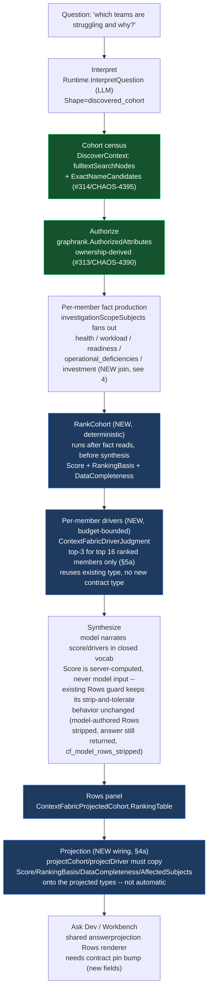
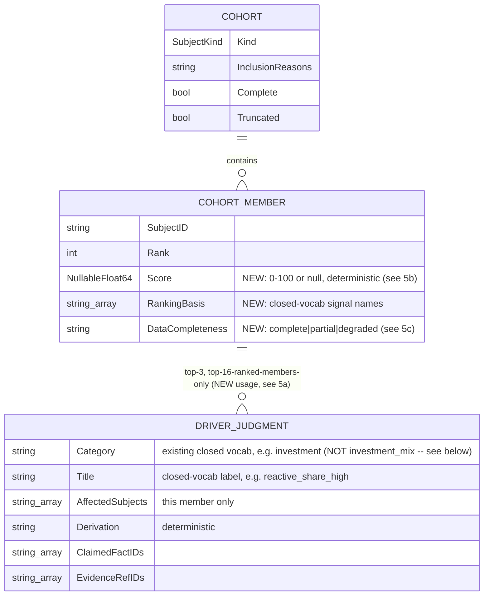

# Context Fabric: subject model and cohort answer design (CHAOS-4398)

Design note for the 2026-08-28 gate re-open: team/cohort questions and the chat
surface were not gate-clean (chris 04:05). Covers the current subject model,
the two corrected root causes that blocked team cohort answers, and the
cohort ranking + drivers + Rows design that answers the charter question
"which teams are struggling and why" (CHAOS-3741, CHAOS-4398).

Decision record: [Linear — Subject model + cohort answers, decisions
2026-08-28](https://linear.app/fullchaos/document/subject-model-cohort-answers-decisions-2026-08-28-8fec005d1fb3).
Plan source: `.remember/context-fabric/drafts/cohort-answer-plan.md` and
`.remember/context-fabric/drafts/subject-model-requirement.md` (session
scratch, not authoritative — this page and the Linear document are).

## 1. Subject model

`ContextFabricSubjectKind` (`internal/contracts/v1/context_fabric_types.go:84`)
declares the full subject vocabulary. Of the kinds relevant to cohort/team
answers:

| Kind | Source (ClickHouse / graph) | Ownership rule | Status |
|---|---|---|---|
| `team` | `teams` table; graph node via `queryTeams` (`devhealthsource/teams_projects.go`) | **Ownership only** — a team owns a subject iff `team_repo_ownership`/`team_project_ownership` says so. Never person→membership (CHAOS-4321 hard rule) | first-class, cohort-capable |
| `project` | `projects` table; graph node via `teams_projects.go` | `team_project_ownership` (project→team) | first-class, cohort-capable — `interpretedCohortKind` already selects `SubjectProject` for project-shaped questions and `DiscoveredCohort` admits project nodes the same way it admits team nodes. The real limitation is narrower: `interpretedCohortKind` picks exactly **one** kind per question (a substring heuristic, `graphrank/discover.go:296`), so a mixed team+project cohort in one question is not supported — that is a distinct, pre-existing gap, not "project is single-subject only" |
| `repository` | `repositories`/`tables.go` | N/A (leaf; owned by team indirectly via ownership tables, never a direct graph edge — see diagram 3 caveat below) | first-class |
| `metric` | `ContextFabricSubjectMetric` constant declared (`model.go:92`) | — | **declared, not wired** — no query producer reads it yet |
| person | — | — | **not a subject kind in acr.** No `SubjectPerson` exists. This is by design, not an oversight: the platform contract bars person-level productivity/health/workload/staffing rankings (root `AGENTS.md`, "Visualization Guardrails"); a `person` subject able to carry a ranking would need a governance decision first, not a silent addition. |

**No direct repository↔project or repository↔team graph edge exists, by
design** — `project` here is a work-tracking project (Linear-shaped), not a
repository group. The only path from a project/team to a repository-scoped
activity kind (PR, review, CI run, deployment) is through `work_item`:
`project <-BELONGS_TO_PROJECT- work_item -BELONGS_TO_REPOSITORY-> repository`,
an **activity proxy**, never an ownership claim
(`docs/design/context-fabric-architecture-diagrams.md` §3,
`docs/design/context-fabric-fact-scope.md` §1). ClickHouse-side ownership
joins (`team_repo_ownership`, used by `HealthProvider`'s project rollup) are a
fact-producer join, not a graph edge, and do not appear in the graph diagram.

## 2. Corrections (2026-08-28 gate re-open)

Two independently-real defects co-occurred on the same live "which teams are
struggling" request and were first diagnosed backwards. Both are now fixed or
in flight; **do not re-litigate the original framing** below — it is kept only
so the corrected mechanism is legible against what a reader might find in
older commit messages or tickets.

### 2a. Team authorization was a wildcard over-exposure, not a deny (CHAOS-4390, fixed)

**Original (superseded) framing:** `graphrank.AuthorizedAttributes`
(`authorize.go:48`) was believed to deny any node whenever
`principal.RepositoryScopes` is non-empty unless the node's
`authorization_repositories` matches, and since `queryTeams` never set
`RepositorySlugs` on team nodes, every team was believed to be denied.

**Falsified by a live FalkorDB testcontainers round-trip.**
`falkorgraph/projection.go`'s `authorizationValue` converts an EMPTY
`RepositorySlugs` list into the literal wildcard string `"*"`, and the
wildcard branch in `scopeContainsAttr` authorizes that unconditionally for
*any* repository-scoped principal. The real defect was the opposite
direction: every team in an organization was visible to every
repository-scoped principal, unconditionally — a cross-scope information
leak, not a false deny.

**Fix (merged, PR #313):** authorize a team iff it owns ≥1 repository inside
the principal's scope (`team_repo_ownership`, CHAOS-4321 ownership-only). A
team with no ownership row gets an explicit deny sentinel
(`noTeamOwnershipSentinel`) — never a bare empty list, which would fall back
to the wildcard and reproduce the exact leak this fix closes.

### 2b. Cohort retrieval was fulltext-only (CHAOS-4395, in flight)

`DiscoverContext`'s only node source for the subjectless-cohort case was
`fulltextSearchNodes` — a lexical search over the raw question text. A
termless "which teams are struggling" names no team by label/alias/key, so
the search legitimately returned nothing and the cohort stayed empty — even
though `Interpretation.Shape` was correctly `discovered_cohort` and
authorization (once 2a is fixed) would allow every member.

**Interpretation was never the gap.** `InterpretationOutput.Shape` is a real
enum (`single_subject|explicit_cohort|discovered_cohort|open`,
`genkitruntime/runtime.go:1221`) and the prompt already instructs the model to
pick `discovered_cohort` for exactly this question shape
(`genkitruntime/prompts.go:89`). Top-level intent is genuinely LLM-driven
(`Runtime.InterpretQuestion`).

**Fix (PR #314, stacked on #313):** when `Shape` names a cohort kind, source
cohort members from `ExactNameCandidates`/the kind census (CHAOS-4348's
existing kind-exhaustive, term-free fetch, already used by the single-subject
path) in addition to fulltext — scoped to cohort requests only. Output shape
stays offers-only (no ranking/drivers); those are CHAOS-4398, below.

## 3. Cohort answer pipeline (CHAOS-4398)

The model never computes or narrates a number it was not given — the same
discipline as canonical theme roll-up (root `AGENTS.md`) and
`attachCanonicalRows` (`model_runtime.go:575`, "only place `Rows` is set").
`RankCohort` sits in that same ordering slot: after fact reads, before
`SynthesizeAnswer`. `Score` is never a field the model can set in the first
place (it is computed server-side and only ever narrated), so it needs no new
guard of its own; the existing `StripModelAuthoredClaimedFactRows` path
already tolerates a model-authored `Rows` claim by stripping it and
continuing (`cf_model_rows_stripped`), not by rejecting the whole answer —
this design does not change that behavior and the diagram above corrects an
earlier draft that mischaracterized it as a hard rejection.

## 4. Data model

`Score`/`RankingBasis`/`DataCompleteness` are additive fields on the existing
`ContextFabricCohortMember` (`context_fabric_types.go:995`) — a contract
widening, which per standing rule requires an ask-dev pin bump before the
Workbench/chat surface can render them. `ContextFabricDriverJudgment` is
reused as-is; no new contract type — but its `Category` is a **closed
vocabulary** (`ContextFabricDriverCategory`, `context_fabric_types.go:417`)
with no `investment_mix` member. Term 1's drivers must use the existing
`ContextFabricDriverCategoryInvestment` (`"investment"`) and carry the
finer-grained closed-vocab label (`reactive_share_high`,
`deliberate_share_low`, `mix_concentrated`, `mix_shift_toward_*`) in `Title`,
which is already a free-text string field — not by widening the `Category`
enum. "No person-to-person rankings" is unaffected — a team cohort ranks
teams, never individual people.

### 4a. Projection gap (P1, must be closed in PR1 or PR3)

Adding fields to `ContextFabricCohortMember`/`ContextFabricDriverJudgment`
(the canonical result types) does **not** make them reach API/MCP/Ask Dev.
`internal/contracts/v1/context_fabric_answer_projection.go`'s
`ContextFabricProjectedCohortMember` carries only `Subject`, `Rank`,
`InclusionReasons`, `EvidenceRefIDs` today — no `Score`/`RankingBasis`/
`DataCompleteness`. `ContextFabricProjectedDriver` carries `Category`,
`Title`, `Summary`, etc. but **no `AffectedSubjects`**, so a projected driver
cannot be tied back to which cohort member it explains. Whatever function
builds `ContextFabricProjectedCohort` (the `projectCohort`-shaped code path)
must be extended to copy all four new/newly-needed fields, and per the
[contract-first rule](../contract-versioning.md) that requires, in the same
PR: the Go projected types, the JSON Schema, the OpenAPI document, MCP
embedded schema copies, golden fixtures under `contracts/examples/v1`, and
parity tests — not just the canonical-result-side contract change described
above. Skipping this makes the whole cohort-ranking feature invisible to
every consumer that reads the answer surface instead of the raw
investigation result.

## 5. Score formula

Weighted, renormalized over available signals only — a missing signal family
is excluded from the denominator, never scored as zero. Every signal is
normalized to `[0,1]` **before** its weight is applied (below); without this
the weighted sum is not deterministic and can land outside the declared
`[0,100]` `Score` range, which the first draft of this design left
unspecified.

| # | Signal | Source | Normalization to `[0,1]` | Weight | Direction |
|---|---|---|---|---|---|
| 1 | Investment-mix imbalance (driver family #1, chris direction) | new team-scoped `theme_distribution` (§6) | already `[0,1]` by construction — see sub-formula | 30 | see sub-formula |
| 2 | Health risk | `health.compounding_risk` | already `[0,1]` (the canonical score's own persisted range — `docs/reference` ops metric) | 25 | higher risk → higher score |
| 3 | Deficiency severity | `operational_deficiencies.severity` (string; a team can have several fired rules at once) | map each fired rule's severity string to an ordinal (`low=0.25, medium=0.5, high=0.75, critical=1.0` — **the exact severity value set must be confirmed against `recommendations_daily` in PR1**, this mapping is a proposed default, not verified against live data), then take the **max** across the team's fired rules (worst case governs, not an average) | 20 | higher mapped value → higher score |
| 4 | Readiness gap | `1 - readiness.estimate_coverage_ratio` | already `[0,1]` since `estimate_coverage_ratio` is itself `[0,1]` | 15 | lower coverage → higher score |
| 5 | Workload pressure | `workload.forecast_p50_days` | min-max normalized **within the cohort being ranked** (`(x - min) / (max - min)` over the cohort's own values that day; `0.5` when every member ties, i.e. `max == min`) — a z-score is unbounded and can be negative, so it cannot feed a weighted `[0,100]` sum directly | 10 | longer forecast → higher score |

**Term 1 sub-formula** (own internal weights, produces one `[0,1]` value
before the table's weight-30 applies — already bounded because each
sub-signal below is a boolean threshold crossing, not a raw magnitude): each
sub-signal is also its own closed-vocabulary `RankingBasis`/driver label —
the pattern is borrowed from `investment_mix_explain.py`'s deterministic
`quality_drivers` list, **never** that file's LLM-authored narrative prose
(the Python-prototype path the standing rule excludes as a Context Fabric
reference).

| Sub-signal | Definition | Label (closed vocab) | Sub-weight |
|---|---|---|---|
| Reactive share | `operational` theme share + `quality.bugfix` subcategory share > 0.40 | `reactive_share_high` | 0.35 |
| Deliberate share | `feature_delivery` theme share < 0.20 | `deliberate_share_low` | 0.30 |
| Concentration | `max(theme_share)` across the 5 canonical themes > 0.55 | `mix_concentrated` | 0.15 |
| Mix shift | see below — signed, not just magnitude | `mix_shift_toward_operational` / `mix_shift_toward_feature` / `mix_shift_other` | 0.20 |

**Mix shift needs a signed delta, not a magnitude sum.** `Σ|share_t -
share_t-1|` over all 5 themes tells you shift *happened* (crosses the 0.15pt
threshold) but carries no sign or destination, so it cannot choose between
`mix_shift_toward_operational` and `mix_shift_toward_feature`. Compute the
**signed** per-theme delta (`share_t - share_t-1`, 5 values summing to ~0)
and take the theme with the largest-magnitude positive delta as the
direction: label `mix_shift_toward_operational` if that theme is
`operational`, `mix_shift_toward_feature` if it is `feature_delivery`, and
`mix_shift_other` (a third closed-vocab value, added here) if the largest
mover is `maintenance`, `quality`, or `risk` — the two-label vocabulary in
the plan draft cannot represent a shift that moves mass into neither named
theme.

No new categories are invented in the taxonomy sense — every label maps onto
the fixed 5-theme/15-subcategory taxonomy (root `AGENTS.md`: "no
synonyms/overrides"), mapping stated explicitly here so it is auditable. Each
label above is carried in `ContextFabricDriverJudgment.Title` with
`Category=` the existing `ContextFabricDriverCategoryInvestment`
(`"investment"`) — **not** a new `investment_mix` category value, which is
not in the closed `ContextFabricDriverCategory` vocabulary
(`context_fabric_types.go:417`) and would be rejected by
`ContextFabricDriverJudgment.Validate`.

### 5a. Driver budget (P1, must be resolved before PR2)

`ContextFabricDriversMaxCount` is **50** total driver judgments per answer
(`context_fabric_model_bounds.go:236`), and `MaxCohortMembers` defaults to
**250** (`answer_reuse.go:213`) — both bounds are real and independent. Top-3
drivers per member is infeasible past 16 members (`16 × 3 = 48 ≤ 50`; 17
members already exceeds it), and a cohort that trips the total budget fails
answer validation entirely, which would make the largest, most-in-need-of-an-
answer cohorts the ones most likely to error. Design rule: emit top-3 drivers
only for the **top 16 members by `Score`** (ties broken by pool order, same
tiebreak as ranking itself); members ranked 17th and beyond get `Score` +
`RankingBasis` + `DataCompleteness` (already enough to render a ranked Rows
table) but zero `ContextFabricDriverJudgment` entries. This is the same
"disclose the bound, do not silently drop" pattern `Cohort.Truncated` already
uses for membership itself. `16` is derived from `floor(50/3)`; if a future
PR needs more members with full drivers, it must either version the driver
contract or reduce the per-member driver count, not silently violate
`ContextFabricDriversMaxCount`.

### 5b. Zero-signal team (P1, must be resolved in PR1)

A team with rows in **none** of the 5 signal families (§5's "explicitly
supported" degraded case) has an empty weight denominator — `Score` cannot be
computed as a number, and assigning `0` would make the least-observed team
render as the healthiest, which contradicts this design's own "never scored
as zero" intent from the first draft. Resolution: `Score` must be a
**nullable** field (`*float64` in Go, `score: number | null` in the widened
contract — an addition to the §4a contract-widening list, not a separate
change), `null` exactly when zero signal families are available.
`DataCompleteness=degraded` already covers this case; rank placement for a
null-`Score` member is deterministic and last: sorted after every member with
a real `Score`, ties among null-`Score` members broken by pool order (the
same tiebreak used everywhere else in this design). The member still appears
in the Rows table — never dropped — with its score cell rendered as "no
data" rather than a fabricated number.

### 5c. Completeness thresholds (non-overlapping)

The first draft's `partial` (`≥1 missing`) and `degraded` (`≤2 available`)
ranges overlapped whenever exactly 1 or 2 families were missing. Corrected,
non-overlapping thresholds over the 5 top-level signal families (term 1
counts as one family):

| Families available | `DataCompleteness` |
|---|---|
| 5 | `complete` |
| 3–4 | `partial` |
| 1–2 | `degraded` |
| 0 | `degraded`, `Score=null` (§5b) |

## 6. Finding: the existing investment producer reads the deprecated source

`FactInvestment` (CHAOS-4363/#308) reads `investment_metrics_daily`, fed by
the **deprecated** `ops/src/dev_health_ops/config/investment_areas.yaml` rule
set (free-form legacy labels, e.g. `security`/`infrastructure` — not the
canonical 5-theme taxonomy). The canonical theme/subcategory distribution
comes from `work_unit_investments`, read through the query-time
`latest_work_unit_investments` CTE (not a persisted table — it dedups to one
row per `(org_id, work_unit_id)` via `argMax(..., computed_at)`), LEFT
JOINed to `work_item_team_attributions` via ops's shared
`build_unit_team_subquery` helper (`api/queries/investment.py`; see
`fetch_investment_team_edges` for the reference caller), which already
carries ownership precedence per CHAOS-2600 — **acr has no producer reading
this join today**, the same class of gap CHAOS-4347 named for repository
status and CHAOS-4365 named for cognitive load. The investment Rows proven
live on 2026-08-27 came from the deprecated source. CHAOS-4398's PR1 adds the
new team-scoped read before term 1 of the score formula can be trusted —
either a new typed query function in `api/queries/investment.py` or an
equivalent join built the same way; there is no existing exported query API
for this shape to call as-is. See the ops-side deprecation note:
`dev-health-ops` `docs/reference/data-models/investment.md`.

## 7. What this does not cover

- Cohort ranking/drivers implementation itself (CHAOS-4398 is Backlog as of
  this writing) — this page documents the design, not a shipped capability.
  Update this page's pipeline diagram's node classes (`fixed` vs. `newnode`)
  as each of CHAOS-4398's 4 stacked PRs lands. §4a, §5a, §5b, and §5c resolve
  contract/bound conflicts a review of this design surfaced (driver-count
  budget, nullable score, non-overlapping completeness, the projection gap,
  the `Category` vocabulary, and severity/workload normalization) — PR1/PR2
  implement against the corrected versions in those sections, not the
  original unbounded framing.
- The severity→ordinal mapping in §5 row 3 is a proposed default that must be
  checked against `recommendations_daily`'s real severity value set in PR1,
  not assumed correct from this page alone.
- `metric` and `person` subject handling — out of scope; see §1.
- Chat-vs-Workbench structure-offer parity and the "cannot re-ask" chat
  defect — tracked separately (`.remember/context-fabric/drafts/subject-model-requirement.md`
  §2-3), not a subject-model or cohort-ranking concern.
