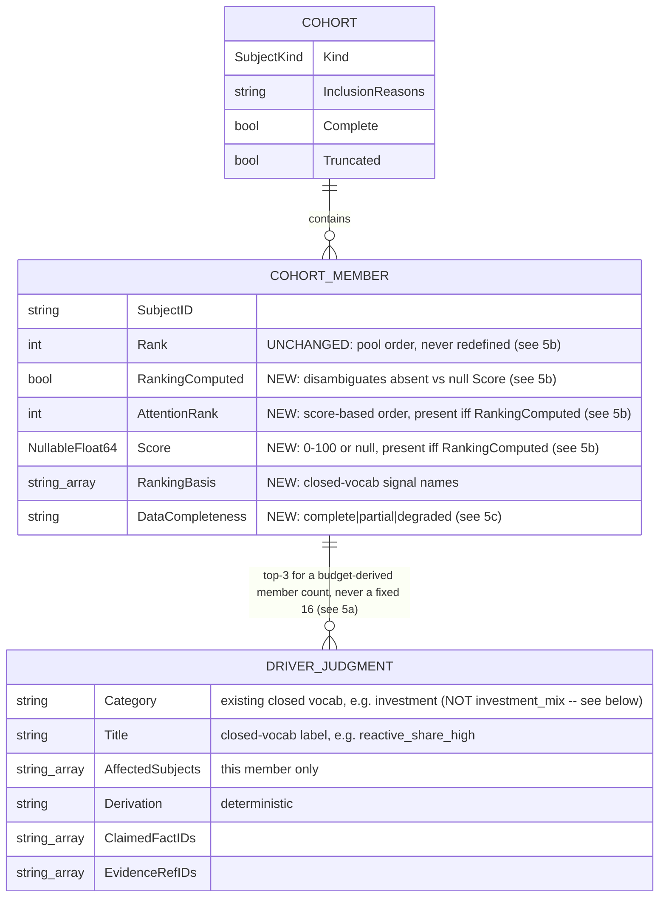
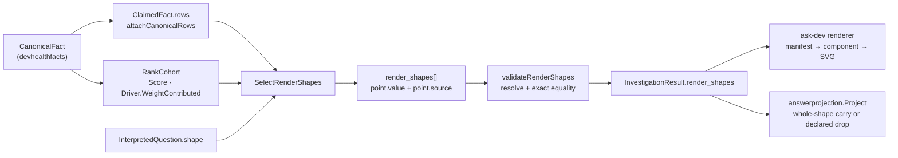

# Context Fabric: subject model and cohort answer design (CHAOS-4398)

Design note for the 2026-08-28 gate re-open: team/cohort questions and the chat
surface were not gate-clean (chris 04:05). Covers the current subject model,
the two corrected root causes that blocked team cohort answers, and the
cohort ranking + drivers + Rows design that answers the charter question
"which teams are struggling and why" (CHAOS-3741, CHAOS-4398).

Decision record: [Linear — Subject model + cohort answers, decisions
2026-08-28](https://linear.app/fullchaos/document/subject-model-cohort-answers-decisions-2026-08-28-8fec005d1fb3).
Plan source: `.remember/context-fabric/drafts/cohort-answer-plan.md` and
`.remember/context-fabric/drafts/subject-model-requirement.md` (session
scratch, not authoritative — this page and the Linear document are).

## 1. Subject model

`ContextFabricSubjectKind` (`internal/contracts/v1/context_fabric_types.go:84`)
declares the full subject vocabulary. Of the kinds relevant to cohort/team
answers:

| Kind | Source (ClickHouse / graph) | Ownership rule | Status |
|---|---|---|---|
| `team` | `teams` table; graph node via `queryTeams` (`devhealthsource/teams_projects.go`) | **Ownership only** — a team owns a subject iff `team_repo_ownership`/`team_project_ownership` says so. Never person→membership (CHAOS-4321 hard rule) | first-class, cohort-capable |
| `project` | `projects` table; graph node via `teams_projects.go` | `team_project_ownership` (project→team) | first-class, cohort-capable — `interpretedCohortKind` already selects `SubjectProject` for project-shaped questions and `DiscoveredCohort` admits project nodes the same way it admits team nodes. The real limitation is narrower: `interpretedCohortKind` picks exactly **one** kind per question (a substring heuristic, `graphrank/discover.go:296`), so a mixed team+project cohort in one question is not supported — that is a distinct, pre-existing gap, not "project is single-subject only" |
| `repository` | `repositories`/`tables.go` | N/A (leaf; owned by team indirectly via ownership tables, never a direct graph edge — see diagram 3 caveat below) | first-class |
| `metric` | `ContextFabricSubjectMetric` constant declared (`model.go:92`) | — | **declared, not wired** — no query producer reads it yet |
| person | — | — | **not a subject kind in acr.** No `SubjectPerson` exists. This is by design, not an oversight: the dev-health **platform** root `AGENTS.md` (`../../AGENTS.md` from this repo — distinct from this repo's own `AGENTS.md`) bars person-to-person rankings under "Visualization Guardrails," and the Context Fabric project's own Linear description states the finer "no person-level productivity, health, workload, or staffing ranking" as a non-negotiable boundary; a `person` subject able to carry a ranking would need a governance decision first, not a silent addition. |

**No direct repository↔project or repository↔team graph edge exists, by
design** — `project` here is a work-tracking project (Linear-shaped), not a
repository group. The only path from a project/team to a repository-scoped
activity kind (PR, review, CI run, deployment) is through `work_item`:
`project <-BELONGS_TO_PROJECT- work_item -BELONGS_TO_REPOSITORY-> repository`,
an **activity proxy**, never an ownership claim
(`docs/design/context-fabric-architecture-diagrams.md` §3,
`docs/design/context-fabric-fact-scope.md` §1). ClickHouse-side ownership
joins (`team_repo_ownership`, used by `HealthProvider`'s project rollup) are a
fact-producer join, not a graph edge, and do not appear in the graph diagram.

## 2. Corrections (2026-08-28 gate re-open)

Two independently-real defects co-occurred on the same live "which teams are
struggling" request and were first diagnosed backwards. Both are now fixed or
in flight; **do not re-litigate the original framing** below — it is kept only
so the corrected mechanism is legible against what a reader might find in
older commit messages or tickets.

### 2a. Team authorization was a wildcard over-exposure, not a deny (CHAOS-4390, fixed)

**Original (superseded) framing:** `graphrank.AuthorizedAttributes`
(`authorize.go:48`) was believed to deny any node whenever
`principal.RepositoryScopes` is non-empty unless the node's
`authorization_repositories` matches, and since `queryTeams` never set
`RepositorySlugs` on team nodes, every team was believed to be denied.

**Falsified by a live FalkorDB testcontainers round-trip.**
`falkorgraph/projection.go`'s `authorizationValue` converts an EMPTY
`RepositorySlugs` list into the literal wildcard string `"*"`, and the
wildcard branch in `scopeContainsAttr` authorizes that unconditionally for
*any* repository-scoped principal. The real defect was the opposite
direction: every team in an organization was visible to every
repository-scoped principal, unconditionally — a cross-scope information
leak, not a false deny.

**Fix (merged, PR #313):** authorize a team iff it owns ≥1 repository inside
the principal's scope (`team_repo_ownership`, CHAOS-4321 ownership-only). A
team with no ownership row gets an explicit deny sentinel
(`noTeamOwnershipSentinel`) — never a bare empty list, which would fall back
to the wildcard and reproduce the exact leak this fix closes.

### 2b. Cohort retrieval was fulltext-only (CHAOS-4395, in flight)

`DiscoverContext`'s only node source for the subjectless-cohort case was
`fulltextSearchNodes` — a lexical search over the raw question text. A
termless "which teams are struggling" names no team by label/alias/key, so
the search legitimately returned nothing and the cohort stayed empty — even
though `Interpretation.Shape` was correctly `discovered_cohort` and
authorization (once 2a is fixed) would allow every member.

**Interpretation was never the gap.** `InterpretationOutput.Shape` is a real
enum (`single_subject|explicit_cohort|discovered_cohort|open`,
`genkitruntime/runtime.go:1221`) and the prompt already instructs the model to
pick `discovered_cohort` for exactly this question shape
(`genkitruntime/prompts.go:89`). Top-level intent is genuinely LLM-driven
(`Runtime.InterpretQuestion`).

**Fix (PR #314, stacked on #313):** when `Shape` names a cohort kind, source
cohort members from `ExactNameCandidates`/the kind census (CHAOS-4348's
existing kind-exhaustive, term-free fetch, already used by the single-subject
path) in addition to fulltext — scoped to cohort requests only. Output shape
stays offers-only (no ranking/drivers); those are CHAOS-4398, below.

## 3. Cohort answer pipeline (CHAOS-4398)

```mermaid
flowchart TD
  Q["Question: 'which teams are struggling and why?'"] --> INTERPRET["Interpret<br/>Runtime.InterpretQuestion (LLM)<br/>Shape=discovered_cohort"]
  INTERPRET --> CENSUS["Cohort census<br/>DiscoverContext: fulltextSearchNodes today<br/>+ ExactNameCandidates -- IN FLIGHT (#314/CHAOS-4395,<br/>not yet merged as of this writing)"]
  CENSUS --> AUTHZ["Authorize<br/>graphrank.AuthorizedAttributes<br/>ownership-derived (#313/CHAOS-4390, MERGED)"]
  AUTHZ --> FACTS["Per-member fact production (NEW requirement injection, §3a)<br/>investigationScopeSubjects fans out subjects, but fact KINDS<br/>still come from Interpretation.FactRequirements + graphContext.FactRequirements<br/>(engine.go:1217-1222 mergeFactRequirements) -- cohort ranking must force-add<br/>health / workload / readiness / operational_deficiencies / investment (NEW join, see 4)<br/>the same way graphContext.FactRequirements already injects non-model requirements"]
  FACTS --> RANK["RankCohort (NEW, deterministic)<br/>runs after fact reads, before synthesis<br/>Score + RankingBasis + DataCompleteness ONLY --<br/>no ContextFabricDriverJudgment emission here (see DRIVERS below)"]
  RANK --> SYNTH["Synthesize (open question, see below)<br/>Score is server-computed, model never overrides it,<br/>but HOW a narrated score gets grounded/checked is<br/>NOT YET SPECIFIED -- PR3 picks: new canonical-observation<br/>claim type, or fully server-templated non-model text.<br/>Existing Rows guard keeps its strip-and-tolerate<br/>behavior unchanged (model-authored Rows stripped,<br/>answer still returned, cf_model_rows_stripped)"]
  SYNTH --> DRIVERS["Per-member drivers (NEW, budget-bounded, AFTER synthesis, §5a)<br/>ContextFabricDriverJudgment -- moved here so the cohort's share<br/>of ContextFabricDriversMaxCount=50 is computed as<br/>50 - len(synthesisDrivers), the ACTUAL count synthesis returned,<br/>never a fixed pre-synthesis guess. Emits top-3 for top<br/>floor(available/3) ranked members, capped at 16"]
  DRIVERS --> ROWS["Rows panel<br/>ContextFabricProjectedCohort.RankingTable (NEW field, §4a)"]
  ROWS --> PROJECT["Projection (NEW wiring, §4a)<br/>projectCohort/projectDriver must copy<br/>Score/RankingBasis/DataCompleteness/AffectedSubjects<br/>onto the projected types -- not automatic. New fields<br/>are optional/omitempty: a v1 result computed before<br/>this change simply omits them, it is not a false zero"]
  PROJECT --> ASKDEV["Ask Dev / Workbench<br/>shared answerprojection Rows renderer<br/>needs contract pin bump (new optional fields)"]

  classDef gap fill:#78350f,stroke:#f59e0b,color:#ffffff
  classDef fixed fill:#14532d,stroke:#22c55e,color:#ffffff
  classDef newnode fill:#1e3a5f,stroke:#3b82f6,color:#ffffff
  class CENSUS gap
  class AUTHZ fixed
  class RANK,DRIVERS,ROWS,PROJECT newnode
```

The model never computes or narrates a number it was not given — the same
discipline as canonical theme roll-up (dev-health platform root `AGENTS.md`,
`../../AGENTS.md` from this repo) and `attachCanonicalRows`
(`model_runtime.go:575`, "only place `Rows` is set").
`RankCohort` sits in that same ordering slot: after fact reads, before
`SynthesizeAnswer`. `Score` is computed server-side and the model can never
override it — an earlier draft of this design said `Score` is "never model
input" in the same breath as asking the model to narrate it, which cannot
both be true, and that self-contradiction is corrected here, but the fix is
**not yet fully specified**: `SynthesisDraft.ValidateAgainst` grounds a
claim's stated numbers only against `input.Facts.Facts` today, so simply
including `Score` in the synthesis prompt text (as this design's earlier
revision proposed) does not, by itself, stop the model from narrating a
different number in prose — nothing currently checks a narrated score claim
against the canonical value the way `ValidateAgainst` checks fact claims.
PR3 (synthesis + Rows) must resolve this one of two ways: (a) add `Score` as
a server-authored canonical observation/claim that `ValidateAgainst` can
ground against, the same mechanism claimed facts use, or (b) keep score
narration entirely deterministic and server-templated (e.g. "Score: 74/100"
composed outside the model, never asked of the model as free text) — this
design does not pick between them; either is compatible with everything
else here. The existing `StripModelAuthoredClaimedFactRows` path already
tolerates a model-authored `Rows` claim by stripping it and continuing
(`cf_model_rows_stripped`), not by rejecting the whole answer — this design
does not change that behavior. `CENSUS` above is marked `gap`, not `fixed`:
`DiscoverContext` still sources cohort members from `fulltextSearchNodes`
only on `main` as of this writing (§2b); PR #314/CHAOS-4395 adding
`ExactNameCandidates` is in flight, not merged, and this diagram must be
updated to `fixed` in the same PR that merges it, per the standing update
rule in `context-fabric-architecture-diagrams.md`.

### 3a. Fact requirement injection (P1, must be resolved in PR1) — RESOLVED

PR1 (`internal/contextfabric/engine.go`, `chaos-4398-cohort-rank`): when
`graphContext.Cohort != nil`, the five ranking-formula kinds
(`health`/`workload`/`readiness`/`operational_deficiencies`/`investment`)
are injected as the LAST group into
`mergeFactRequirements(statusComposedRequirements, graphContext.FactRequirements,
cohortRankingRequirements)` — first-kind-wins keeps a more specific existing
requirement (its own `Subjects`/`Parameters`) if the interpreter or graph
already asked for that kind, and only fills a kind that is otherwise absent.
Pinned by `TestEngineRanksDiscoveredCohortBetweenFactReadAndSynthesis`: the
interpreter's own `FactRequirements` name only `FactHealth`, and the test
asserts the fact reader observes all five kinds in the merged
`Requirements`.

`investigationScopeSubjects` (fact_planner.go) only fans the SUBJECT set out
to `request.Cohort.Members` — it does not decide which fact KINDS get read.
That decision is `mergeFactRequirements(statusComposedRequirements,
graphContext.FactRequirements)` (`engine.go:1217-1222`), where
`statusComposedRequirements` comes from the model's own
`Interpretation.FactRequirements`. If the interpreter's structured output
for "which teams are struggling" requests only, say, `health` and
`operational_deficiencies`, the other three providers never run and
`RankCohort` cannot compute the documented formula — a silent, non-obvious
failure mode, not a validation error. Resolution: when
`graphContext.Cohort != nil` (a cohort answer), the engine must inject the
five ranking-formula fact requirements (`health`, `workload`, `readiness`,
`operational_deficiencies`, `investment`) into `graphContext.FactRequirements`
before the merge — the same mechanism `graphContext.FactRequirements` already
uses to add non-model-derived requirements, not a change to how the model is
prompted. This is deterministic and unconditional for any cohort answer; the
formula's own per-signal "missing" handling (§5) still applies if a given
provider returns no rows for a given member even after being read.

## 4. Data model

`RankingComputed`/`AttentionRank`/`Score`/`RankingBasis`/`DataCompleteness`
are **additive, optional** (`omitempty`) fields on the existing
`ContextFabricCohortMember`
(`context_fabric_types.go:995`) — additive-optional is the only form allowed
to stay in the v1 contract (root `AGENTS.md`: "Additive optional fields may
stay in v1... changed meaning... require a new major contract"). Absence of
these fields on a stored/serialized result means exactly one thing: this
result was computed before CHAOS-4398 landed (or by a producer that has not
adopted ranking yet) — it is **not** a signal of zero score or degraded data,
and validation/schema must not require them. This is a contract widening,
which per standing rule requires an ask-dev pin bump before the Workbench/
chat surface can render them. `ContextFabricDriverJudgment` is reused as-is;
no new contract type — but its `Category` is a **closed vocabulary**
(`ContextFabricDriverCategory`, `context_fabric_types.go:417`) with no
`investment_mix` member. Term 1's drivers must use the existing
`ContextFabricDriverCategoryInvestment` (`"investment"`) and carry the
finer-grained closed-vocab label (`reactive_share_high`,
`deliberate_share_low`, `mix_concentrated`, `mix_shift_toward_*`) in `Title`,
which is already a free-text string field — not by widening the `Category`
enum. "No person-to-person rankings" is unaffected — a team cohort ranks
teams, never individual people.

### 4a. Projection gap (P1, must be closed in PR1 or PR3) — DEFERRED to PR3

**Lane decision (`lane-4398-cohort`, PR1):** closed in PR3, not PR1. PR1's
scope (per the CHAOS-4398 build order) is the canonical-result-side contract
(`ContextFabricCohortMember`'s five new fields, §4 above) and the
deterministic `RankCohort` engine pass that populates them — never the
per-member drivers (PR2) or the answer-projection/Rows-panel surface this
section describes (PR3). Extending
`ContextFabricProjectedCohortMember`/`ContextFabricProjectedDriver`/
`ContextFabricProjectedCohort.RankingTable` together with their JSON
Schema/OpenAPI/MCP/golden-fixture/parity-test updates is real, additional
contract-first work this section correctly scopes — tracked as a PR3
follow-up in the CHAOS-4398 PR1 body, not silently dropped. Until PR3 lands,
the ranking fields are real on the canonical `ContextFabricInvestigationResult`
but invisible to every consumer that only reads the answer-projection
surface (API/MCP `investigate_question`/Ask Dev) — the same "contract
widened, ask-dev pin bump owed before the next live proof" situation the
20:50 08-27 standing rule already names.

Adding fields to `ContextFabricCohortMember`/`ContextFabricDriverJudgment`
(the canonical result types) does **not** make them reach API/MCP/Ask Dev.
`internal/contracts/v1/context_fabric_answer_projection.go`'s
`ContextFabricProjectedCohortMember` carries only `Subject`, `Rank`,
`InclusionReasons`, `EvidenceRefIDs` today — no `RankingComputed`/
`AttentionRank`/`Score`/`RankingBasis`/`DataCompleteness`.
`ContextFabricProjectedDriver` carries `Category`, `Title`, `Summary`, etc.
but **no `AffectedSubjects`**, so a projected driver cannot be tied back to
which cohort member it explains. `ContextFabricProjectedCohort` also has no
field for a ranking table at all today — `RankingTable` in the pipeline
diagram above is a **new** field this design adds to it (type
`[]ContextFabricClaimedFactRow`, the same reused row type
`ContextFabricProjectedFact.Rows` already uses, `context_fabric_answer_projection.go:234`),
not a rename of something that exists. Whatever function builds
`ContextFabricProjectedCohort` (the `projectCohort`-shaped code path) must be
extended to copy/compute all seven new/newly-needed pieces
(`RankingComputed`, `AttentionRank`, `Score`, `RankingBasis`,
`DataCompleteness`, `AffectedSubjects`, `RankingTable`), all as `omitempty`
for the same v1-compatibility reason as above, and per the
[contract-first rule](../contract-versioning.md) that requires, in the same
PR: the Go projected types, the JSON Schema, the OpenAPI document, MCP
embedded schema copies, golden fixtures under `contracts/examples/v1`, and
parity tests — not just the canonical-result-side contract change described
above. Skipping this makes the whole cohort-ranking feature invisible to
every consumer that reads the answer surface instead of the raw
investigation result.

## 5. Score formula

Weighted, renormalized over available signals only — a signal family whose
**source was unavailable/pruned/errored** is excluded from the denominator,
never scored as zero. Every signal is normalized to `[0,1]` **before** its
weight is applied (below); without this the weighted sum is not
deterministic and can land outside the declared `[0,100]` `Score` range,
which the first draft of this design left unspecified.

**"Missing" means the source did not answer, not that it answered zero.**
`OperationalDeficienciesProvider` (and every fact provider in this design)
returns `contextfabric.FactProviderResult{State: SourceAvailable}` with zero
`Facts` when a team genuinely has no currently-fired rules — that is a
**successful read of "no risk,"** not an unavailable source. Treating a
successful empty read as "missing" would exclude the 20-point deficiency
weight and renormalize the remaining, mostly-adverse signals upward,
penalizing a healthy team for having nothing wrong.

**Availability is per-member AND per-target-scalar, not per-provider-call.**
`FactProviderResult.State` describes the whole batch read for a family, not
any one team: if readiness returns a row for team A but none for team B in
the same call, the call is still `SourceAvailable` overall, which would
wrongly mark team B "available" with no value to normalize. It goes one
level deeper than "has a row," too: a present row can still omit the
specific field this formula needs — `health.go` only sets `compounding_risk`
when its own `hasRisk` flag is true, `readiness.go` only sets
`estimate_coverage_ratio` when `HasRatio` is true, and the same
has/value-guard pattern applies to `workload.forecast_p50_days`. Treating
"a row exists" as sufficient would count these no-value rows as available,
wrongly inflating both the family's contribution and `DataCompleteness`. The
rule, applied per `(member, signal family)` pair:
- **available-with-value**: this specific member has a fact row in the
  result carrying a non-empty value for the exact target field this
  formula's normalization step reads (`compounding_risk`,
  `estimate_coverage_ratio`, `forecast_p50_days`, or a deficiency severity
  string), AND the batch state for the row that carried it was
  `SourceAvailable` or `SourceTruncated` (a truncated batch can still carry
  a fully valid retained row for this member — truncation truncates the
  batch's row count, it does not retroactively invalidate a row that
  survived truncation).
- **available-zero** (a defined exception, not a general rule): this member
  has no deficiency row at all AND the batch state is `SourceAvailable` —
  this is the one family where "no row" has an established meaning ("no
  currently fired rules"). No other family in this table gets a free zero
  for an absent row or an absent target field.
- **missing** for this member: the batch state is `SourcePruned`/
  `SourceUnavailable`/error (never per-row for these three — an
  unsuccessful batch read has no valid rows to salvage), OR the batch state
  is `SourceAvailable`/`SourceTruncated` but this member has no row, OR this
  member has a row that does not carry the required target field (the
  `hasRisk`/`HasRatio`-style guard was false).

| # | Signal | Source | Normalization to `[0,1]` | Weight | Direction |
|---|---|---|---|---|---|
| 1 | Investment-mix imbalance (driver family #1, chris direction) | new team-scoped `theme_distribution` (§6) | already `[0,1]` by construction — see sub-formula | 30 | see sub-formula |
| 2 | Health risk | `health.compounding_risk` | already `[0,1]` (the canonical score's own persisted range — `docs/reference` ops metric) | 25 | higher risk → higher score |
| 3 | Deficiency severity | `operational_deficiencies.severity` (string; a team can have several fired rules at once, or legitimately zero — see the available-zero exception above) | **Confirmed in PR1** (ops's `recommendations/schema.py`: `Severity = Literal["warning", "critical"]` — a CLOSED two-value vocabulary, not the four-value placeholder this row originally proposed; also verified against live `recommendations_daily` data). Mapping: `warning=0.5, critical=1.0`; zero fired rules (`SourceAvailable`, no row for this member) → `0`. Take the **max** across the team's fired rules (worst case governs, not an average) | 20 | higher mapped value → higher score |
| 4 | Readiness gap | `1 - readiness.estimate_coverage_ratio` | already `[0,1]` since `estimate_coverage_ratio` is itself `[0,1]` | 15 | lower coverage → higher score |
| 5 | Workload pressure | `workload.forecast_p50_days` | min-max normalized **within the cohort being ranked** (`(x - min) / (max - min)` over the cohort's own values that day; `0.5` when every member ties, i.e. `max == min`) — a z-score is unbounded and can be negative, so it cannot feed a weighted `[0,100]` sum directly | 10 | longer forecast → higher score |

**Multi-scope aggregation (P1, must be resolved in PR1) — RESOLVED.** `readiness` and
`workload` providers can each emit multiple facts per team — readiness
partitions by provider and work scope, workload partitions by work scope —
so "the" `estimate_coverage_ratio`/`forecast_p50_days` for a member is not a
single value without a stated policy. Rule (consistent with row 3's own
worst-case-governs choice, so the formula has one aggregation philosophy, not
several): take the **worst** value across a member's own scope partitions —
`min(estimate_coverage_ratio)` across scopes for readiness gap (the least-
covered scope drives the gap), `max(forecast_p50_days)` across scopes for
workload pressure (the longest forecast drives the pressure). A member with
zero rows in a scope-partitioned family after §5's per-member missing check
still resolves to "missing" for that family; a member with rows in some
scopes and not others uses only the scopes that returned rows.

**Term 1 sub-formula** (own internal weights, produces one `[0,1]` value
before the table's weight-30 applies — already bounded because each
sub-signal below is a boolean threshold crossing, not a raw magnitude): each
sub-signal is also its own closed-vocabulary `RankingBasis`/driver label —
the pattern is borrowed from `investment_mix_explain.py`'s deterministic
`quality_drivers` list, **never** that file's LLM-authored narrative prose
(the Python-prototype path the standing rule excludes as a Context Fabric
reference).

| Sub-signal | Definition | Label (closed vocab) | Sub-weight |
|---|---|---|---|
| Reactive share | `operational` theme share + `quality.bugfix` subcategory share > 0.40 | `reactive_share_high` | 0.35 |
| Deliberate share | `feature_delivery` theme share < 0.20 | `deliberate_share_low` | 0.30 |
| Concentration | `max(theme_share)` across the 5 canonical themes > 0.55 | `mix_concentrated` | 0.15 |
| Mix shift | see below — signed, not just magnitude | `mix_shift_toward_operational` / `mix_shift_toward_feature` / `mix_shift_other` | 0.20 |

**Mix shift needs a signed delta, not a magnitude sum.** `Σ|share_t -
share_t-1|` over all 5 themes tells you shift *happened* (crosses the 0.15pt
threshold) but carries no sign or destination, so it cannot choose between
`mix_shift_toward_operational` and `mix_shift_toward_feature`. Compute the
**signed** per-theme delta (`share_t - share_t-1`, 5 values summing to ~0)
and take the theme with the largest-magnitude positive delta as the
direction: label `mix_shift_toward_operational` if that theme is
`operational`, `mix_shift_toward_feature` if it is `feature_delivery`, and
`mix_shift_other` (a third closed-vocab value, added here) if the largest
mover is `maintenance`, `quality`, or `risk` — the two-label vocabulary in
the plan draft cannot represent a shift that moves mass into neither named
theme. **Tie-break (P2):** two themes can land on the same largest positive
delta, especially with quantized/rounded shares — `RankCohort` must stay
deterministic (§1's pipeline discipline), so ties are broken by the fixed
taxonomy order `feature_delivery, operational, maintenance, quality, risk`
(the same order `investment_taxonomy.py`/`taxonomies/investment.md` already
declare canonically), never by map iteration or row order.

No new categories are invented in the taxonomy sense — every label maps onto
the fixed 5-theme/15-subcategory taxonomy (root `AGENTS.md`: "no
synonyms/overrides"), mapping stated explicitly here so it is auditable. Each
label above is carried in `ContextFabricDriverJudgment.Title` with
`Category=` the existing `ContextFabricDriverCategoryInvestment`
(`"investment"`) — **not** a new `investment_mix` category value, which is
not in the closed `ContextFabricDriverCategory` vocabulary
(`context_fabric_types.go:417`) and would be rejected by
`ContextFabricDriverJudgment.Validate`.

### 5a. Driver budget (P1, must be resolved before PR2) — layered on PR2's structured member drivers, ruling below

**Ruling (orchestrator, CHAOS-4398 PR2):** this section's budget scheme
below (`ContextFabricDriverJudgment` emission into the shared, answer-wide
`result.Drivers` array; the 50-cap/5-10 render-budget math; post-synthesis
timing; `Standing`/`DriverID` crafted to survive projection truncation) is
**not superseded** -- it is a rendering layer that sits ON TOP OF, not in
competition with, PR2's structured per-member drivers
(`ContextFabricCohortMember.Drivers []ContextFabricCohortMemberDriver` --
signal name, `[0,1]` value, formula weight, points contributed, evidence
window, closed-vocab threshold labels; `Sum(WeightContributed)`
reconstructs `Score` exactly, Go-validated). PR2's array is the **primitive**:
computed inside `RankCohort`, before synthesis, member-scoped, no
answer-wide budget or `Standing` contention. This section's
`ContextFabricDriverJudgment` emission is the **narration** built from that
primitive: every narrated entry must cite a member driver by `(team,
signal)` and must never introduce a number absent from it -- the budget math
and post-synthesis timing below are UNCHANGED by PR2 and remain to be
delivered in PR3, alongside the Rows panel.

**Contract shape note (PR2 R4, codex R3 findings 2/5):** `ContextFabricCohortMemberDriver`'s
Go write-path validator (`validateDrivers`) is the AUTHORITY on this
shape's cross-array/cross-field invariants (no duplicate-signal drivers,
exact driver-set-to-`ranking_basis` correspondence, `Sum(WeightContributed)==Score`,
threshold-label cross-checks). The published JSON Schema is a permissive
STRUCTURAL SUPERSET, not exhaustive: some of these invariants are not
expressible in this repo's own contractcheck engine (no `contains`/
`minContains`/`maxContains` support), and null-vs-zero on a persisted read
isn't schema-distinguishable either. A payload the schema accepts is not
guaranteed valid; a payload Go's write path accepts always is. Tracked as
a follow-up, not required to ship PR2 (CHAOS-4416).

**Original budget analysis (unchanged, PR3-owned):**

There are **two separate, independent driver limits**, and the canonical-
result cap alone is not the binding constraint a caller actually experiences:

1. **Canonical-result validation cap**: `ContextFabricDriversMaxCount` is
   **50** total driver judgments **for the whole answer**
   (`context_fabric_model_bounds.go:236`) — `result.Drivers` is one array
   shared with every other driver-producing part of synthesis (status,
   blockers, health, etc.), not a budget cohort ranking owns alone.
   `MaxCohortMembers`'s **250** (`answer_reuse.go:213`) is the ceiling used
   only for reuse rechecks, not a caller default — real request defaults are
   much smaller (MCP defaults cohort membership to **20**,
   `internal/mcp/investigate_question.go:21`; the shared answer-projection
   default is **25**, `project.go:47`); a request can still ask for up to
   250, so the budget problem below must hold at that ceiling, not just at
   the common-case defaults.

   **Ordering problem this design's first two drafts got wrong:** §3's
   pipeline runs `RankCohort` (computing `Score`/`RankingBasis`/
   `DataCompleteness`) before `SynthesizeAnswer`, because narration needs
   the score already computed. But that does **not** mean cohort *driver
   judgments* (the `ContextFabricDriverJudgment` entries themselves) must
   also be emitted before synthesis — and they should not be, because
   before synthesis runs, nothing yet knows how many non-cohort drivers
   (status, blockers, health, etc.) the model's own synthesis pass will
   produce. A fixed reservation (e.g. "reserve 10 slots for everything
   else") is not a safety guarantee: the synthesis prompt/contract
   currently permits up to the full 50, so a synthesis pass that legitimately
   returns more than the reserved amount, combined with a cohort emission
   sized against that reservation, can still exceed
   `ContextFabricDriversMaxCount` when the two are appended together.
   Corrected design: split ranking from driver emission across the pipeline
   boundary. `RankCohort` (Score/RankingBasis/DataCompleteness) stays before
   synthesis, unchanged. Cohort **driver judgment** emission moves to
   **after** `SynthesizeAnswer` returns and **before** the commit-affirmation
   gate: compute `available = ContextFabricDriversMaxCount -
   len(synthesisDrivers)` from the actual synthesis output (not a guess),
   then emit top-3 drivers only for the **top `floor(available/3)` members
   by `Score`** (ties broken by pool order), capped at 16 as an upper bound
   even if more budget is technically available (a Rows table with drivers
   for 40+ teams is not a more useful answer). Members beyond that cutoff
   get `Score` + `RankingBasis` + `DataCompleteness` (already enough to
   render a ranked Rows table) but zero `ContextFabricDriverJudgment`
   entries — the same "disclose the bound, do not silently drop" pattern
   `Cohort.Truncated` already uses for membership. A future PR needing a
   higher guaranteed member-with-drivers count must version the driver
   contract or cap the synthesis prompt's own driver allowance lower, not
   silently violate `ContextFabricDriversMaxCount`.

2. **Projection-time render budget** (`answerprojection.Budget.MaxDrivers`,
   `project.go:34`) is a **much smaller, separate, request-scoped** limit
   applied AFTER the canonical result exists: MCP requests default it to
   **5** (`internal/mcp/investigate_question.go:20`), the shared projection
   package defaults to **10** (`project.go:46`), and a caller can raise it up
   to `ContextFabricProjectedDriversMaxCount`. This budget is **shared across
   every driver family in the whole answer**, not reserved for cohort
   drivers, and `projectDrivers` truncates by sorting on `Standing` (then
   `DriverID` as a tiebreak) — **not** by cohort rank
   (`answerprojection/project.go:267-274`). So on a typical MCP answer, only
   ~5 of the canonical cohort drivers this design emits (bounded per point 1
   above) will actually render, and which 5 survive depends entirely on
   `Standing`, not
   on which team scored highest. To make the most-in-need team's drivers the
   ones that actually survive a small budget, this design's driver emission
   should set `Standing=ContextFabricDriverPrincipal` for the single
   highest-`Score` member's top driver and `ContextFabricDriverContributing`
   for the rest, and derive each `DriverID` so it sorts by member rank as the
   tiebreak (e.g. `cohort-<org>-<rank:02d>-<n>`) — this is a recommendation
   for PR2 to finalize, not a fully specified algorithm here, but the
   two-budget distinction itself is not optional: a design that only cites
   the 50-cap and ignores the request-level 5/10 default will ship a feature
   where teams "struggling most" routinely do not appear in what the caller
   actually sees.

### 5b. Zero-signal team (P1, must be resolved in PR1) — RESOLVED

PR1 implements this section's own resolution verbatim:
`ContextFabricCohortMember` gains `RankingComputed bool`, `Score *float64`,
`AttentionRank int`, `RankingBasis []string`, `DataCompleteness` — `Rank` is
untouched. `RankCohort` (`internal/contextfabric/cohort_ranking.go`) sets
`Score = nil` exactly when zero families are available, places nil-`Score`
members last in `AttentionRank` (ties broken by pool order via
`sort.SliceStable`), and never reorders `Cohort.Members` itself. Pinned by
`TestRankCohort_ZeroAvailableSignalsIsNilScoreDegradedEmptyBasis` and
`TestRankCohort_NilScoreMembersRankLastTiedByPoolOrder`.

A team with rows in **none** of the 5 signal families (§5's "explicitly
supported" degraded case) has an empty weight denominator — `Score` cannot be
computed as a number, and assigning `0` would make the least-observed team
render as the healthiest, which contradicts this design's own "never scored
as zero" intent from the first draft.

**A nil `*float64` with `omitempty` is indistinguishable from an absent
field — that breaks the exact v1-compatibility story §4 relies on.** Go's
`encoding/json` omits a nil pointer under `omitempty` exactly the same way it
omits a field that was never set, so a today's zero-signal member (ranking
ran, found nothing) and a result computed before CHAOS-4398 (ranking never
ran) would serialize identically — the reader cannot tell "no ranking
attempted" from "ranking attempted, no signal." Resolution: add a companion
boolean, `RankingComputed bool` (`omitempty`, so a pre-CHAOS-4398 result
still omits it and reads as `false`), set `true` by any producer that ran
`RankCohort` for this member regardless of outcome. `Score *float64` then
carries three real states: `RankingComputed` absent/false → ranking never
ran (the v1-compatibility case); `RankingComputed=true, Score=nil` → ranking
ran, zero signal families, `DataCompleteness=degraded`; `RankingComputed=true,
Score=<value>` → a real, computed score. This is still additive-optional:
`RankingComputed` is a new field, not a redefinition of an existing one. The
member still appears in the Rows table — never dropped — with its score cell
rendered as "no data" rather than a fabricated number.

**Rank placement must not repurpose the existing `Rank` field's meaning.**
`ContextFabricCohortMember.Rank` is a currently-required v1 field already
assigned from graph/pool retrieval order and already projected as part of
that judgment (§1 pipeline, pre-CHAOS-4398 behavior) — redefining what it
means (pool order → attention-score order) for existing callers is a
**changed meaning**, which root `AGENTS.md` requires a new major contract
for, not an additive-optional field. Resolution: leave `Rank` exactly as-is
(pool order, unchanged) and add a new optional field,
`AttentionRank int` (`omitempty`, 1-indexed, present only when
`RankingComputed=true`), carrying the score-based order this design actually
needs. Consumers that want the pre-CHAOS-4398 pool order keep reading `Rank`
unaffected; consumers rendering the cohort-attention Rows table read
`AttentionRank`. A null-`Score` member's `AttentionRank` is placed
deterministically last: after every member with a real `Score`, ties among
null-`Score` members broken by `Rank` (pool order) as the tiebreak.

### 5c. Completeness thresholds (non-overlapping)

The first draft's `partial` (`≥1 missing`) and `degraded` (`≤2 available`)
ranges overlapped whenever exactly 1 or 2 families were missing. Corrected,
non-overlapping thresholds over the 5 top-level signal families (term 1
counts as one family), counted **per member** using §5's corrected
per-`(member, family)` availability rule — not the batch-level
`SourceAvailable` state alone:

| Families available | `DataCompleteness` |
|---|---|
| 5 | `complete` |
| 3–4 | `partial` |
| 1–2 | `degraded` |
| 0 | `degraded`, `Score=null` (§5b) |

## 6. Finding: the existing investment producer reads the deprecated source

`FactInvestment` (CHAOS-4363/#308) reads `investment_metrics_daily`, fed by
the **deprecated** `ops/src/dev_health_ops/config/investment_areas.yaml` rule
set (free-form legacy labels, e.g. `security`/`infrastructure` — not the
canonical 5-theme taxonomy). The canonical theme/subcategory distribution
comes from `work_unit_investments`, read through the query-time
`latest_work_unit_investments` CTE (not a persisted table — it dedups to one
row per `(org_id, work_unit_id)` via `argMax(..., computed_at)`), LEFT
JOINed to `work_item_team_attributions` via ops's shared
`build_unit_team_subquery` helper (`api/queries/investment.py`; see
`fetch_investment_team_edges` for the reference caller), which already
carries ownership precedence per CHAOS-2600 — **acr has no producer reading
this join today**, the same class of gap CHAOS-4347 named for repository
status and CHAOS-4365 named for cognitive load. The investment Rows proven
live on 2026-08-27 came from the deprecated source. CHAOS-4398's PR1 adds the
new team-scoped read before term 1 of the score formula can be trusted —
either a new typed query function in `api/queries/investment.py` or an
equivalent join built the same way; there is no existing exported query API
for this shape to call as-is. See the ops-side deprecation note:
`dev-health-ops` `docs/reference/data-models/investment.md`.

## 7. What this does not cover

- Cohort ranking/drivers implementation itself (CHAOS-4398 is Backlog as of
  this writing) — this page documents the design, not a shipped capability.
  Update this page's pipeline diagram's node classes (`fixed` vs. `gap` vs.
  `newnode`) as each of CHAOS-4398's 4 stacked PRs — and CHAOS-4395 — lands.
  Four review passes on this design surfaced and this page now resolves:
  the driver-count budget being global and shared, computed **after**
  synthesis from the actual non-cohort driver count rather than a
  pre-synthesis guess, on top of a separate smaller projection-time render
  budget (§5a); that grounding a narrated `Score` against the canonical
  value is an open PR3 design choice, not something merely showing it in
  the prompt already solves (§3); fact requirements for ranking not
  auto-flowing from cohort subject fan-out and needing explicit injection
  (§3a); v1 optional-field compatibility for the new member fields,
  including that a nil pointer with `omitempty` cannot by itself distinguish
  "no ranking attempted" from "ranking attempted, no signal" (§4/§4a/§5b);
  that `Rank`'s existing pool-order meaning must not be repurposed, requiring
  a separate `AttentionRank` field (§5b); an undefined `RankingTable` field
  (§4a); per-member **and per-target-field** (not per-provider-batch, not
  just per-row) signal availability, a resolved `SourceTruncated` handling
  rule, and an explicit multi-scope aggregation policy for
  readiness/workload (§5); non-overlapping completeness ranges counted per
  member (§5c); the `Category` vocabulary (§4/§5); signed mix-shift direction
  with a deterministic tie-break (§5); the missing-vs-successfully-empty
  distinction for deficiency (§5); accurate `MaxCohortMembers` default
  citations (§5a); and mislabeled `AGENTS.md` citations that conflated this
  repo's own `AGENTS.md` with the dev-health platform root one two levels up
  (§1/§3). PR1/PR2/PR3 implement against these corrected sections, not any
  earlier framing.
- The severity→ordinal mapping in §5 row 3 and the score-narration grounding
  mechanism (§3) are proposed defaults / open choices that must be confirmed
  or decided in PR1/PR3, not assumed correct from this page alone.
- `metric` and `person` subject handling — out of scope; see §1.
- Chat-vs-Workbench structure-offer parity and the "cannot re-ask" chat
  defect — tracked separately (`.remember/context-fabric/drafts/subject-model-requirement.md`
  §2-3), not a subject-model or cohort-ranking concern.

## 8. Outcome (CHAOS-4398 PR3) — replaces the binary §4.2 qualify/does-not-qualify

Chris's Linear doc "Dev Health Ops Purpose and Contract" §4.2 ("Qualification
for a team requiring attention") originally specified a **binary**
qualify/does-not-qualify gate (≥2 dimensions sustained OR one critical rule,
plus sample/window/attribution/denominator/coverage requirements). The
contract review (`.remember/context-fabric/drafts/purpose-contract-review-2026-08-28.md`
§4, adoption §5) and chris's ruling replace that binary with a **per-team
outcome enum** carried on the contract itself, so a caller can distinguish
"this team looked fine" from "this team was never actually assessed" —
North Star §8's own framing (an answer must say what it knows AND the
boundary of what it knows, not silently collapse the two into one signal).

**`ContextFabricCohortMemberOutcome`** (`ContextFabricCohortMember.Outcome`,
mirrored verbatim on `ContextFabricProjectedCohortMember.Outcome`): a closed
4-value vocabulary, required whenever `RankingComputed` is true, absent
otherwise (the same "ranking never ran" absence rule every other ranking
field on this type already follows, §5b).

| Outcome | Condition (deterministic, `RankCohort`) | `Score` | `MissingSignals` |
|---|---|---|---|
| `not_applicable` | `availableWeight == 0` (zero applicable signal families — §4.2's old "cannot be assessed" case, made explicit and named instead of silently excluded from the answer) | `nil` | all 5 families |
| `insufficient_evidence` | `availableWeight < 50` OR `availableCount < 2` families | `nil` | every unavailable family |
| `provisional` | `50 <= availableWeight < 100` | real | every unavailable family |
| `qualified` | `availableWeight == 100` (all 5 families available) | real | empty |

`availableWeight`/`availableCount` are the SAME per-`(member, family)`
availability values §5's formula already computes (Σ weights of available
families) — Outcome is a classification layered on top of that existing
computation, not a second pass over the facts.

**`MissingSignals []string`** (mirrored verbatim on the projected member)
names which of the 5 closed family names
(`investment_mix`/`health.compounding_risk`/`operational_deficiencies.severity`/
`readiness.coverage_gap`/`workload.forecast_pressure` —
`contextFabricCohortMemberDriverWeights`'s own key set) were unavailable for
this member. Empty iff `Outcome == qualified`; the presence of this list —
not narration — is what lets a Rows-panel or MCP consumer render "why does
this team have no score" without inventing prose.

**Distinct from `DataCompleteness`.** `DataCompleteness` (§5c) stays a pure
data-availability measure: how many of the 5 families had rows at all,
independent of whether the resulting `Score` cleared any threshold. A member
CAN be `degraded` completeness (only 2 families available) and still be
`qualified` or `provisional` if those 2 families' combined weight clears 50 —
investment_mix (weight 30) + health (weight 25) = 55 clears `provisional`
with only 2 of 5 families present. Outcome is the field a consumer reads to
know **why** `Score` is null; `DataCompleteness` never answers that question
on its own.

**Contract test** (per the orchestrator's ruling, both canonical and
projected member validators, `internal/contracts/v1`):
`Outcome` present for every `RankingComputed` member; `Score` non-null **iff**
`Outcome ∈ {qualified, provisional}`; `MissingSignals` non-empty **iff**
`Outcome != qualified`.

**Rows-panel rendering.** `ContextFabricProjectedCohort.RankingTable`
(§4a) carries `outcome` as one of every ranked row's fields, alongside
`score` (explicit `null` when absent — "never a bare score": a row never
shows a number with no outcome context next to it, and never silently omits
the score key either). A member with `Outcome ∈ {insufficient_evidence,
not_applicable}` still gets a row — rank/score null, outcome and (via the
canonical member) `MissingSignals` visible — so a cohort answer names every
team it considered, not just the ones it could score.

Reference: North Star §8 (per team-lead, CHAOS-4398 PR3 ruling); contract
doc §4.2 (upload
`e2522b60-devhealthopspurposeandcontract20260828T112058PDT.md`); review doc
`.remember/context-fabric/drafts/purpose-contract-review-2026-08-28.md` §4/§5.

## 10. Conditional render shapes (CHAOS-4415 slice 1)

North Star check 10 — "rich views are conditional on intent, never default"
— had no consumer. §4a's `RankingTable` gave a cohort answer a table; a
chart was left to whoever read the answer. On 2026-08-29 19:59 PDT chris
reported the consequence: the teams answer rendered the ranked-teams table,
driver cards, and coverage/limitations lists, and **no chart at all**,
although the same answer carried a per-team attention score (46.7), a
per-driver contribution breakdown (readiness 20.0 / operational 13.3 /
workload 13.3) and dated readiness/workload records (2026-08-03, 08-18,
08-30).

The fix moves the DECISION into the service. `ContextFabricRenderShape`
(`internal/contracts/v1/context_fabric_render_shapes.go`) is an optional,
additive v1 field on both `ContextFabricInvestigationResult.RenderShapes`
and `ContextFabricAnswerProjection.RenderShapes`.

### 10.1 The kind vocabulary is closed now, produced incrementally

`ContextFabricRenderKind` declares all eight members in this slice —
`series`, `table`, `quadrant`, `treemap`, `sunburst`, `sankey`, `burndown`,
`forecast` — so a consumer can switch exhaustively and a later producer
never widens the wire underneath it. Only `series` has a producer here; the
other seven are filed as CHAOS-4415 sub-issues.

**Why bars are a `series` presentation, not their own kind.** A bar chart, a
stacked bar chart and a line chart are the same data — an ordered set of
`(label, value)` points, optionally grouped into several series — drawn
three ways. A `bar` kind would put a PRESENTATION choice into the vocabulary
that describes DATA, and force every consumer to implement three identical
payload readers. So `Kind` names the data shape and `Presentation`
(`bars` / `stacked_bars` / `line`) names the encoding: a consumer switches
once on `Kind` to learn how to READ the payload and once on `Presentation`
to learn how to DRAW it. The other six kinds are separate because each needs
a payload `series` cannot carry — x/y pairs, a hierarchy, flows, scope
against time, a distribution.

### 10.2 The selection rules

Deterministic, total, and evaluated on the FINAL result — after synthesis,
after §5a narration, after the commit-affirmation gate, immediately before
`Validate`. There is no fallback branch: a question no rule fires for gets
no shape, which is the common case.

| Rule (`selected_by`) | Fires when | Produces |
|---|---|---|
| `cohort_attention_score` | `interpretation.shape ∈ {explicit_cohort, discovered_cohort}` AND ≥1 member has `ranking_computed` with a non-null `score` | `series` / `bars`, one point per ranked member in `attention_rank` order, value = that member's `score` |
| `cohort_driver_contribution` | the rule above fired AND ≥1 ranked member carries drivers AND the distinct signal count fits one stack | `series` / `stacked_bars`, one series per driver family, value = that member's `weight_contributed` for it |
| `dated_fact_trend` | a claimed fact's `rows` carry a date column present on EVERY row, all in the same shape, all distinct, ≥2 of them, plus ≥1 fully-numeric column | `series` / `line` over a time axis, one series per numeric column, points in chronological order |
| — anything else — | | no shape |

Two negatives are as load-bearing as the positives:

- **Cohort DATA is not cohort INTENT.** §4's canonical example carries a
  ranked team cohort under a `single_subject` interpretation. Charting it
  would answer a question nobody asked (check 1), so the cohort rules read
  `interpretation.shape`, never the presence of `cohort`. `open` is excluded
  for the same reason: an unshaped question has not asked for a ranking.
- **An unranked member is not plotted.** "Insufficient evidence" and "scored
  zero" are different states (§8, check 12), and a zero-height bar says the
  second. A member without a score gets no point; a driver family a member
  does not carry gets no segment — never a zero.

The stacked breakdown is skipped WHOLE (with reason `too_many_signals`)
rather than truncated when more families exist than a stack can carry: a
stacked bar claims its parts sum to the score, and a stack missing segments
claims something false.

### 10.3 A chart is a claimed fact

Every point carries a `ContextFabricRenderPointSource` naming where in the
SAME document its number came from — `cohort_member_score`,
`cohort_driver_weight_contributed`, or `claimed_fact_row`
(`claim_id` + `row_index` + `field`). `validateRenderShapes` resolves each
source and requires **exact** float equality, on both the canonical result
and the projection.

Exact equality is the load-bearing part. A builder that copies always
passes; a builder that rounds, rescales, aggregates, interpolates or invents
always fails. There is no tolerance to argue about because there is no
legitimate arithmetic for a shape to do — a derived number belongs in a
canonical fact first, where it gets provenance and coverage of its own.

This is §5a's grounding rule and CHAOS-4347/4355's Rows discipline (rows are
attached server-side from the cited canonical fact, never model-authored),
carried into chart space. A model cannot author a shape at all: there is no
`SynthesisDraft` field for one, and selection runs after
`SynthesisDraft.ValidateAgainst` has already completed.

### 10.3a Four properties the first adversarial review bought

Each of these was a real defect found by review and closed with a red test.
They are recorded because each one is the *same* mistake in a different
place: a number quietly stopping being the number it claims to be.

**An integer past 2^53 is refused, not cast.** `Point.Value` is a float64 —
a chart axis is continuous, and JSON has one number type — and beyond 2^53
consecutive integers are indistinguishable in that type: `9007199254740993`
and `9007199254740992` are the same float64. A row carrying the first and a
chart claiming the second compared **equal**, which is the resolve-and-
compare rule defeated by a silent cast. Such a point is now refused
(`ContextFabricRenderPointExactIntegerBound`) on all three paths — resolver,
selector, projection. A chart that cannot carry a number faithfully must not
carry it at all; the fact keeps its table.

**Trend dates are distinct by INSTANT, not by spelling.**
`2026-08-03T00:00:00Z` and `2026-08-02T17:00:00-07:00` are two spellings of
one moment. A raw-string check called them distinct, and a time axis —
positioned by elapsed time — then stacked two different values on one x
position.

**A truncated chart says so — in BOTH directions.** A cohort may carry 250
members and a series 64 points, so a large cohort's chart shows only the top
of the ranking; and a shape holds at most 8 series, so a row table with 9
numeric columns yields a partial trend. Both losses are counted on the
selection event and logged (`render_shape_members_truncated`,
`render_shape_series_truncated`). A chart of the top 64 that says nothing
reads as a chart of the whole cohort, and an 8-series shape reported as
healthy reads as a complete trend. The second was found only because the
first had already been fixed and the same question was asked again of the
sibling path — closing one silent truncation and leaving its twin open is how
the class survives.

**Label disambiguation runs AFTER clamping.** Two genuinely distinct member
labels sharing their first 256 characters each looked unique, were clamped
to the same string, collided as axis positions, and made the whole otherwise
valid result fail its own validator. The suffix is an ordinal rather than the
canonical id, because a canonical id can itself be long enough to be clamped
away and would reintroduce the collision it was meant to fix; the full
identity of every point is still on the wire in its own `source`. The clamp
also cuts on rune boundaries — a byte cut can split a multi-byte character
and produce a label nobody chose.

### 10.3b Adjudicated: a trend does not require cohort intent

Review challenged rule 3 for firing on row shape alone: should a
`single_subject` answer that happens to carry dated rows get a chart it was
not asked for? Two things settle it.

The rule is the ruling. §Scope item 2 of CHAOS-4415 and chris's 2026-08-29
report both state it as "facts with dated records → time series", naming the
absent readiness/workload trend as part of the reported defect.

And the premise does not hold: a trend is not an additional, unasked chart.
It renders inside the fact's own rows panel and REPLACES the client-side
heuristic chart CHAOS-4355 already drew for those same rows — one fact's
numbers are never shown twice under two different selection rules. It also
only ever fires on a CLAIMED fact, one the answer's own drivers cite, never
on arbitrary context. So the rule changes how evidence the answer already
relies on is drawn, not whether an unrelated chart appears.

The cohort rules, where the risk of answering an unasked question is real,
do gate on `interpretation.shape`.

### 10.4 Fact → shape → renderer

### 10.5 Telemetry

`EngineTelemetry.RecordRenderShapeSelection` fires once per investigation
that reaches selection — **including when nothing was selected**. A summary
line always carries `render_shapes_selected`, so `0` is a positive statement
that the rules ran and chose nothing rather than the absence of a log line,
which is indistinguishable from the selector never having run. One line per
selected shape carries `render_shape_kind` / `render_shape_presentation` /
`render_shape_rule` / `render_shape_series` / `render_shape_points`, and the
summary line carries `render_shape_members_truncated` /
`render_shape_series_truncated`; one
line per declining rule carries `render_shape_skip_reason` from the closed
set `not_cohort_intent` · `no_ranked_member` · `no_drivers` ·
`too_many_signals` · `no_dated_rows` · `shape_budget`. Content-safe by
construction: closed vocabulary and counts, never a label, subject or
plotted number.

### 10.6 What the projection can and cannot carry

`ContextFabricProjectedCohortMember` carries no `drivers` array (§4a
narrowed it deliberately); only each member's top-2 driver weights survive,
as `ranking_table` cells. A stacked contribution shape citing every family
therefore usually cannot resolve inside the projection, and is dropped WHOLE
and counted in `projection_budget.render_shapes_omitted`. That is the
correct outcome, not a gap to paper over: the projection may not carry a
chart its own reader cannot check. ask-dev is unaffected — it consumes the
canonical `context_fabric_investigation_result.v1`. Widening the projected
member so the MCP surface can carry the breakdown too is a filed follow-up.
