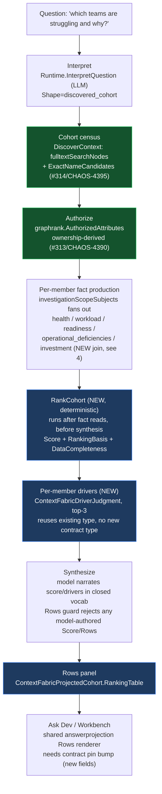
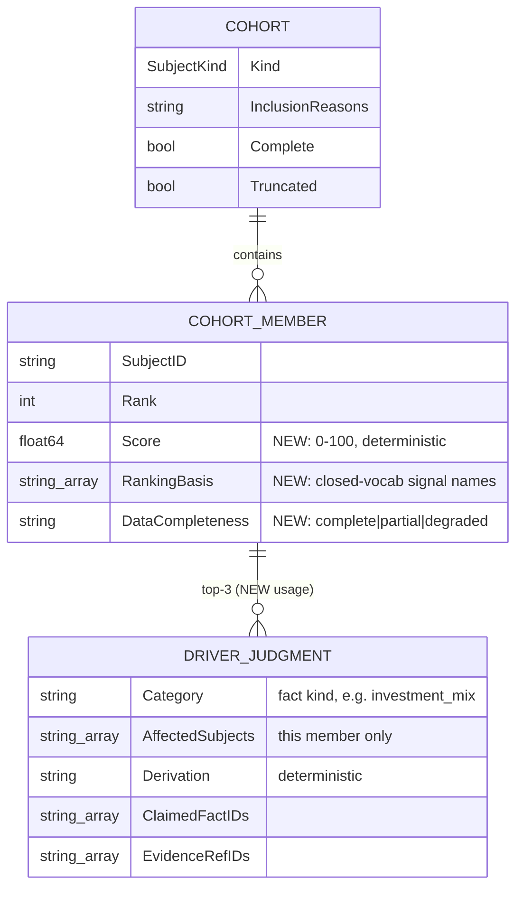

# Context Fabric: subject model and cohort answer design (CHAOS-4398)

Design note for the 2026-08-28 gate re-open: team/cohort questions and the chat
surface were not gate-clean (chris 04:05). Covers the current subject model,
the two corrected root causes that blocked team cohort answers, and the
cohort ranking + drivers + Rows design that answers the charter question
"which teams are struggling and why" (CHAOS-3741, CHAOS-4398).

Decision record: [Linear — Subject model + cohort answers, decisions
2026-08-28](https://linear.app/fullchaos/document/subject-model-cohort-answers-decisions-2026-08-28-8fec005d1fb3).
Plan source: `.remember/context-fabric/drafts/cohort-answer-plan.md` and
`.remember/context-fabric/drafts/subject-model-requirement.md` (session
scratch, not authoritative — this page and the Linear document are).

## 1. Subject model

`ContextFabricSubjectKind` (`internal/contracts/v1/context_fabric_types.go:84`)
declares the full subject vocabulary. Of the kinds relevant to cohort/team
answers:

| Kind | Source (ClickHouse / graph) | Ownership rule | Status |
|---|---|---|---|
| `team` | `teams` table; graph node via `queryTeams` (`devhealthsource/teams_projects.go`) | **Ownership only** — a team owns a subject iff `team_repo_ownership`/`team_project_ownership` says so. Never person→membership (CHAOS-4321 hard rule) | first-class, cohort-capable |
| `project` | `projects` table; graph node via `teams_projects.go` | `team_project_ownership` (project→team) | first-class, single-subject only today (cohort kind selection is single-kind, see §3) |
| `repository` | `repositories`/`tables.go` | N/A (leaf; owned by team indirectly via ownership tables, never a direct graph edge — see diagram 3 caveat below) | first-class |
| `metric` | `ContextFabricSubjectMetric` constant declared (`model.go:92`) | — | **declared, not wired** — no query producer reads it yet |
| person | — | — | **not a subject kind in acr.** No `SubjectPerson` exists. This is by design, not an oversight: the platform contract bars person-level productivity/health/workload/staffing rankings (root `AGENTS.md`, "Visualization Guardrails"); a `person` subject able to carry a ranking would need a governance decision first, not a silent addition. |

**No direct repository↔project or repository↔team graph edge exists, by
design** — `project` here is a work-tracking project (Linear-shaped), not a
repository group. The only path from a project/team to a repository-scoped
activity kind (PR, review, CI run, deployment) is through `work_item`:
`project <-BELONGS_TO_PROJECT- work_item -BELONGS_TO_REPOSITORY-> repository`,
an **activity proxy**, never an ownership claim
(`docs/design/context-fabric-architecture-diagrams.md` §3,
`docs/design/context-fabric-fact-scope.md` §1). ClickHouse-side ownership
joins (`team_repo_ownership`, used by `HealthProvider`'s project rollup) are a
fact-producer join, not a graph edge, and do not appear in the graph diagram.

## 2. Corrections (2026-08-28 gate re-open)

Two independently-real defects co-occurred on the same live "which teams are
struggling" request and were first diagnosed backwards. Both are now fixed or
in flight; **do not re-litigate the original framing** below — it is kept only
so the corrected mechanism is legible against what a reader might find in
older commit messages or tickets.

### 2a. Team authorization was a wildcard over-exposure, not a deny (CHAOS-4390, fixed)

**Original (superseded) framing:** `graphrank.AuthorizedAttributes`
(`authorize.go:48`) was believed to deny any node whenever
`principal.RepositoryScopes` is non-empty unless the node's
`authorization_repositories` matches, and since `queryTeams` never set
`RepositorySlugs` on team nodes, every team was believed to be denied.

**Falsified by a live FalkorDB testcontainers round-trip.**
`falkorgraph/projection.go`'s `authorizationValue` converts an EMPTY
`RepositorySlugs` list into the literal wildcard string `"*"`, and the
wildcard branch in `scopeContainsAttr` authorizes that unconditionally for
*any* repository-scoped principal. The real defect was the opposite
direction: every team in an organization was visible to every
repository-scoped principal, unconditionally — a cross-scope information
leak, not a false deny.

**Fix (merged, PR #313):** authorize a team iff it owns ≥1 repository inside
the principal's scope (`team_repo_ownership`, CHAOS-4321 ownership-only). A
team with no ownership row gets an explicit deny sentinel
(`noTeamOwnershipSentinel`) — never a bare empty list, which would fall back
to the wildcard and reproduce the exact leak this fix closes.

### 2b. Cohort retrieval was fulltext-only (CHAOS-4395, in flight)

`DiscoverContext`'s only node source for the subjectless-cohort case was
`fulltextSearchNodes` — a lexical search over the raw question text. A
termless "which teams are struggling" names no team by label/alias/key, so
the search legitimately returned nothing and the cohort stayed empty — even
though `Interpretation.Shape` was correctly `discovered_cohort` and
authorization (once 2a is fixed) would allow every member.

**Interpretation was never the gap.** `InterpretationOutput.Shape` is a real
enum (`single_subject|explicit_cohort|discovered_cohort|open`,
`genkitruntime/runtime.go:1221`) and the prompt already instructs the model to
pick `discovered_cohort` for exactly this question shape
(`genkitruntime/prompts.go:89`). Top-level intent is genuinely LLM-driven
(`Runtime.InterpretQuestion`).

**Fix (PR #314, stacked on #313):** when `Shape` names a cohort kind, source
cohort members from `ExactNameCandidates`/the kind census (CHAOS-4348's
existing kind-exhaustive, term-free fetch, already used by the single-subject
path) in addition to fulltext — scoped to cohort requests only. Output shape
stays offers-only (no ranking/drivers); those are CHAOS-4398, below.

## 3. Cohort answer pipeline (CHAOS-4398)

The model never computes or narrates a number it was not given — the same
discipline as canonical theme roll-up (root `AGENTS.md`) and
`attachCanonicalRows` (`model_runtime.go:575`, "only place `Rows` is set").
`RankCohort` sits in that same ordering slot: after fact reads, before
`SynthesizeAnswer`.

## 4. Data model

`Score`/`RankingBasis`/`DataCompleteness` are additive fields on the existing
`ContextFabricCohortMember` (`context_fabric_types.go:995`) — a contract
widening, which per standing rule requires an ask-dev pin bump before the
Workbench/chat surface can render them. `ContextFabricDriverJudgment` is
reused as-is; no new contract type. "No person-to-person rankings" is
unaffected — a team cohort ranks teams, never individual people.

## 5. Score formula

Weighted, renormalized over available signals only — a missing signal family
is excluded from the denominator, never scored as zero.

| # | Signal | Source | Weight | Direction |
|---|---|---|---|---|
| 1 | Investment-mix imbalance (driver family #1, chris direction) | new team-scoped `theme_distribution` (§6) | 30 | see sub-formula |
| 2 | Health risk | `health.compounding_risk` | 25 | higher risk → higher score |
| 3 | Deficiency severity | `operational_deficiencies.severity` | 20 | higher severity → higher score |
| 4 | Readiness gap | `1 - readiness.estimate_coverage_ratio` | 15 | lower coverage → higher score |
| 5 | Workload pressure | `workload.forecast_p50_days`, z-scored within cohort | 10 | longer forecast → higher score |

**Term 1 sub-formula** (own internal weights, produces one `[0,1]` value
before the table's weight-30 applies): each sub-signal is also its own
closed-vocabulary `RankingBasis`/driver label — the pattern is borrowed from
`investment_mix_explain.py`'s deterministic `quality_drivers` list, **never**
that file's LLM-authored narrative prose (the Python-prototype path the
standing rule excludes as a Context Fabric reference).

| Sub-signal | Definition | Label (closed vocab) | Sub-weight |
|---|---|---|---|
| Reactive share | `operational` theme share + `quality.bugfix` subcategory share > 0.40 | `reactive_share_high` | 0.35 |
| Deliberate share | `feature_delivery` theme share < 0.20 | `deliberate_share_low` | 0.30 |
| Concentration | `max(theme_share)` across the 5 canonical themes > 0.55 | `mix_concentrated` | 0.15 |
| Mix shift | Σ\|Δshare\| vs. prior comparable 90d window > 0.15pts | `mix_shift_toward_operational` / `mix_shift_toward_feature` | 0.20 |

No new categories are invented — every label maps onto the fixed 5-theme/
15-subcategory taxonomy (root `AGENTS.md`: "no synonyms/overrides"), mapping
stated explicitly here so it is auditable. `DataCompleteness` is `complete`
only if all 5 top-level signal families returned rows; `partial` if ≥1 is
missing; `degraded` if ≤2 are available (CHAOS-3781 degrade-not-fabricate
posture — a team with zero data is shown as degraded, never silently
dropped).

## 6. Finding: the existing investment producer reads the deprecated source

`FactInvestment` (CHAOS-4363/#308) reads `investment_metrics_daily`, fed by
the **deprecated** `ops/src/dev_health_ops/config/investment_areas.yaml` rule
set (free-form legacy labels, e.g. `security`/`infrastructure` — not the
canonical 5-theme taxonomy). The canonical theme/subcategory distribution
lives in `latest_work_unit_investments` ⋈ `work_item_team_attributions`
(ops's `fetch_investment_breakdown(include_team_id=True)`, ownership
precedence per CHAOS-2600) — **acr has no producer reading this join today**,
the same class of gap CHAOS-4347 named for repository status and CHAOS-4365
named for cognitive load. The investment Rows proven live on 2026-08-27 came
from the deprecated source. CHAOS-4398's PR1 adds the new team-scoped read
before term 1 of the score formula can be trusted. See the ops-side
deprecation note: `dev-health-ops` `docs/reference/data-models/investment.md`.

## 7. What this does not cover

- Cohort ranking/drivers implementation itself (CHAOS-4398 is Backlog as of
  this writing) — this page documents the design, not a shipped capability.
  Update this page's pipeline diagram's node classes (`fixed` vs. `newnode`)
  as each of CHAOS-4398's 4 stacked PRs lands.
- `metric` and `person` subject handling — out of scope; see §1.
- Chat-vs-Workbench structure-offer parity and the "cannot re-ask" chat
  defect — tracked separately (`.remember/context-fabric/drafts/subject-model-requirement.md`
  §2-3), not a subject-model or cohort-ranking concern.
