# Context Fabric vector and semantic retrieval (CHAOS-3778)

Status: IMPLEMENTED. Orchestrator GO received 2026-08-13, including the item-4
corroboration ruling. Everything below describes shipped behavior except where
marked.

Deviations from the design as approved: none in substance. Two things the
design under-specified and the implementation had to settle:

* The never-demote guard in `CorroboratedConfidence` is REACHABLE, not merely
  defensive — an exact label match reached through traversal carries base 0.85
  with two mechanisms, whose corroborated value (0.7795) is lower. The design
  note called it unreachable; that was wrong. Consequence: the function's output
  is bounded by `max(base, CorroboratedCeiling)`, not by the ceiling alone, so
  the pinned invariant is "corroboration never LIFTS a candidate to the
  top-of-two gate" rather than "the output is always below it".
* `contracts/openapi/acr-v1.json` `$ref`s the JSON Schema file directly and
  carries no duplicate `SubjectCandidate` definition, so the schema edit IS the
  OpenAPI change and `make contract-write` regenerated the YAML mirror with no
  diff.

Scope: TRD §19.4. Acceptance bars AC-3778-0 through AC-3778-7.
Precondition AC-3778-0 (lexical score-ladder normalization) is MERGED on `main`
(`falkorgraph/queries.go`, `graphrank/types.go`). This design composes with that
ladder; it does not re-open it.

---

## 1. Live probe results

Everything below was verified against a live server before this design was
written. No claim here is inferred from documentation.

### 1.1 Embedder — LM Studio

`GET http://localhost:1234/v1/models` serves six models. Five are generation
models (`qwen/qwen3.5-35b-a3b`, `google/gemma-4-e4b`, `google/gemma-4-31b`,
`google/gemma-4-26b-a4b-qat`, `gemma-4-26b-a4b-it@q4_k_m`). One is an embedding
model:

| Property | Value |
| --- | --- |
| Model id | `text-embedding-nomic-embed-text-v1.5` |
| Dimension | 768 |
| Vector norm | 1.0000 (already L2-normalized) |
| Batch input | Accepted (`input` as an array) |
| Cold latency | 9.3 s (first call — model load) |
| Warm latency | 10–17 ms, single input |

Because vectors arrive L2-normalized, cosine similarity equals the dot product.
No client-side normalization is needed.

The two generation models Chris named are not embedding models. The lane does
not need `/api/v1/models/load`: an embedding model is already loaded.

### 1.2 FalkorDB vector index

Server: module `graph` version 42002.

Creation (Cypher form, works):

```
CREATE VECTOR INDEX FOR (n:Subject) ON (n.embedding)
  OPTIONS {dimension:768, similarityFunction:'cosine'}
```

Query (works on `GRAPH.RO_QUERY`):

```
CALL db.idx.vector.queryNodes('Subject','embedding', $k, vecf32($vec))
  YIELD node, score
```

Verified behaviors:

| Behavior | Observed |
| --- | --- |
| **`score` is a cosine DISTANCE** | Identical vector → `0`. Unrelated vector → `0.699398`, which is exactly `1 − cos` (`cos = 0.3007`). Range `[0,2]`. |
| `WHERE node.org_id = $org` | Applies as a POST-filter on the k-NN result, not as a constraint on the search. |
| Dimension mismatch | Hard server error: `Vector dimension mismatch, expected 4 but got 2`. |
| Node without the property | Silently absent from results. No error. |
| Repeat index creation | `Attribute 'embedding' is already indexed` — not idempotent. |
| Coexistence with the fulltext index | Vector index on `Subject.embedding` and fulltext index on `Subject.search_text` coexist. Both keep working. |
| `db.indexes()` status | Reports `OPERATIONAL` and echoes `{dimension, similarityFunction, M, efConstruction, efRuntime}`. |

**The distance finding is the single most important one in this document.**
`graphrank.ResultConfidence` has a `score >= 0 && score <= 1 → return score` arm.
Feeding FalkorDB's vector score into it gives the BEST possible match a
confidence of `0.0` and a poor match `0.699`. That is D11 inverted a second
time, in a new place. `graphrank/types.go:88-95` already warns about exactly
this case for a future vector backend. This adapter therefore normalizes into
`Relevance` and never lets a vector score reach that arm.

---

## 2. Where embeddings live

**In FalkorDB, as a property on the existing `:Subject` node, with a per-org
vector index.** Not an external store.

- One graph key per organization already enforces tenancy. An external vector
  store would fork that boundary and add a second thing to authorize.
- Embeddings become projection artifacts of the same node that already carries
  `search_text`, `org_id`, and the `authorization_*` properties. Authorization
  keeps applying before ranking (§12) with no new code path.
- The rebuild/epoch machinery already covers node properties. See §6.

New node properties:

| Property | Type | Purpose |
| --- | --- | --- |
| `embedding` | vector | The vector itself, written via `vecf32(...)`. |
| `embedder_identity` | string | `provider/model` — records what produced the vector. |
| `embedder_dimension` | int64 | Records the dimension. Detects a model change. |

`falkorgraph.safeParams` (client.go:289) already admits `[]interface{}` of
`float64`, so a vector parameter passes the codec allowlist unchanged. The
pinned `falkordb-go` v2.1.0 codec is not touched, and the raw `Conn.Do`
discipline stays as-is: this is one more Cypher string through `a.api.query`.

Index bootstrap follows the existing pattern in `identity.go`
(`createFulltextIndex` + `pollConstraintsOperational`): create, treat
`already indexed` as success via `errAlreadyExists`, then poll `db.indexes()`
to `OPERATIONAL` under a strict allowlist. Zero rows is an error.

---

## 3. What gets embedded, and when

**Projection time, in `acr-projector`.** Never lazily at query time. This fits
the rebuild/epoch machinery and keeps the read path free of a model call for
the corpus side.

One vector per `:Subject` node, over the **same `search_text` property
projection already writes** (`projection.go:234, 318, 360`):

| Subject kind | `search_text` content today | Embedded |
| --- | --- | --- |
| entity | label + aliases + previous names | yes |
| content | title + body | yes, truncated |
| episode | summary (goal/outcome) | yes, truncated |

Reusing `search_text` verbatim means the lexical and vector paths search the
same text. A difference in outcome is then a difference in *mechanism*, not a
difference in corpus — which is what AC-3778-2's measurement needs to be
meaningful.

Text is truncated to a bounded character budget before embedding (config,
default 2000) so one large document cannot blow the projection batch budget.

**One model call per batch, not per node.** The embedder port takes a slice.

Untrusted content keeps its untrusted flag: embedding reads the text, it never
executes it, and no embedded text is echoed into any prompt by this change.

**Not embedded, by rule:** edges. §19.4.4 forbids a model in the write path of
an edge. Embedding a label is not creating an edge. `queryRelationships` is out
of scope for this pass (§7).

---

## 4. How vector scores merge into the normalized ladder

This is D11 territory. The design is *structural* — it makes the unwanted
outcomes arithmetically impossible rather than forbidding them by policy.

### 4.1 Distance to similarity

```
cos       := clamp(1 - score, 0, 1)      // score is a DISTANCE, see §1.2
```

### 4.2 An absolute similarity floor — the AC-3778-4 guard

A configured floor `τ` (default 0.55, tuned per embedder, never hardcoded per
model in code). If `cos < τ`, the candidate is **dropped, not scored**. It never
becomes a `CandidateNode`.

This is the honest-no-match guard. A k-NN query always returns k rows if k rows
exist — a no-match question would otherwise get k confident-looking neighbors.
AC-3778-4 is the highest-severity failure in this issue, so the guard sits at
the adapter boundary, before graphrank ever sees the row.

### 4.3 The vector band — [0.50, 0.70]

```
relevance := 0.50 + 0.20 * (cos - τ) / (1 - τ)      // absolute, per-candidate
```

The band ceiling **0.70 is strictly below the 0.72 lone-candidate commit gate**
in `ResolveFromMergedCandidates` (resolution.go:104). A vector-only candidate
therefore *cannot* auto-commit — not by a rule, but by arithmetic. AC-3778-3's
"a vector hit alone never commits a subject" holds with no special case in
graphrank, and the shipped thresholds stay untouched.

The function is absolute and per-candidate, exactly like
`fulltextRelevanceFromMatchedTerms`: it depends only on this candidate's own
`cos`, never on the result set. Two different queries' vector confidences are
directly comparable. This is the property Codex round 2 forced onto the lexical
arm, and it is honored here from the start.

Band layout, ordered and reasoned:

```
0.00 ─────────────────────────────────────────────────────── dropped (cos < τ)
0.50 ── vector-only ──────────── 0.70 │ 0.72 lone-commit gate
0.50 ── lexical-only ────────────────── 0.75  (merged, AC-3778-0)
0.72 ── corroborated ───────────────────────── 0.86 │ 0.88 top-of-two gate
1.00 ── exact canonical / alias / provider key (unchanged)
```

### 4.4 Corroboration — how the 25pp lift is actually earned

AC-3778-2 wants a 25pp rise in the **correct-commit** rate. AC-3778-3 says a
vector hit alone never commits. Both hold only if a vector hit can be
*corroborated* by a second mechanism and commit on the strength of the pair.

Today `ResolveSubjects` merges two findings of the same subject by keeping the
**higher confidence** (resolve.go:138). That discards the fact that two
independent mechanisms agreed — which is the single most useful signal available
here.

Proposal: `SubjectCandidate` records its **match mechanisms** (also required by
AC-3778-6), and the merge unions mechanisms instead of taking a max. A subject
proposed by two or more distinct mechanisms — from `{exact, alias, provider_key,
lexical, vector, traversal_parent}` — is scored into the **corroborated band
[0.72, 0.86]**, a bounded monotone function of the contributing mechanisms' own
bands.

Consequences, all intended:

- A corroborated candidate reaches the 0.72 lone gate, so it can auto-commit
  when unopposed. This is where the lift comes from.
- It never reaches 0.88, so **two** corroborated candidates still clarify rather
  than guess. That preserves the ruling recorded on the issue (2026-08-13):
  falling to clarification under genuine ambiguity is intended behavior.
- A vector hit alone stays at ≤ 0.70 and commits nothing. AC-3778-3 literal.
- `searchTruncated` still short-circuits to ambiguous before any threshold
  (resolution.go:80). Truncation authority is unchanged.

**This is the one change that reaches into `graphrank`'s merge rule, and the one
point where I want an explicit GO.** Without it, AC-3778-2 has no mechanical
path while AC-3778-3 holds. The alternative — letting a vector-only candidate
commit — is forbidden by the AC.

### 4.5 Order-soundness obligation

A test extends the AC-3778-0 monotonicity proof across the vector arm: for a
fixed mechanism set, a strictly higher `cos` never yields a lower confidence
than a lower `cos`, and no single-mechanism candidate ever outranks a
corroborated one. Bands are disjoint where they must be ordered and overlap only
where two single-mechanism proposals are genuinely comparable.

---

## 5. Transport

New package `internal/contextfabric/embedprovider`, mirroring `modelprovider`'s
shape and posture exactly.

- Reuses `modelprovider`'s `newClientOptions` pattern: an explicit base URL and
  explicit credential on every construction, so an ambient `OPENAI_*` variable
  can neither redirect traffic nor supply a credential the configuration did not
  choose.
- Reuses the `sanitizeProviderErrorBody` middleware discipline (provider.go:147)
  — a provider response body is never logged or surfaced, at any status class.
- Uses the `openai-go` SDK's `Embeddings` service directly, **not** Genkit's
  `compat_oai`. That wrapper eagerly defines embedders and hard-codes model ids
  (documented at modelprovider/config.go:15-23); the embedding call needs none
  of it. Same SDK, same option plumbing, no new transport code.

New ACR-owned port in `contextfabric/ports.go` — §19.4.7 calls for one; the
"no port change expected" line refers to `GraphReader`, which is unchanged:

```go
type Embedder interface {
    Embed(ctx context.Context, texts []string) ([][]float32, EmbedderIdentity, error)
}
type EmbedderIdentity struct { Provider, Model string; Dimension int }
```

Configuration — the LM Studio endpoint is a **dev config value only**, never a
constant in code:

| Variable | Default | Note |
| --- | --- | --- |
| `ACR_CONTEXT_FABRIC_EMBED_PROVIDER` | — | Recorded verbatim in the identity. |
| `ACR_CONTEXT_FABRIC_EMBED_BASE_URL` | — | Unset ⇒ vector retrieval disabled. |
| `ACR_CONTEXT_FABRIC_EMBED_MODEL` | — | e.g. `text-embedding-nomic-embed-text-v1.5`. |
| `ACR_CONTEXT_FABRIC_EMBED_DIMENSION` | — | Must match the index. |
| `ACR_CONTEXT_FABRIC_EMBED_API_KEY` / `_FILE` | empty | LM Studio needs none; the shape accommodates one for a hosted embedder. |
| `ACR_CONTEXT_FABRIC_EMBED_SIMILARITY_FLOOR` | 0.55 | τ, §4.2. |
| `ACR_CONTEXT_FABRIC_EMBED_TIMEOUT` | 250ms | Read-path (single-text) calls. §6.2. |
| `ACR_CONTEXT_FABRIC_EMBED_BATCH_TIMEOUT` | 5s | Write/projection-path calls, independent of the read-path timeout above (CHAOS-3828). |
| `ACR_CONTEXT_FABRIC_EMBED_ALLOW_INSECURE_BASE_URL` | false | Required for a loopback `http://` endpoint. |

Unset base URL ⇒ the feature is off and the lexical path is unchanged. Same
opt-in posture as answer reuse.

From inside a container the dev value is `http://host.docker.internal:1234/v1/`;
on the host, `http://localhost:1234/v1/`.

---

## 6. Measurement, cost, and the rebuild interaction

### 6.1 AC-3778-2 — the 25pp lift

AC-3778-1 requires the corpus to be **authored after implementation and withheld
from this lane**. So this lane delivers the **harness**, not the corpus:

- A live-tagged benchmark runner that reads a corpus path from the environment,
  runs each question through `ResolveSubjects` twice — vector disabled, then
  enabled — against live dev data, and emits correct-commit / wrong-commit /
  no-match counts plus the delta.
- The runner records the lexical-only baseline first (AC-3778-1 ordering) and
  fails if the wrong-commit rate rises at all (AC-3778-3) or if a control
  no-match question resolves (AC-3778-4).
- This lane authors only a small non-authoritative smoke corpus, for wiring.
  The held-out 50 comes from the orchestrator or Chris.

### 6.2 AC-3778-5 — 150 ms p95

Measured budget for the retrieval stage, from the probes:

| Step | Measured |
| --- | --- |
| Embed the question (warm, 1 input) | 10–17 ms |
| `db.idx.vector.queryNodes` | < 1 ms |
| Normalize + merge | negligible |

Headroom is large. The real risk is a **cold embedder: 9.3 s**. Mitigation: a
bounded per-request embed timeout (default 250 ms) and **fail-open to
lexical-only** — a vector step that times out or errors degrades the request to
the existing lexical path and marks coverage partial. It never blocks or slows
the answer past the budget. That is the honest reading of "adds at most 150 ms".

Projection-side cost is one batched embed call per projection batch, which does
not raise projection lag beyond its current service level — measured and
reported as implementation evidence.

### 6.3 AC-3778-7 — rebuild and reuse

Embeddings are **projection artifacts**, so the existing epoch/invalidation
machinery already covers them. Stating it explicitly:

- Embedder identity and dimension are written onto each node and into the
  projection receipt.
- Changing either is detected at bootstrap by comparing the configured identity
  against what `db.indexes()` reports and what nodes carry. On mismatch the
  adapter **refuses to query the vector index** and degrades to lexical-only
  until a rebuild runs. A stale-dimension vector is never queried.
- The operator-prescribed recovery is the existing
  `acr-projector rebuild --org` path. It already resets every source checkpoint
  and bumps the rebuild epoch, which invalidates answer reuse (CHAOS-3782,
  condition 3 and 4). No new invalidation concept is introduced.
- FalkorDB's own hard dimension-mismatch error is a free second fail-closed
  layer underneath the adapter check.

---

## 7. Out of scope

- Relationship/edge vector index (`db.idx.vector.queryRelationships`). Subjects
  only this pass.
- Any model or embedder in the write path of an edge (§19.4.4).
- Retrieval-augmented generation from raw text. Approved source text stays
  untrusted data.
- Exposing a vector index, a distance value, or a native query to any consumer.
- Cross-organization embedding, a shared index, or a shared vector namespace.
- Changing the lexical band [0.50, 0.75] or the shipped commit thresholds
  (0.72 / 0.88 / gap 0.12). Both stay exactly as merged.
- Similarity as an authorization mechanism. Authorization stays ahead of ranking.
- Choosing the production embedder. `gpt-5-nano` fallback is a later decision.
- Routes, MCP surface, and answer projection (lane-3746 owns those).

---

## 8. Pathway diagram (CHAOS-4133)

Full pathway from bring-up to a served vector-search result, code-grounded
against `internal/contextfabric/embedprovider` and
`internal/contextfabric/falkorgraph`. Two hops get their own explicit
callout rather than being left as an implicit side effect of "the write
path" or "the read path":

- **The INVALIDATION hop** is the **stored-vector identity fence**
  (`verifyStoredEmbedderIdentity`): a vector written under one embedder
  identity is treated as unusable the moment the CURRENTLY configured
  embedder no longer matches it. This is the actual invalidation
  mechanism in this flow — nothing else in it decides "this cached
  artifact is now stale."
- **The VISIBILITY-ISOLATION hop** is the epoch **build-aside** mechanism
  (CHAOS-3898): a write during an open rebuild targets the BUILD epoch,
  which is invisible to every reader (readers always resolve the ACTIVE
  epoch) until the swap promotes it. This is isolation, not invalidation
  — nothing is being marked stale, a whole epoch simply is not visible
  yet.

```mermaid
flowchart TD
    subgraph ENV["Env resolution & config (embedprovider)"]
        A1["docker compose --env-file ops/.env up<br/>(CHAOS-4192: omitting --env-file<br/>silently resolves ${VAR:-} blank)"] --> A2["ACR_CONTEXT_FABRIC_EMBED_BASE_URL / _API_KEY / ...<br/>process environment"]
        A2 --> A3["embedprovider.ConfigFromEnv(os.LookupEnv)"]
        A3 --> A4{"Configured()?<br/>(BaseURL nonblank)"}
        A4 -- "no" --> A5["ErrNotConfigured<br/>clean no-op: vector retrieval OFF,<br/>lexical path unchanged"]
        A4 -- "yes" --> A6["Config.validate()"]
        A6 --> A7{"APIKey blank AND<br/>NOT AllowNoCredential?"}
        A7 -- "yes (CHAOS-4192 guard)" --> A8["hard error at STARTUP<br/>composition aborts before any batch runs<br/>(ACR_CONTEXT_FABRIC_EMBED_ALLOW_NO_CREDENTIAL<br/>is the explicit opt-in for a real no-auth<br/>endpoint, e.g. loopback LM Studio/Ollama/TEI)"]
        A7 -- "no" --> A9["embedprovider.New(cfg) returns Embedder"]
    end

    A9 --> B1

    subgraph WRITE["Write path: acr-projector batch loop (embedProjectionBatch)"]
        B1["projectionrun.Coordinator tick"] --> B2["ApplyProjectionBatch"]
        B2 --> B3["resolveWriteKey(orgID)<br/>BUILD epoch if a rebuild is open,<br/>else ACTIVE epoch"]
        B3 --> B5{"embedder == nil?"}
        B5 -- "yes (feature off)" --> B6["collectEmbedTargets + clearNodeVectors(id-only)<br/>embedded=0, cleared=0 (routine, not an error)<br/>commits"]
        B5 -- "no" --> BIX["vectorIndexDimension(key)<br/>PRE-EMBED gate, checked BEFORE any Embed() call"]
        BIX --> BIX2{"probe error, OR<br/>index absent/unknown?"}
        BIX2 -- "yes" --> BREPLAY["REPLAY: batch FAILS,<br/>checkpoint holds, next tick retries<br/>(recordVectorDegraded)"]
        BIX2 -- "no" --> BIX3{"dimension != embedder's<br/>configured dimension?"}
        BIX3 -- "yes (PERSISTENT failure)" --> B9b["clearNodeVectors(all targets)<br/>recordVectorDegraded + Warn<br/>commits (reads already fenced off<br/>by the same mismatch)"]
        BIX3 -- "no" --> B4["collectEmbedTargets(batch)"]
        B4 --> B4z{"zero embed targets?"}
        B4z -- "yes" --> B6z["clearNodeVectors(id-only only)<br/>cleared=0, commits"]
        B4z -- "no" --> B7["embedWithBoundedRetry(texts)<br/>(CHAOS-4259: a TRANSIENT error --<br/>timeout/429/5xx/connection failure --<br/>gets a short bounded retry with backoff first;<br/>a PERSISTENT error is never retried)"]
        B7 --> B8{"still failing after retry,<br/>or vector count mismatch?<br/>(one bad batch must not stall<br/>projection forever)"}
        B8 -- "yes" --> B9["clearNodeVectors(targets)<br/>recordVectorDegraded + Warn log<br/>(embedded:0, cleared:N) -- commits<br/>reportEmbedFailure: org's consecutive-failure<br/>streak escalates to an ERROR-level signal<br/>after N in a row (CHAOS-4259)"]
        B8 -- "no" --> B10r["resetEmbedFailureStreak(orgID)"] --> B10["writeNodeVector per target<br/>stamps embedder identity + composition tag<br/>commits"]
    end

    B10 --> C1
    B9 --> C1
    B9b --> C1
    B6 --> C1
    B6z --> C1

    subgraph STORE["FalkorDB per-epoch storage"]
        C1["Subject.embedding vector index<br/>(the write path's own vectorIndexDimension gate<br/>above IS the per-batch check;<br/>ensureVectorIndex is the separate bootstrap-time<br/>create/verify path)"]
        C1 -.->|"VISIBILITY-ISOLATION HOP (CHAOS-3898),<br/>NOT invalidation -- nothing is marked stale here:<br/>a BUILD epoch simply is not visible to any reader<br/>until the active-epoch pointer flips atomically.<br/>Old epoch survives its grace window, then a<br/>retire sweep issues GRAPH.DELETE."| C2["epoch build-aside-and-swap<br/>graphKeyForEpoch(prefix, org, epoch)"]
    end

    C1 --> D0

    subgraph READ["Read path: KNN"]
        D0["Engine.ResolveInvestigationBinding<br/>(once per investigation, BEFORE any graph call)<br/>resolveActiveEpoch + graphKeyForEpoch<br/>= the ACTIVE epoch key, never BUILD"]
        D0 --> D1b["ResolveSubjects(key, binding)<br/>constructs ONE resolutionFence{}<br/>for this whole resolution call"]
        D1b --> D1["hybridSearchNodes / questionVectorSearchNodes<br/>(receive the already-resolved key + fence;<br/>they do NOT re-resolve a key themselves)"]
        D1 --> D3{"embedder == nil?"}
        D3 -- "yes" --> D4["skip vector arm, lexical only<br/>degraded=false (nothing was expected)"]
        D3 -- "no" --> D5["fence.readable() -&gt; vectorFenceCheck(key, orgID)<br/>MEMOIZED per resolutionFence: the FIRST term/call<br/>in this resolution probes, every later one in the<br/>SAME resolution reuses that verdict"]
        D5 --> D6{"index_absent /<br/>index_unknown /<br/>dim_mismatch?"}
        D6 -- "yes" --> D7["degraded=true, vector arm skipped<br/>RecordVectorFence: Warn-logged<br/>(no dedicated metric/dashboard, but not silent --<br/>grep for 'vector read fence did not pass')"]
        D6 -- "no" --> D8["verifyStoredEmbedderIdentity<br/>(THE ACTUAL INVALIDATION CHECK:<br/>a node's stamped identity vs the<br/>CURRENTLY configured embedder --<br/>same-dimension model swaps are the<br/>failure this specifically closes)"]
        D8 -- "mismatch" --> D7
        D8 -- "match" --> D9["embed query text (task-prefixed)<br/>CALL db.idx.vector.queryNodes<br/>similarity floor (tau) drops far neighbors"]
        D9 --> D10["candidates merged into the<br/>normalized lexical+vector ladder (§4)"]
    end
```



Hops most likely to be missing from an investigator's mental model, per
CHAOS-4133's own evidence class:

1. **The blank-credential guard fires at STARTUP, not per-batch.** Before
   CHAOS-4192, a blank credential produced no error anywhere — only a
   scrolling `embedded:0, cleared:N` Warn per batch, indistinguishable
   from routine degraded operation unless someone was watching closely
   enough to notice `cleared` was never zero.
2. **Write and read resolve DIFFERENT epochs by design.** A write during
   an open rebuild targets the BUILD epoch; every read stays on the
   ACTIVE epoch until the swap. This is intentional isolation, not a bug
   — but it means "I just wrote a vector" and "a read can see it" are not
   the same moment.
3. **The stored-vector identity fence is memoized per resolution, not
   re-probed per read.** `resolutionFence` holds one verdict for the
   whole `ResolveSubjects` call; the first term/question that needs the
   vector arm pays the probe, every later one in the same resolution
   reuses it. It is not silent — any non-OK result is Warn-logged via
   `RecordVectorFence` (`"vector read fence did not pass"`) — but there
   is no dedicated metric or dashboard for it, so an investigator still
   has to know to grep logs rather than check a panel.
4. **A cleared vector and a never-written vector are indistinguishable
   downstream.** Both read as "no embedding" — the batch-level Warn log is
   the only place the difference (something was cleared vs. nothing was
   ever there) is recorded.
5. **The write path's index-dimension check runs BEFORE any `Embed()`
   call, and it does not always clear-and-commit.** A transient probe
   failure or an absent/unknown index REPLAYS the whole batch (the
   checkpoint holds, the next tick retries) — only a genuine, PERSISTENT
   dimension mismatch clears vectors and commits. This is a different,
   earlier gate than the post-`Embed()` clear-and-continue everyone
   remembers from the CHAOS-4192 incident, and conflating the two
   misses that some write-path failures never touch `Embed()` at all.

See also: `internal/contextfabric/embedprovider/config.go` (env
resolution + the CHAOS-4192 guard), `internal/contextfabric/falkorgraph/vector_projection.go`
(write path, the fence, index-state classification),
`internal/contextfabric/falkorgraph/lifecycle.go` (epoch resolution),
`internal/contextfabric/falkorgraph/reader.go` (`ResolveInvestigationBinding`
resolving the key once per investigation, `ResolveSubjects` constructing
the one `resolutionFence` a whole resolution shares),
`docs/operations.md`'s CHAOS-3916 cutover runbook (operational epoch
pre-flights) and CHAOS-4192 incident note (the `--env-file`/falkordb
volume traps this diagram's env-resolution box exists to prevent
re-deriving from scratch).
